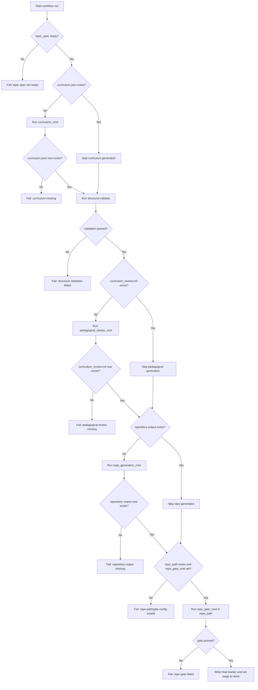
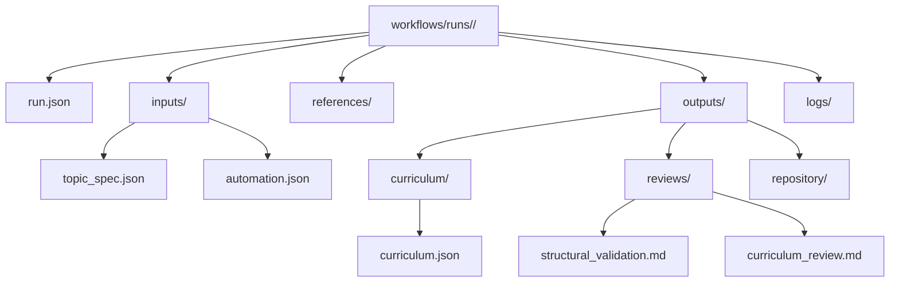

# curriculum-builder

A local system for building coding-learning workflows from prompt specs.

This repository has two purposes:
1. Inspect curriculum graphs in a static UI.
2. Run a structured workflow that produces curriculum, reviews, and repository outputs per run.

## Repository Goal

Create a repeatable process for turning a topic spec into:
- a curriculum graph,
- structural and pedagogical reviews,
- a generated learning repository.

Each execution is isolated in its own run folder under `workflows/runs/<run_id>/`.

## Core Concepts

- `topic_spec.json`: source-of-truth input for a topic.
- `curriculum.json`: generated learning DAG.
- Structural validation: graph/schema/constraint correctness.
- Pedagogical validation: learning quality and sequencing quality.
- Repository generation: produce learner-facing exercises/tests/docs in phased mode (`plan`, `scaffold`, `full`).

## Single Workflow

1. Start a run.
2. Fill topic spec.
3. Generate curriculum.
4. Run structural validation.
5. Run pedagogical validation.
6. Generate repository outputs.
7. Run final quality gate in generated repository.

Prompt guides for these stages:
- `prompts/workflow.md`
- `prompts/topic_spec.md`
- `prompts/curriculum_generator.md`
- `prompts/structural_validator.md`
- `prompts/curriculum_validator.md`
- `prompts/repo_generator.md`

## Workflow Diagrams

Stage transitions inferred from run artifacts:

```mermaid
flowchart LR
    A[initialized] -->|topic_spec contract passes| B[spec_ready]
    B -->|outputs/curriculum/curriculum.json exists| C[curriculum_generated]
    C -->|validate passes and structural marker is current| D[structurally_validated]
    D -->|outputs/reviews/curriculum_review.md exists| E[pedagogically_validated]
    E -->|outputs/repository contains files| F[repo_generated]
    F -->|repo gate passes and final marker is current| G[done]
    D -.->|curriculum or spec changed after structural marker| C
    G -.->|repository changed after final marker| F
```



`workflow.py run <run_id>` execution flow:



## Commands

General:
- `make setup`
- `make dev`
- `make test`
- `make validate`
- `make gate`

Workflow run management:
- `make workflow-start RUN_NAME="<topic-slug>"` (or `make workflow-start`)
- `make workflow-list`
- `make workflow-status RUN_ID="<run_id>"`
- `make workflow-next RUN_ID="<run_id>"`
- `make workflow-validate RUN_ID="<run_id>"`
- `make workflow-run RUN_ID="<run_id>"`
- `make workflow-archive RUN_ID="<run_id>"`

Equivalent direct CLI:
- `python3 scripts/workflow.py init "<topic-slug>"`
- `python3 scripts/workflow.py status <run_id>`
- `python3 scripts/workflow.py next <run_id>`
- `python3 scripts/workflow.py validate <run_id>`
- `python3 scripts/workflow.py run <run_id>`
- `python3 scripts/workflow.py archive <run_id>`
- `python3 scripts/workflow.py list`
- `python3 scripts/validator.py <curriculum.json> --topic-spec <topic_spec.json>`

## End-to-End Runbook

Use this exact sequence for one full run.

1. Initialize a run.

```bash
make workflow-start RUN_NAME="my-topic"
make workflow-list
```

Pick the `run_id` you just created from `make workflow-list`.

2. Fill run input spec.

Edit:
- `workflows/runs/<run_id>/inputs/topic_spec.json`

Important:
- Do not leave template placeholder values (`replace_with_...`, `Example ...`, etc.).
- `spec_ready` is reached only when this file passes contract checks.

3. Fill run automation commands.

Edit:
- `workflows/runs/<run_id>/inputs/automation.json`

Each field must be real (not placeholders):
- `curriculum_cmd`: must create `workflows/runs/<run_id>/outputs/curriculum/curriculum.json`
- `pedagogical_review_cmd`: must create `workflows/runs/<run_id>/outputs/reviews/curriculum_review.md`
- `repo_generation_cmd`: must create files under `workflows/runs/<run_id>/outputs/repository/`
- `repo_path`: path to generated repo (relative to run dir or absolute)
- `repo_gate_cmd`: command run inside `repo_path` that must exit `0`

4. Check readiness and next action.

```bash
make workflow-status RUN_ID="<run_id>"
make workflow-next RUN_ID="<run_id>"
```

5. (Optional) Run only structural validation.

```bash
make workflow-validate RUN_ID="<run_id>"
```

This writes:
- `workflows/runs/<run_id>/outputs/reviews/structural_validation.md`
- `workflows/runs/<run_id>/logs/structural_validation.ok` (only on pass)

6. Run full automation.

```bash
make workflow-run RUN_ID="<run_id>"
```

7. Confirm completion.

```bash
make workflow-status RUN_ID="<run_id>"
```

Expected final stage:
- `done`

8. (Optional) Archive run outputs.

```bash
make workflow-archive RUN_ID="<run_id>"
```

## Common Failures And Fixes

- `Topic spec not ready: .../inputs/topic_spec.json`
  Fix: complete `topic_spec.json` so it passes contract validation.

- `curriculum_cmd is not configured in inputs/automation.json`
  Fix: replace placeholder with a real command.

- `Curriculum was not produced at expected path: .../outputs/curriculum/curriculum.json`
  Fix: ensure `curriculum_cmd` writes to that exact run path.

- `pedagogical_review_cmd is not configured in inputs/automation.json`
  Fix: set a command that writes `outputs/reviews/curriculum_review.md`.

- `repo_generation_cmd is not configured in inputs/automation.json`
  Fix: set a command that creates files under `outputs/repository/`.

- `repo_path is not configured in inputs/automation.json` or `Configured repo_path does not exist: ...`
  Fix: point `repo_path` at the generated repository directory.

- `repo_gate_cmd is not configured in inputs/automation.json`
  Fix: set the final gate command (for example `make gate` if that generated repo supports it).

## Run Folder Layout

Directory structure at a glance:



```text
workflows/runs/<run_id>/
|- run.json
|- inputs/
|  |- topic_spec.json
|  `- automation.json
|- references/
|- outputs/
|  |- curriculum/
|  |  `- curriculum.json
|  |- reviews/
|  |  |- structural_validation.md
|  |  `- curriculum_review.md
|  `- repository/
`- logs/
```

Notes:
- `workflows/runs/` is git-ignored by default (except control files).
- `run.json` stores workflow stage and history.

Run stages:
- `initialized`
- `spec_ready`
- `curriculum_generated`
- `structurally_validated`
- `pedagogically_validated`
- `repo_generated`
- `done`

`spec_ready` is reached only when `inputs/topic_spec.json` passes the topic spec contract checks (not just `topic_id`).

## Automation (Full Run)

`workflow.py run <run_id>` can automate the full process if run-specific commands are configured in:
- `workflows/runs/<run_id>/inputs/automation.json`

Template file:
- `workflows/templates/automation.template.json`

Expected command slots:
- `curriculum_cmd`
- `pedagogical_review_cmd`
- `repo_generation_cmd`
- `repo_path`
- `repo_gate_cmd`

Important:
- `done` stage is reached only after `repo_gate_cmd` succeeds.
- If `repo_gate_cmd` is missing, the run stops before completion and does not create `logs/final_gate.ok`.
- `workflow.py validate` runs structural checks against both curriculum JSON and run-specific topic spec.
- `pattern_coverage_map` is always required in `curriculum.json` (use `{}` when no design patterns are defined).

## UI Usage

Run:
```bash
make dev
```
Then open:
- `http://localhost:4173/app/`

Default dataset:
- `data/curriculum.json`

You can load a local JSON via the app file picker.

## Maintenance

When updating repository behavior:
1. Keep workflow paths and README in sync.
2. Keep `scripts/workflow.py` stage logic aligned with run artifacts.
3. Keep prompt contracts aligned:
   - `topic_spec` keys
   - curriculum output shape
   - validation expectations
4. Add or update tests under `tests/`.
5. Run `make gate` before handoff.

## Quality Gates

Repository-level gate:
- `make gate`

Gate currently checks:
- Python syntax under `scripts/` and `tests/`
- structural validation on `data/curriculum.json`
- unit tests under `tests/`

## Repository Structure

- `app/`: static inspector UI.
- `data/`: baseline curriculum JSON data.
- `prompts/`: workflow prompts and contracts.
- `scripts/`: validator, workflow CLI, and gate script.
- `tests/`: regression tests for fixtures and tooling.
- `workflows/`: templates and run outputs (run outputs are ignored).

## What To Remove / Keep Clean

Keep:
- prompt contracts and scripts currently referenced by README and Makefile.

Remove when obsolete:
- duplicate docs that diverge from this README,
- scripts no longer called by Make or tests,
- stale templates not used by `scripts/workflow.py`.
