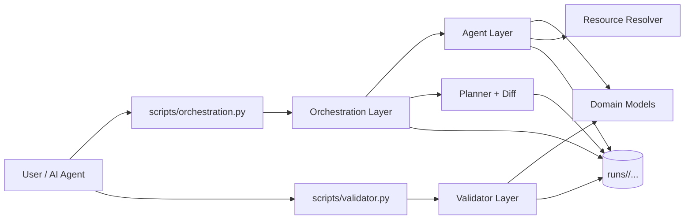
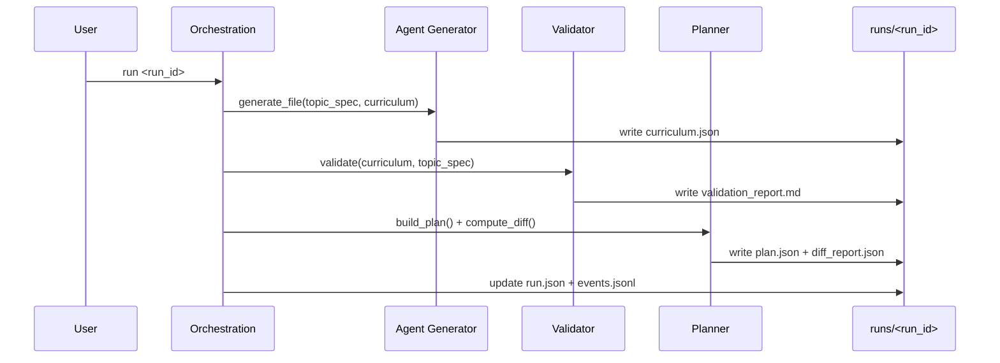
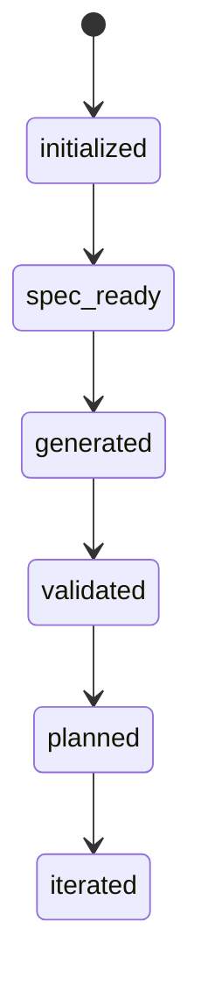

# curriculum-builder

Agent-first learning compiler that turns a `topic_spec.json` into a validated curriculum DAG and an executable learning plan.

Core loop:
`Spec -> Generate -> Validate -> Plan -> Iterate`

Evidence strictness is a dial, not a fork:
`minimal | standard | strict`

## Quickstart

- `make setup`
- `make orchestration-start RUN_NAME="quantum-neural-networks"`
- fill `runs/<run_id>/inputs/topic_spec.json`
- `make orchestration-run RUN_ID="<run_id>"`
- inspect `runs/<run_id>/outputs/curriculum/curriculum.json`

## Architecture

### High-level system



### Module responsibilities

- `learning_compiler/agent/`: generation engine, topic-spec normalization, node construction, resource resolver contracts.
- `learning_compiler/validator/`: deterministic quality gate for schema, graph, evidence, and node-quality checks.
- `learning_compiler/orchestration/`: run lifecycle, stage sync, reports, artifact persistence, planning, diffing.
- `learning_compiler/domain/`: typed domain models (`TopicSpec`, `Curriculum`, `CurriculumNode`, etc.).
- `learning_compiler/api.py`: stable public API facade (`AgentAPI`, `ValidatorAPI`, `OrchestrationAPI`).
- `learning_compiler/errors.py`: typed error taxonomy and stable exit-code mapping.
- `learning_compiler/config.py`: centralized runtime configuration.

### Code structure patterns (industry baseline)

- Thin CLI / rich core:
  - `scripts/*.py` are wrappers only.
  - business logic lives in `learning_compiler/*`.
- Typed protocol boundaries:
  - generation contracts (`CurriculumGenerator`, `ResourceResolver`) are interface-driven.
  - domain payloads are modeled as dataclasses in `learning_compiler/domain/`.
- Explicit run metadata model:
  - orchestration uses `RunMeta` instead of ad-hoc dict mutation.
- Fresh-run artifact contract:
  - run metadata is validated strictly; incompatible local runs should be re-initialized.
- Structured operational traces:
  - lifecycle events are standardized and appended to `logs/events.jsonl`.
- Centralized configuration:
  - path and environment resolution is handled by `learning_compiler/config.py`.

## Pipeline Design

### Runtime flow



### Run lifecycle state machine



## Design Patterns Used

- Compiler pipeline pattern: strict staged transformation and validation.
- Proposer/Judge split: agent proposes, validator decides acceptance.
- Orchestrator pattern: orchestration coordinates work without owning generation intelligence.
- Functional core / imperative shell: deterministic core logic wrapped by thin CLI/process shell.
- Strategy/DI pattern: generation and resource resolution are interface-driven and injectable.
- State machine pattern: explicit run stage progression synchronized from artifacts.

## Why This Is Staff-Level Agentic Engineering

- Clear domain boundaries: agent, validator, orchestration have explicit responsibilities.
- Typed contracts over ad-hoc dict flow: domain models and API facade reduce ambiguity.
- Reliability-first data model: immutable run artifacts under `runs/<run_id>/...`.
- Determinism as policy: reproducible generation/planning with documented guarantees.
- PoC speed with explicit contracts: regenerate run artifacts on incompatible schema changes.
- Quality gates in CI: syntax, architecture boundary checks, validator checks, tests, and coverage threshold.
- Operational traceability: standardized run events and stage history.

## Canonical Artifacts

Per run (`runs/<run_id>/`):
- `inputs/topic_spec.json`
- `outputs/curriculum/curriculum.json`
- `outputs/reviews/validation_report.md`
- `outputs/plan/plan.json`
- `outputs/reviews/diff_report.json`
- `logs/events.jsonl`
- `run.json`

## Commands

General:
- `make setup`
- `make dev`
- `make test`
- `make validate`
- `make gate`
- `make static-check`
- `make coverage-check`

`make validate` defaults to the latest generated run curriculum when path is omitted.

Orchestration:
- `make orchestration-start RUN_NAME="<topic-slug>"`
- `make orchestration-list`
- `make orchestration-status RUN_ID="<run_id>"`
- `make orchestration-next RUN_ID="<run_id>"`
- `make orchestration-validate RUN_ID="<run_id>"`
- `make orchestration-plan RUN_ID="<run_id>"`
- `make orchestration-iterate RUN_ID="<run_id>"`
- `make orchestration-run RUN_ID="<run_id>"`
- `make orchestration-archive RUN_ID="<run_id>"`

Direct CLI:
- `python3.11 scripts/orchestration.py init "<topic-slug>"`
- `python3.11 scripts/orchestration.py run <run_id>`
- `python3.11 scripts/orchestration.py validate <run_id>`
- `python3.11 scripts/orchestration.py plan <run_id>`
- `python3.11 scripts/orchestration.py iterate <run_id>`
- `python3.11 scripts/orchestration.py status <run_id>`
- `python3.11 scripts/orchestration.py next <run_id>`
- `python3.11 scripts/orchestration.py archive <run_id>`
- `python3.11 scripts/orchestration.py list`
- `python3.11 scripts/validator.py [curriculum.json] --topic-spec <topic_spec.json>`

## Topic Spec Contract

Detailed contract is in `prompts/topic_spec.md`.

Top-level fields:
- `spec_version`
- `goal`
- `audience`
- `prerequisites`
- `scope_in`
- `scope_out`
- `constraints`
- `domain_mode`
- `evidence_mode`
- `misconceptions` (optional)

`constraints` fields:
- `hours_per_week` (> 0)
- `total_hours_min` (> 0)
- `total_hours_max` (> 0)
- `depth` (`survey|practical|mastery`)
- `node_count_min` (optional int)
- `node_count_max` (optional int)
- `max_prerequisites_per_node` (optional int >= 1)

Enum meanings:
- `depth`: `survey`, `practical`, `mastery`
- `domain_mode`: `mature`, `frontier`
- `evidence_mode`: `minimal`, `standard`, `strict`

## UI

- Run `make dev`
- Open `http://localhost:4173/app/`
- Default behavior: loads latest available run curriculum from `runs/<run_id>/outputs/curriculum/curriculum.json`
- Fallback: load a local JSON via file picker

## Quality Gate

Run before handoff:

```bash
make gate
```

Gate includes:
- syntax checks
- static architecture checks
- curriculum validation
- tests
- statement coverage threshold check (stdlib trace-based)

Supporting docs:
- `docs/determinism.md`
- `docs/agentic-engineering-map.md`
