# Agent Runtime

This document describes generation runtime behavior, provider modes, and troubleshooting.

## 1. Runtime Components

- `learning_compiler/agent/generator.py`
  - entrypoint for curriculum generation and trace persistence.
- `learning_compiler/agent/planning/spec.py`
  - normalization from raw topic spec to `GenerationSpec`.
- `learning_compiler/agent/optimizer.py`
  - loop controller for iterative optimization.
- `learning_compiler/agent/planning/proposer.py`
  - initial draft proposal stage.
- `learning_compiler/agent/quality/pedagogy_critic.py`
  - deterministic learner-path critique.
- `learning_compiler/agent/quality/model.py`
  - deterministic multi-dimension score model.
- `learning_compiler/agent/quality/planner.py`
  - diagnostics to repair actions.
- `learning_compiler/agent/quality/executor.py`
  - deterministic patches + provider-mediated repair pass.
- `learning_compiler/agent/llm/client.py`
  - public facade and provider factory.
- `learning_compiler/agent/llm/remote.py`
  - remote Responses API provider implementation.
- `learning_compiler/agent/llm/codex.py`
  - `codex exec` provider implementation.
- `learning_compiler/agent/llm/schema.py` and `learning_compiler/agent/llm/prompt.py`
  - strict schema and prompt/parse helpers reused by provider adapters.

## 2. End-to-End Runtime Flow

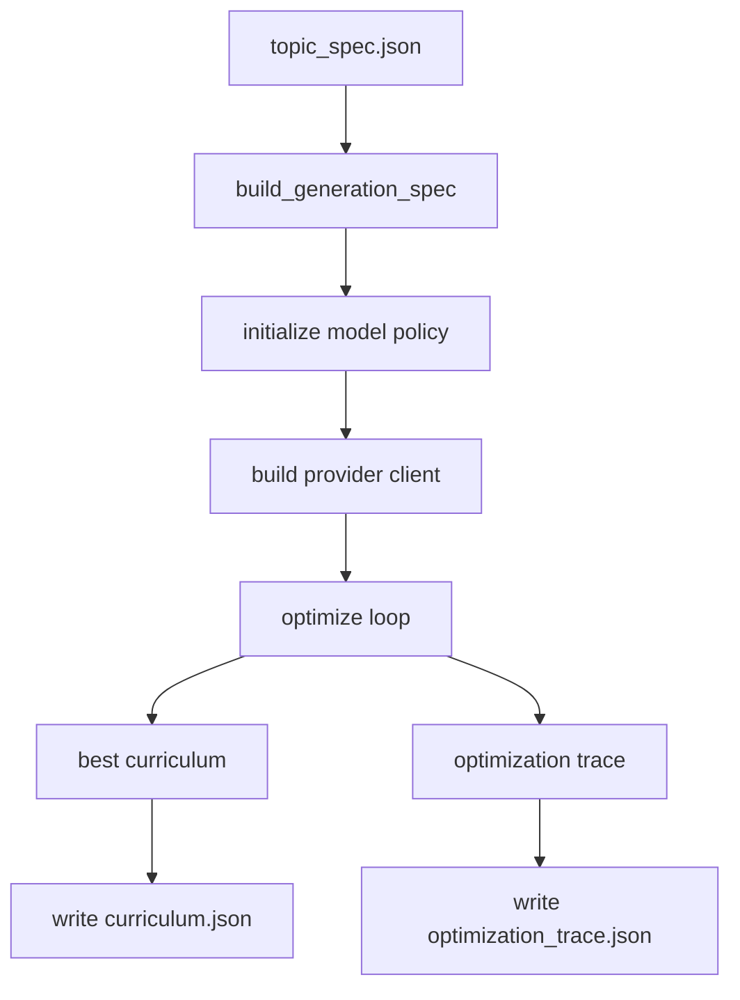

## 3. Optimization Loop

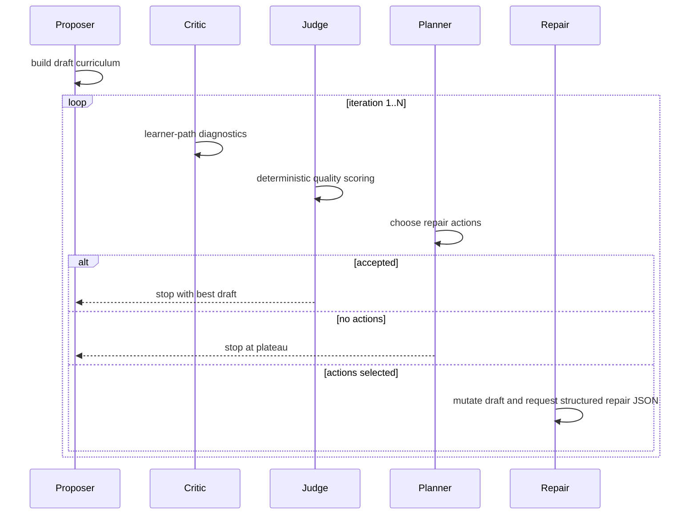

Acceptance condition:
- no hard-fail diagnostics
- score >= `AGENT_TARGET_SCORE`
- pedagogy minimum quality satisfied

## 4. Provider Selection Flow

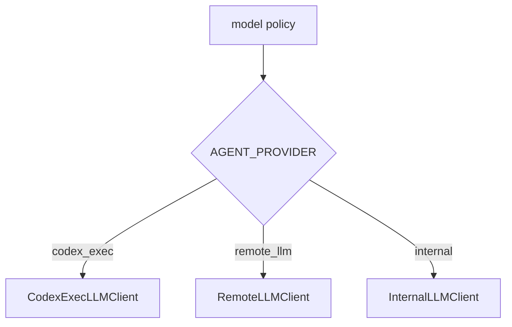

## 5. Provider Modes and Flows

### `codex_exec` (default)

- uses CLI subprocess: `CODING_AGENT_CMD exec - ...`
- enforces strict output schema via `--output-schema`
- reads final message from `--output-last-message`
- retries according to retry budget

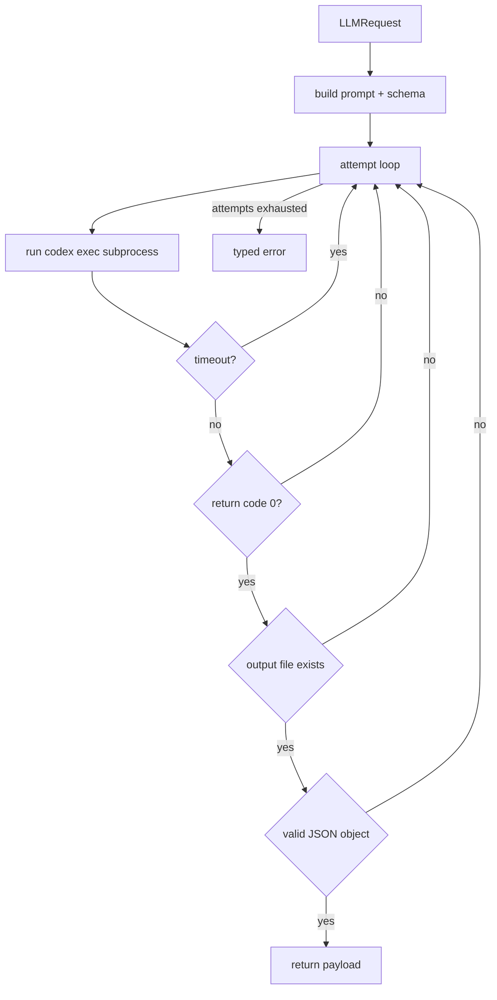

Typical use:

```bash
AGENT_PROVIDER=codex_exec \
CODING_AGENT_CMD=codex \
python3.11 scripts/orchestration.py run <run_id>
```

### `remote_llm`

- uses HTTP `POST <OPENAI_BASE_URL>/responses`
- sends strict JSON schema format request
- extracts structured payload from response blocks
- retries retryable network/HTTP failures

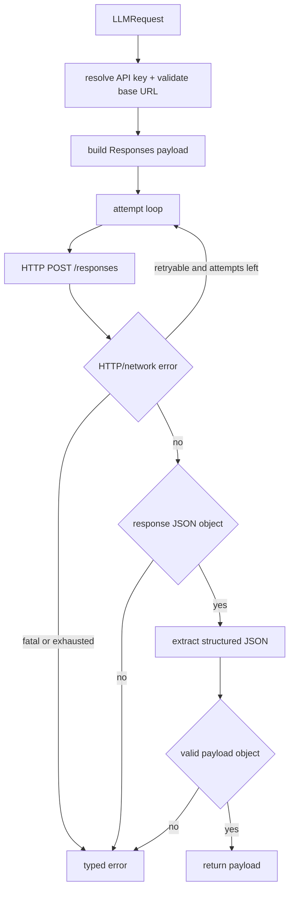

Typical use:

```bash
AGENT_PROVIDER=remote_llm \
AGENT_MODEL=gpt-4.1-mini \
OPENAI_API_KEY=<key> \
python3.11 scripts/orchestration.py run <run_id>
```

### `internal`

- deterministic internal client
- no remote API and no CLI model call
- useful for deterministic tests and fast local checks

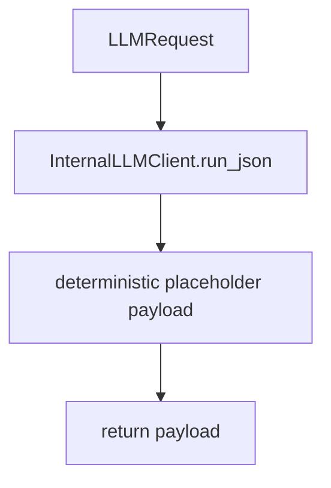

## 6. Runtime Policy and Config Flow

Policy source:
- `learning_compiler/agent/model_policy.py`

Key env vars:
- `AGENT_PROVIDER` (`codex_exec|remote_llm|internal`)
- `AGENT_MODEL`
- `CODING_AGENT_CMD`
- `OPENAI_API_KEY`
- `OPENAI_BASE_URL`
- `AGENT_MAX_ITERATIONS`
- `AGENT_MAX_ACTIONS_PER_ITERATION`
- `AGENT_TARGET_SCORE`
- `AGENT_TIMEOUT_SECONDS`
- `AGENT_RETRY_BUDGET`
- `AGENT_SCOPE_TEXT_MAX_CHARS`

Defaults:
- provider: `codex_exec`
- timeout: `300s` for `codex_exec`, `30s` for others
- retry budget default: `1`

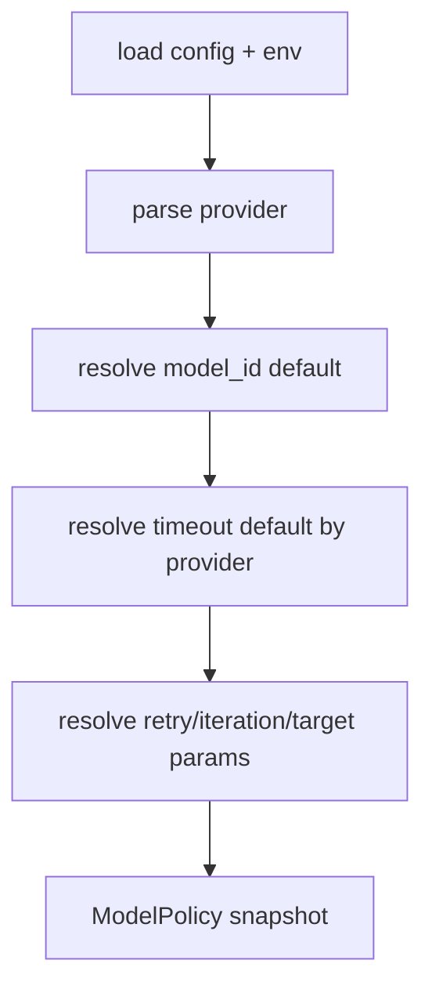

## 7. Structured Output Contract Flow

Provider calls are schema-constrained:
- proposer schema: `proposer_curriculum_v1`
- repair schema: `repair_curriculum_v1`

Schema requires:
- top-level object with `curriculum`
- node list with required typed fields
- resource and mastery object shapes
- no additional properties

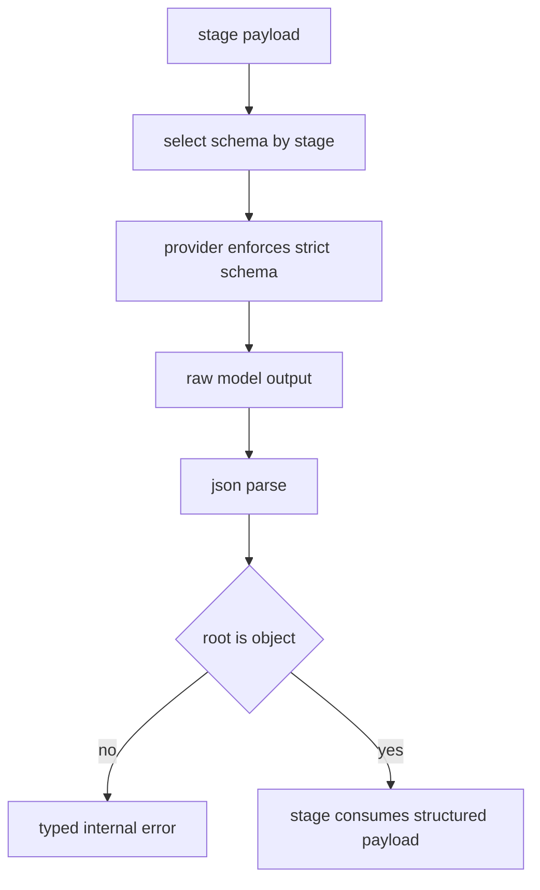

## 8. Prompt/Payload Strategy Flow

Agent runtime uses compact payloads for LLM stages:
- compact topic spec subset
- compact curriculum projection (`id`, `title`, `prerequisites`, `estimate_minutes`)
- optional scope document payload with truncation guard

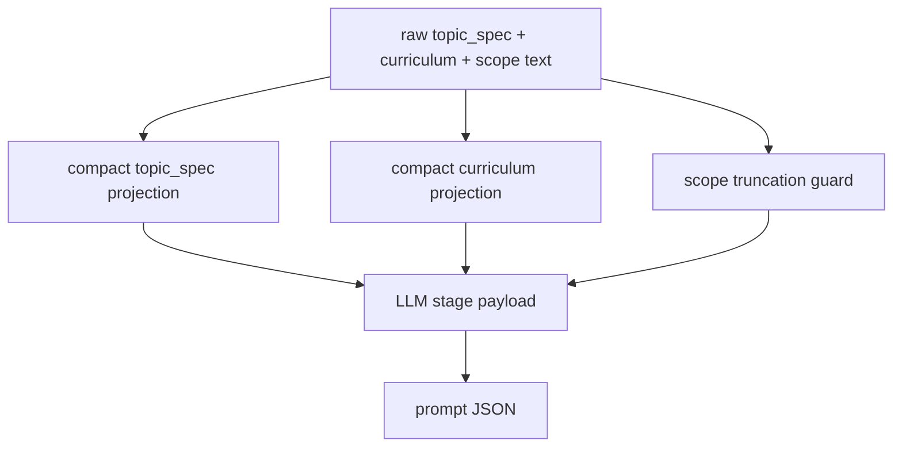

## 9. Reliability and Troubleshooting Flow

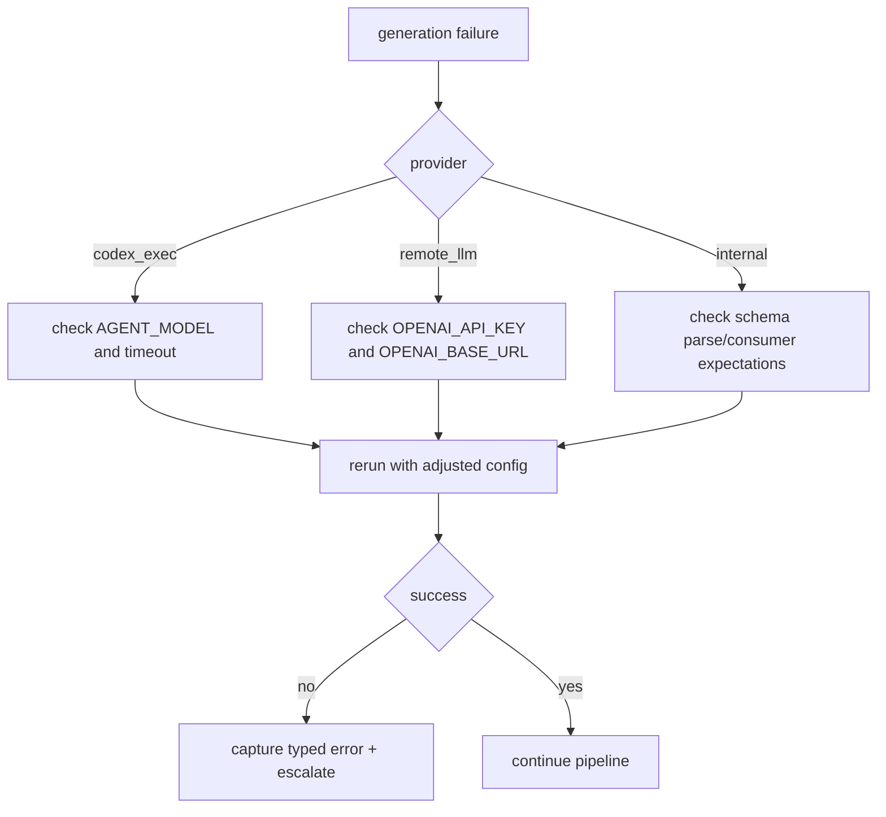

### Error: `codex_exec mode failed to return valid structured JSON`

Likely causes:
- model timeout
- malformed model output not matching schema
- incompatible model override in chat-authenticated codex mode

Checks:
1. unset `AGENT_MODEL` for `codex_exec` if using account default routing
2. increase `AGENT_TIMEOUT_SECONDS`
3. confirm `CODING_AGENT_CMD` points to working `codex` binary

### Error: invalid `OPENAI_BASE_URL`

- ensure `OPENAI_BASE_URL` includes valid `http://` or `https://` scheme
- verify hostname is present

### Error: `OPENAI_API_KEY is required`

- only applies to `AGENT_PROVIDER=remote_llm`
- set `OPENAI_API_KEY` or switch provider to `codex_exec`/`internal`

## 10. Extension Guide Flow

To add a new provider:
1. extend `ModelProvider` enum and parsing.
2. implement `LLMClient.run_json` behavior.
3. wire client construction in `build_llm_client`.
4. add tests for retries, timeout, malformed output, and config errors.
5. document env vars and defaults.

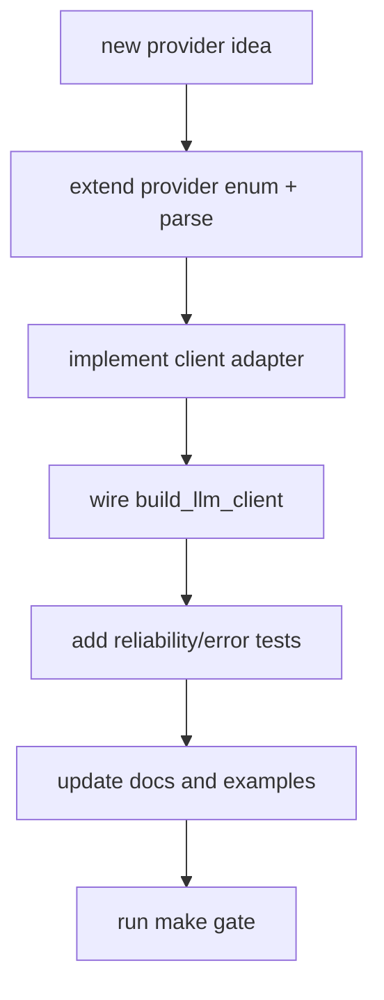
