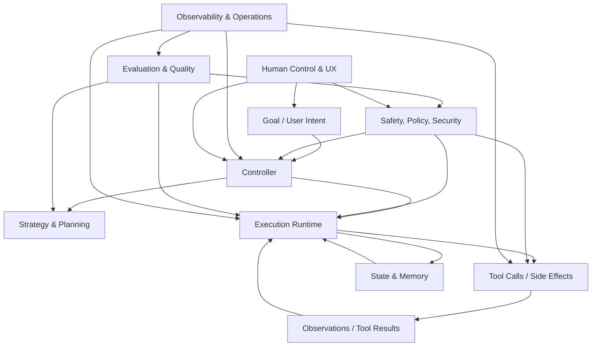

# Agentic Engineering Atlas: A Systems Map from Field to Implementation

## Abstract

Agentic engineering is the engineering discipline concerned with building **agentic systems**: software that uses a model (often a large language model) to **form plans, choose actions, call tools, and update state** in a closed feedback loop. This chapter provides a structured map of the field **from the highest level (L0: field) down to concrete implementation tactics (L4)**, with particular attention to *engineering precision*: interfaces, invariants, failure modes, tests, and operational concerns. It is written as both (i) a conceptual reference for the domain and (ii) a pragmatic roadmap for evolving a proof-of-concept repository into a production-grade system.

---

## 0. Reader’s guide

### 0.1 What this chapter is (and is not)

This document is simultaneously:

- A **taxonomy** of agentic engineering methods (planning, runtime, memory, safety, evaluation, operations, UX, governance).
- A **capability map** that connects abstract methods to implementable primitives.
- A **repo-oriented coverage snapshot** plus **recommended target additions** for missing capabilities.

This document is not a literature survey; it is a **systems engineering map**. Citations are intentionally omitted in favor of reproducible implementation guidance and search terms.

### 0.2 How to use the granularity levels

The chapter uses a five-level model:

| Level | Name | Primary question | Artifact produced |
| --- | --- | --- | --- |
| **L0** | Field | Which engineering domain are we in? | Capability boundary |
| **L1** | Method family | What class of approaches exists in this field? | Design approach |
| **L2** | Technique / named pattern | Which concrete pattern can be studied and applied? | Pattern card |
| **L3** | Implementation primitives | What components and contracts are needed in code? | Interfaces + invariants |
| **L4** | Concrete implementation | What exact code/tests/artifacts should exist? | Modules + tests + docs |

A practical rule: **L2 is where “named ideas” live; L3 is where you force them to be real.** A system that stops at L2 is a slide deck; a system that reaches L3/L4 is an engineering artifact.

### 0.3 Status legend

- **Strong**: implemented + exercised by tests and/or a quality gate.
- **Partial**: present but limited depth, hardening, or operational coverage.
- **Missing**: not implemented yet.

### 0.4 Scope split: Atlas vs Repo Map

- `docs/agentic-engineering-atlas.md` (this file) is the **breadth atlas** of the field, with repo examples and recommended target modules.
- `docs/agentic-engineering-map.md` is the **current repo implementation map** and should be treated as the source of truth for exact present-state coverage.

---

## 1. Definition and scope

### 1.1 Working definition: agentic systems

An agentic system is any system that repeatedly executes a loop resembling:

1. **Observe**: assemble context about the user intent and environment.
2. **Decide**: infer goals, plan actions, select tools or functions.
3. **Act**: call tools, modify state, produce outputs.
4. **Learn/update**: update memory/state; adjust plan or policy.

This loop may be explicit (a “ReAct-style loop”) or staged (a pipeline that emulates the loop across steps). The defining property is **feedback**: tool results or state changes influence subsequent decisions.

### 1.2 Agentic engineering versus adjacent disciplines

Agentic engineering overlaps with, but is not reducible to:

- **Prompt engineering** (local prompt shaping): necessary but insufficient.
- **Distributed systems** (retries, idempotency, consistency): essential for tool-heavy agents.
- **Security engineering** (least privilege, auditability): required when tools have side effects.
- **Testing and evaluation engineering** (determinism tests, scenario evals): mandatory because behavior is probabilistic.
- **Product engineering** (UX, control surfaces): agents require controllability.

The “agentic” twist is that the system’s behavior emerges from the interaction of:
- a probabilistic model,
- a tool/environment interface,
- and runtime control logic.

### 1.3 Design constraint: side effects are the cliff edge

Tools create side effects: sending messages, writing files, modifying tickets, executing code, spending money. For agentic systems, **the risk budget is dominated by side effects**, not by text generation. This motivates policy enforcement, human approvals, idempotency, audit trails, and structured evaluation.

---

## 2. Reference architecture: the agentic stack

### 2.1 Big-picture control loop

### 2.2 Architectural responsibilities (informal contracts)

A robust agentic architecture assigns responsibility explicitly:

- **Controller**: orchestrates the loop, manages stages, and enforces stop conditions.
- **Planner**: produces a plan artifact (or plan fragments) with explicit assumptions.
- **Executor**: performs steps; validates tool inputs/outputs; handles retries/timeouts.
- **Tool layer**: exposes tools via typed schemas; enforces least privilege; provides idempotency hooks.
- **State & memory**: stores ephemeral run state and long-term knowledge; provides provenance.
- **Safety/policy/security**: enforces constraints; mediates side effects; performs risk gating.
- **Evaluation**: offline and online measurement; regression harness; scenario suites.
- **Observability & operations**: logs, metrics, traces, costs, runbooks, postmortems.
- **Human control & UX**: approvals, overrides, explanations, and safe abort/resume.

A useful mental model: **the model is a component, not the system**. The system is the runtime that contains the model.

---

## 3. Granularity model (L0–L4)

### 3.1 L0 fields (domains of engineering work)

Fields are the “capability buckets” that determine team ownership and review structure. If a system fails, it almost always fails in a specific field:
- planning error,
- memory corruption,
- unsafe tool call,
- missing eval coverage,
- operational blind spot,
- poor user control.

### 3.2 L1 method families

Method families group approaches that solve the same problem class (e.g., planning via search, planning via constraints, planning via decomposition).

### 3.3 L2 patterns

L2 patterns are named techniques that can be implemented and tested. Examples:
- **ReAct** (reason–act–observe loop),
- **Plan-and-Execute** (separate plan and executor),
- **RAG** (retrieval augmented generation),
- **Circuit breaker** (runtime failure containment),
- **Golden file tests** (regression assurance).

### 3.4 L3 primitives

L3 primitives are the “atoms” of implementation:
- interfaces/protocols,
- data models,
- state machines,
- error taxonomies,
- artifact contracts,
- event schemas,
- tool schemas.

### 3.5 L4 concrete implementation

L4 is the ground truth: the actual modules, tests, scripts, and docs. L4 should be reviewable without reading prompts. A stable agentic system is **artifact-driven**.

---

## 4. Repository coverage overview

This chapter assumes an existing codebase (a proof-of-concept and learning environment). Paths below are either:
- current modules that exist now, or
- recommended target modules for missing capabilities.

### 4.1 L0 field map and current coverage

| L0 Field | Coverage in this repo |
| --- | --- |
| Strategy and Planning | Strong |
| State and Memory | Strong |
| Tooling and Execution Runtime | Strong |
| Reliability and Safety | Strong |
| Evaluation and Quality Engineering | Strong |
| Observability and Operations | Partial |
| Human Interface and Product Control | Partial |
| **Security, Privacy, and Governance** | Missing (explicitly modeled) |

The final field (security/privacy/governance) is called out separately because many PoCs implicitly assume trust. In production, trust must be engineered.

### 4.2 What “coverage” means (engineering definition)

Coverage does not mean “feature exists.” It means:

- **A contract exists** (types/schemas).
- **Failure modes are handled** (typed errors, idempotency, retries).
- **Behavior is verified** (tests/evals).
- **Operations are feasible** (logs/metrics/runbooks).
- **Users are protected** (policy and control surfaces).

---

# Part I — Field chapters (L0) with method maps (L1–L4)

## 5. L0: Strategy and Planning

### 5.1 Purpose and boundary

Planning converts intent into an actionable structure: tasks, dependencies, constraints, and schedules. It produces **plans as artifacts** that can be inspected, validated, tested, and replayed.

### 5.2 Engineering invariants

A planning subsystem should make the following invariants true:

- **Explicitness**: the plan is a concrete artifact (e.g., `plan.json`), not an implicit prompt.
- **Stability under determinism**: in deterministic mode, identical inputs yield identical plans.
- **Feasibility**: dependencies are acyclic; constraints are satisfiable or failure is explicit.
- **Auditability**: planning decisions can be explained via structured metadata, not hidden reasoning.

### 5.3 L1–L4 breakdown

| L1 Method family | L2 Technique/pattern | L3 Implementation primitives | L4 Concrete implementation in this repo | Status | Search terms |
| --- | --- | --- | --- | --- | --- |
| Deterministic curriculum decomposition | Constraint-aware planning | Constraint model, deterministic node target calculator, title seeding | `learning_compiler/agent/spec.py` (`target_nodes`, `target_minutes`, `seed_titles`) | Strong | `constraint-aware planning deterministic` |
| Dependency-aware sequencing | DAG topological ordering | Node map, indegree tracking, stable ordering rules | `learning_compiler/orchestration/planning.py` (`topological_order`) | Strong | `topological sort planning dag` |
| Schedule estimation | Critical path analysis | Duration model, longest-path reconstruction | `learning_compiler/orchestration/planning.py` (`compute_critical_path`) | Strong | `critical path method dag` |
| Iterative curriculum optimization | Propose -> Critique -> Judge -> Repair | Loop controller, critic diagnostics, deterministic acceptance, typed repair actions | `learning_compiler/agent/optimizer.py`, `pedagogy_critic.py`, `quality_model.py`, `repair_planner.py`, `repair_executor.py` | Strong | `iterative dag optimization llm critic judge` |
| Agent loop control | ReAct | Loop state, tool selection policy, stop criteria | Not implemented (current flow is staged pipeline, not a live loop) | Missing | `ReAct prompting` `reason act observe loop` |
| Agent loop control | Plan-and-Execute | Separate planner/executor modules, plan artifact, execution cursor | Partially represented by `generate → validate → plan → iterate` pipeline | Partial | `plan and execute agents` |
| Self-correction | Reflexion / critic loop | Critique pass, repair action planning, bounded iteration stop rule | `learning_compiler/agent/pedagogy_critic.py`, `learning_compiler/agent/repair_planner.py`, `learning_compiler/agent/optimizer.py` | Strong | `Reflexion agent` `self critique llm` |
| Search-based planning | Tree/Graph of Thought | Branching plan candidates, scoring, pruning, budget | Not implemented | Missing | `tree of thought` `graph of thought` |
| Formal planning | HTN / symbolic planners | Task schemas, preconditions/effects, planner interface | Not implemented | Missing | `hierarchical task network planning` |
| Constraint solving | SAT/SMT-backed planning | Constraint encoding, solver adapter, unsat cores | Not implemented | Missing | `SMT solver scheduling` |

### 5.4 Implementation guidance for missing planning loops

**ReAct (bounded) implementation sketch (L4):**
- Add an explicit loop runner (e.g., `learning_compiler/agent/loop_react.py`) that owns:
  - a `LoopState` dataclass (step index, tool budget, observation buffer, termination reason),
  - a `ToolPolicy` interface for selecting tools,
  - and a `StopPolicy` for termination conditions.
- Ensure a **tool budget** and **max steps** are enforced; treat budget exhaustion as a first-class termination.
- Record each iteration as a **structured event** (see observability field).

**Verification expectations (tests):**
- Determinism test in “fixed seed mode” (same observations → same tool calls).
- Budget enforcement tests (max steps and max tool calls).
- Negative tests for invalid tool result schemas.

### 5.5 Current competence map

This repository already demonstrates:

- Deterministic planning under constraints.
- DAG planning and critical-path reasoning.
- Plans as stable artifacts.

The next step is to incorporate **dynamic loop strategies** while preserving determinism under test configurations.

---

## 6. L0: State, Memory, and Knowledge Management

### 6.1 Purpose and boundary

State is the “physics” of the system: what is true between steps. Memory extends state across time. In agentic systems, the principal risk is not “forgetting”; it is **remembering incorrectly** (stale artifacts, inconsistent snapshots, hallucinated provenance).

### 6.2 Engineering invariants

- **Explicit lifecycle**: state transitions are explicit and validated.
- **Freshness**: derived artifacts must be invalidated when upstream changes.
- **Provenance**: every artifact can be traced to the run metadata.
- **Isolation**: runs do not cross-contaminate state unless explicitly merged.

### 6.3 L1–L4 breakdown

| L1 Method family | L2 Technique/pattern | L3 Implementation primitives | L4 Concrete implementation in this repo | Status | Search terms |
| --- | --- | --- | --- | --- | --- |
| Workflow state control | Explicit state machine | Stage enum, stage order, stage sync rules | `learning_compiler/orchestration/types.py`, `learning_compiler/orchestration/stage.py` | Strong | `state machine workflow orchestration` |
| Artifact consistency | Freshness/marker checks | Marker files, dependency mtime checks | `validation_is_current`, `plan_is_current`, `diff_is_current` in `learning_compiler/orchestration/stage.py` | Strong | `artifact freshness check` |
| Metadata contracts | Strict typed run metadata | Typed model, schema validation, fail-fast parse | `learning_compiler/orchestration/meta.py`, `learning_compiler/orchestration/fs.py` | Strong | `typed metadata schema validation` |
| Persistence strategy | Fresh-run contract | Re-init policy for incompatible local artifacts | Documented in `AGENTS.md` + strict run metadata load errors | Strong | `poc fresh-run contract` |
| Long-term semantic memory | Retrieval memory (RAG) | Embeddings/index, retrieval policy, memory write/read API | Not implemented | Missing | `agent long term memory retrieval` |
| Long-term episodic memory | Interaction summaries | Summarizer, temporal index, provenance fields | Not implemented | Missing | `episodic memory llm agents` |
| Checkpointing/rollback | Execution checkpoint model | Snapshot protocol, resume cursor, rollback procedure | Not implemented | Missing | `workflow checkpoint rollback` |
| Consistency models | Versioned state | Content-addressed artifacts, DAG of artifacts | Not implemented | Missing | `content addressed storage artifacts` |
| Semantic caching | Cache for model/tool results | Cache key design, TTL, invalidation rules | Not implemented | Missing | `semantic cache llm` |

### 6.4 Implementation guidance for semantic memory (RAG)

A production memory subsystem typically requires:

- A **write API**: `remember(document, tags, provenance)`.
- A **read API**: `recall(query, k, filters)`.
- A **policy layer**: limits what may be remembered (privacy) and when memory is authoritative.
- A **provenance model**: where did this fact come from? When was it last validated?

**Verification expectations (tests):**
- Deterministic embedding mode for tests (stub embeddings or fixed vectors).
- Retrieval ranking stability tests.
- Privacy policy tests: prohibited content is not stored.

---

## 7. L0: Tooling and Execution Runtime

### 7.1 Purpose and boundary

The runtime is the “operating system” of the agent: it determines how plans are executed, how tools are called, how failures propagate, and how work is resumed. In agentic systems, the runtime must be engineered as if it were a distributed system, because tool calls are remote, flaky, and side-effectful.

### 7.2 Engineering invariants

- **Tool calls are typed**: inputs and outputs are validated against schemas.
- **Side effects are controlled**: idempotency, retries, and compensations are explicit.
- **Failures are classifiable**: transient vs permanent vs policy violations.
- **Progress is resumable**: state and artifacts allow continuation.

### 7.3 L1–L4 breakdown

| L1 Method family | L2 Technique/pattern | L3 Implementation primitives | L4 Concrete implementation in this repo | Status | Search terms |
| --- | --- | --- | --- | --- | --- |
| Command orchestration | Thin CLI / rich core | Parser dispatch + module handlers | `learning_compiler/orchestration/cli.py`, `commands_basic.py`, `commands_pipeline.py` | Strong | `thin cli rich core` |
| Tool abstraction | Dependency injection via protocol | Generator contract interface | `learning_compiler/agent/contracts.py` + orchestration usage | Strong | `python protocol dependency injection` |
| Provider runtime modes | Strategy selection (`internal`, `coding_agent`) | Policy model, provider selection, structured client factory | `learning_compiler/agent/model_policy.py`, `learning_compiler/agent/llm_client.py`, `learning_compiler/config.py` | Strong | `model provider strategy pattern` |
| Safe command inputs | Input contract hardening | `run_id` regex + path containment checks | `learning_compiler/orchestration/command_utils.py`, `learning_compiler/orchestration/fs.py` | Strong | `path traversal prevention pathlib` |
| Idempotent progression | Repeat-safe command behavior | Stage sync + marker validation before actions | `sync_stage` + pipeline command flow | Partial | `idempotent orchestration commands` |
| Failure semantics | Typed error propagation | Domain error taxonomy + stable exit codes | `learning_compiler/errors.py` | Strong | `typed error taxonomy cli` |
| Resilience controls | Timeout + retry budget | timeout seconds, retry budget, stage-specific failure handling | `learning_compiler/agent/model_policy.py`, `learning_compiler/agent/llm_client.py` | Partial | `timeout retry budget llm pipeline` |
| Runtime isolation | Circuit breaker / bulkhead | Failure counters, open/half-open states | Not implemented | Missing | `circuit breaker pattern` |
| Concurrency control | Work queues | Task queue, leases, cancellation | Not implemented | Missing | `task queue lease cancellation` |
| Sandboxing | Restricted execution environment | Permissions, resource limits, syscall controls | Not implemented | Missing | `sandboxed execution python` |

### 7.4 Implementation guidance for retries and idempotency

Retries in agentic systems are not optional; they are a cost of interacting with external services. However, retries must be **typed and bounded**:

- Only retry **transient** failures (timeouts, 5xx, rate limits).
- Never retry **policy violations** or **schema violations**.
- Always enforce an **attempt budget** and **deadline**.
- For side-effecting tools, require an **idempotency key** or a compensating action.

**Verification expectations (tests):**
- Simulated transient tool errors cause retries with backoff.
- Permanent errors do not retry.
- Idempotency: repeated execution does not duplicate effects.

---

## 8. L0: Reliability, Safety, and Policy Enforcement

### 8.1 Purpose and boundary

Reliability and safety constrain what the system is allowed to do, and how it behaves under uncertainty and adversarial inputs. In agentic systems, safety is not a wrapper; it is a **first-class subsystem** that shares responsibility for tool calls and state updates.

### 8.2 Engineering invariants

- **Validation precedes execution**: tool calls and plans are validated before side effects occur.
- **Policies are enforceable**: safety rules are deterministic and testable (policy-as-code).
- **Failure is safe**: invalid state leads to controlled termination, not unsafe actions.
- **Adversarial robustness**: malformed inputs do not compromise the system.

### 8.3 L1–L4 breakdown

| L1 Method family | L2 Technique/pattern | L3 Implementation primitives | L4 Concrete implementation in this repo | Status | Search terms |
| --- | --- | --- | --- | --- | --- |
| Contract-first validation | Layered validator architecture | Separate schema/graph/evidence/quality modules | `learning_compiler/validator/*` split by responsibility | Strong | `layered validation architecture` |
| Structural safety | Schema and DAG guards | Required keys, ID checks, cycle/reachability checks | `curriculum_schema.py`, `curriculum_graph.py` | Strong | `dag validation cycle detection` |
| Evidence safety | Evidence strictness profiles | Mode-driven evidence requirements | `curriculum_evidence.py` + `EvidenceMode` | Strong | `evidence mode validation` |
| Failure taxonomy | Stable typed errors | Error enum + exit mapping + details | `learning_compiler/errors.py` | Strong | `domain errors exit codes` |
| Runtime hardening | Fail-safe orchestration | Catch conversion/type failures and return typed errors | `learning_compiler/orchestration/commands_pipeline.py` | Strong | `fail safe orchestration` |
| Policy enforcement | Policy engine | Declarative risk rules, policy DSL/config | Not implemented | Missing | `policy engine guardrails` |
| Adversarial hardening | Fuzzing / hostile input tests | Randomized malformed inputs and assertions | Not implemented | Missing | `property based testing fuzzing python` |
| Tool safety | Output shielding | Output filtering, schema enforcement, prompt injection defense | Not implemented | Missing | `prompt injection tool security` |
| Safety gating | Human-in-the-loop approvals | Approval protocol, decision logs | Not implemented | Missing | `human approval gate workflow` |

### 8.4 Implementation guidance: policy as code

A policy engine should be engineered like any other production component:

- Policies must be **deterministic** (no model calls).
- Policies operate on **structured data** (tool call requests, plan steps).
- Policies provide **explanations** (which rule blocked, what field triggered).

A minimal architecture:

- `PolicyInput` model (tool request, user context, risk attributes).
- `PolicyRule` interface (`evaluate(input) -> Decision`).
- `Decision` model (allow/deny/requires_approval + reason + remediation hints).
- Unit tests per rule; golden tests for policy bundles.

---

## 9. L0: Evaluation and Quality Engineering

### 9.1 Purpose and boundary

Agentic systems do not fail like deterministic programs. They fail like systems under uncertainty: drifting prompts, tool API changes, new user inputs, subtle regressions. Evaluation is the discipline that makes agentic behavior **measurable, regressible, and improvable**.

### 9.2 Engineering invariants

- **Determinism is testable**: under fixed seeds/configs, the system is reproducible.
- **Quality gates are enforceable**: checks are automated and fast enough to run routinely.
- **Evals evolve**: each incident becomes a test; each feature adds a scenario.

### 9.3 L1–L4 breakdown

| L1 Method family | L2 Technique/pattern | L3 Implementation primitives | L4 Concrete implementation in this repo | Status | Search terms |
| --- | --- | --- | --- | --- | --- |
| Regression quality | Fixture-based tests | Canonical sample artifacts | `tests/fixtures/curriculum.json`, `tests/test_curriculum_fixture.py` | Strong | `golden file testing` |
| Reproducibility assurance | Determinism tests | Repeat generation equality checks | `tests/test_agent_determinism.py`, `docs/determinism.md` | Strong | `deterministic test strategy` |
| Architectural quality | Static boundary checks | Import graph constraints | `scripts/static_checks.py`, `tests/test_architecture_boundaries.py` | Strong | `architecture boundary tests` |
| Gate automation | Quality gate script | syntax + static + validate + tests + coverage | `scripts/gate.sh`, `make gate` | Strong | `quality gate ci pipeline` |
| Incident-to-test loop | Regression capture | Tests added for discovered runtime bugs | `tests/test_orchestration_cli.py` additions | Strong | `bug regression test workflow` |
| Evals at scale | Scenario benchmark suite | Versioned eval datasets + score tracking | Not implemented | Missing | `llm eval harness regression` |
| Fault injection | Chaos/adversarial tests | Synthetic failures in runtime paths | Not implemented | Missing | `chaos testing workflow engine` |
| Oracle design | Proposer/Judge evals | Independent verifier (rule-based or model-based) | Partially present via generator/validator split | Partial | `proposer judge pattern` |

### 9.4 Implementation guidance: eval harness architecture

A scalable eval harness tends to require:

- **Scenario datasets**: versioned JSON/YAML describing inputs and expected properties.
- **Execution runner**: runs scenarios, collects traces, computes metrics.
- **Scoring**: rule-based checks + optional model-graded checks (with calibration).
- **Reporting**: trend charts, regressions, and per-scenario diffs.

A strong engineering stance: **make evals executable artifacts** in the repo, not spreadsheets.

---

## 10. L0: Observability and Operations

### 10.1 Purpose and boundary

Observability answers: “What happened? Why did it happen? How do we prevent it?” Operations answers: “Can we run this reliably at scale?” For agentic systems, operations must include **cost and latency**, because tool calls and model inference are metered.

### 10.2 Engineering invariants

- **Every run is auditable**: structured event logs with run metadata.
- **Errors are diagnosable**: error payloads contain context, not just strings.
- **Metrics exist**: latency, cost, failure rates, policy denials, tool usage.
- **Tracing exists**: ability to correlate tool calls and model calls across steps.

### 10.3 L1–L4 breakdown

| L1 Method family | L2 Technique/pattern | L3 Implementation primitives | L4 Concrete implementation in this repo | Status | Search terms |
| --- | --- | --- | --- | --- | --- |
| Transition logging | Structured run events | Standard event schema with metadata | `learning_compiler/orchestration/events.py`, `stage.py` | Strong | `structured event logging` |
| Run audit trail | Append-only history | Persisted run history in `run.json` and logs | `learning_compiler/orchestration/meta.py`, `runs/*/logs/events.jsonl` | Strong | `append only audit log` |
| Diagnostics | Error details payloads | Contextual details in typed errors | `learning_compiler/errors.py`, orchestration errors | Partial | `context rich error handling` |
| Operational metrics | Reliability/cost/latency metrics | Metric collector + summary artifact | Not implemented | Missing | `sli slo metrics pipeline` |
| Tracing | Distributed spans | Trace IDs, span boundaries | Not implemented | Missing | `opentelemetry python tracing` |
| Incident workflow | Runbooks/postmortems | Failure taxonomy + standard response docs | Not implemented | Missing | `incident runbook postmortem` |
| Cost control | Budgeting | Per-run cost caps, per-tool budgets | Not implemented | Missing | `cost budget llm tools` |

### 10.4 Implementation guidance: minimum viable ops layer

A minimal ops layer that materially improves reliability includes:

- `metrics.json` per run: tool call counts, retries, latency buckets, termination reasons.
- A `trace_id` in every event; propagation into tool calls.
- A runbook skeleton for top failure classes (timeouts, schema errors, policy denials).

---

## 11. L0: Human Interface and Product Control

### 11.1 Purpose and boundary

Human control is not an afterthought; it is the antidote to the unpredictability of autonomous behavior. The UI/UX surface defines what humans can see, approve, override, or abort.

### 11.2 Engineering invariants

- **State transparency**: operators can see what the system believes is true.
- **Intervention points**: humans can pause/approve/abort at meaningful boundaries.
- **Safety by UX**: UI makes risky actions difficult and visible.
- **Explanations are structured**: “why did it do that?” is answered via artifacts.

### 11.3 L1–L4 breakdown

| L1 Method family | L2 Technique/pattern | L3 Implementation primitives | L4 Concrete implementation in this repo | Status | Search terms |
| --- | --- | --- | --- | --- | --- |
| Operator guidance | Next-action hints | Stage→action mapping | `cmd_next` in `learning_compiler/orchestration/commands_basic.py` | Strong | `operator guidance workflow cli` |
| State transparency | Status dashboard command | Stage + artifact summary output | `cmd_status` in `learning_compiler/orchestration/commands_basic.py` | Strong | `status command design` |
| Visual inspection | DAG explorer UI | Graph render, node details, filters | `app/index.html`, `app/main.js`, `app/styles.css` | Strong | `curriculum dag inspector` |
| Safe rendering | HTML escaping for loaded JSON | Escape untrusted fields before `innerHTML` | `escapeHtml` usage in `app/main.js` | Strong | `xss escaping innerhtml` |
| Human approval loops | Approval checkpoints | Confirm-before-transition gates | Not implemented | Missing | `human in the loop approval workflow` |
| Guided remediation | Failure playbook UX | Actionable remediation flows in CLI/UI | Not implemented | Missing | `error remediation ux` |
| Explainability | Evidence-backed explanations | Explanation schema, citations/provenance fields | Partially present via evidence validation | Partial | `provenance explanation schema` |

### 11.4 Implementation guidance: approval gates

Approval gates should be implemented as a **protocol**, not a prompt:

- Add a `requires_approval` decision in the policy engine.
- Persist an `approval_request.json` artifact containing:
  - proposed action,
  - risk summary,
  - policy rule references,
  - remediation alternatives.
- Provide CLI/UI commands to:
  - approve (write `approval_granted.marker`),
  - deny (write `approval_denied.marker` + reason),
  - amend (edit plan step or tool args with audit trail).

---

## 12. L0: Security, Privacy, and Governance

### 12.1 Purpose and boundary

Security and governance constrain what the system may access and do, and how it is audited. In agentic systems this is unusually important because the agent may autonomously trigger side effects. Security is therefore a joint property of tools, runtime, and policy.

### 12.2 Engineering invariants

- **Least privilege**: tools expose the minimum required capability.
- **Data minimization**: only necessary data is stored or retrieved.
- **Auditability**: actions and decisions are logged with provenance.
- **Separation of duties**: high-risk actions require separate approval.
- **Privacy compliance**: memory does not become an unbounded data sink.

### 12.3 L1–L4 breakdown (recommended additions)

| L1 Method family | L2 Technique/pattern | L3 Implementation primitives | L4 Concrete implementation (recommended) | Status | Search terms |
| --- | --- | --- | --- | --- | --- |
| Access control | Capability-based tools | Tool scopes, permission model, allowlists | `security/capabilities.py`, `tool_registry.py` with per-tool scopes | Missing | `capability based security` |
| Prompt injection defense | Tool input sandboxing | Tool schema enforcement, content filters, denylists | `security/prompt_injection.py`, validators on tool args | Missing | `prompt injection tool defense` |
| Data governance | Memory retention/TTL | Retention policies, redaction, deletion protocol | `memory/retention.py` + tests | Missing | `data retention policy ttl` |
| Audit and compliance | Immutable audit log | Append-only logs, tamper detection | Extend `events.jsonl` with hash chaining | Missing | `audit log hash chain` |
| Secrets handling | Secret isolation | Secret store adapter, no secrets in prompts | `security/secrets.py` + CI checks | Missing | `secret scanning ci` |
| Abuse prevention | Rate limiting | Tool usage quotas, per-run budgets | `runtime/budgets.py` | Missing | `rate limit quota enforcement` |

This field is intentionally listed as a first-class L0 domain. In production, leaving it implicit is a design bug.

---

# Part II — Pattern catalog (L2) with engineering notes

## 13. Canonical agent loop patterns (L2 focus)

This section answers: **which named loop patterns exist, and what do they require to implement safely?**

| Pattern | Core idea | Typical failure mode | Present in this repo |
| --- | --- | --- | --- |
| **ReAct** | Iterative reason→act→observe loop with tool calls | Unbounded loops; unsafe tool choices | Missing |
| **Plan-and-Execute** | Produce a plan artifact; execute with a cursor | Planner/executor mismatch; stale plans | Partial (staged pipeline) |
| **Reflexion** | Self-critique and repair passes | Over-correction; endless self-review | Strong (critic + planner + repair loop) |
| **Proposer/Judge** | Generation separated from validation | Judge bottleneck or weak oracle | Strong |
| **Tree/Graph of Thought** | Branching reasoning exploration | Cost blow-up; selection bias | Missing |
| **Self-Ask** | Ask sub-questions; answer them iteratively | Sub-question drift | Missing |
| **Multi-agent debate** | Multiple agents propose/criticize | Groupthink; cost blow-up | Missing |
| **Toolformer-style tool use** | Model learns when to call tools | Tool misuse; schema mismatch | Missing |
| **Compiler pattern** | Model writes structured IR; runtime executes | IR drift; validator gaps | Strong (curriculum/plan artifacts) |

### Engineering note: bounded autonomy

For any loop pattern, safe implementation requires:

- **Budgeting** (steps, tool calls, cost).
- **Stop conditions** (success/failure/timeout).
- **Policy gates** before side effects.
- **Structured traces** for debugging.
- **Replayability** under test configurations.

---

## 14. Implementation primitive catalog (L3)

This section lists the most reusable implementation primitives across fields. The goal is a shared vocabulary and a shared “minimum standard” for new features.

### 14.1 Core data models

- `RunId`, `RunMeta`: stable run identity and configuration.
- `Stage`: explicit workflow stage state machine.
- `Plan`: structured plan artifact; includes versioning.
- `Step`: typed step with preconditions, inputs, expected outputs.
- `ToolCall`: tool name, schema version, arguments, idempotency key.
- `ToolResult`: typed outputs + error classification + raw payload (optional).
- `PolicyDecision`: allow/deny/require_approval + reason + remediation hints.
- `Event`: append-only structured logs for every state change and tool call.

### 14.2 Core interfaces (protocols)

- `Planner`: `(context) -> Plan`
- `Executor`: `(plan, cursor, context) -> ExecutionResult`
- `Tool`: `(args) -> result` with schema validation
- `MemoryStore`: `remember(...)`, `recall(...)`, `forget(...)`
- `PolicyEngine`: `evaluate(policy_input) -> PolicyDecision`
- `Evaluator`: `run(scenarios) -> Report`
- `Tracer/Metrics`: `record(event)`, `increment(metric)`

### 14.3 Core taxonomies (error and classification)

- Error class: `Transient` vs `Permanent` vs `PolicyViolation` vs `ValidationError`.
- Termination reasons: `Success`, `FailedValidation`, `ExceededBudget`, `PolicyDenied`, `ToolFailure`.

These taxonomies are not bureaucracy; they are what makes retries, runbooks, and metrics possible.

---

# Part III — Concrete roadmap: from PoC to production

## 15. Capability maturity model

A simple maturity model helps prevent premature complexity:

### 15.1 Phase 0 — Educational PoC

- Artifact-based pipeline (generate/validate/plan).
- Deterministic test mode.
- Typed errors and basic logs.

### 15.2 Phase 1 — Controlled autonomy (MVP)

- Add bounded ReAct for a sub-workflow.
- Add basic retries/timeouts.
- Add per-run metrics (`metrics.json`).
- Add policy engine with a small rule set.
- Add approval gate for high-impact tool calls.

### 15.3 Phase 2 — Production-grade autonomy

- Distributed tracing and correlation IDs.
- Scenario eval harness with trend tracking.
- Fault injection tests (simulated tool failures).
- Semantic memory with privacy policies and provenance.
- Runbooks and incident workflows.

### 15.4 Phase 3 — Scale and governance

- Multi-tenant isolation (if applicable).
- Formal policy bundles; review workflows.
- Compliance artifacts: retention, audit, access control.
- Cost optimization and caching.

---

## 16. Gap map: what is implemented versus what is next

| Domain | Implemented now (from this repo) | Recommended next capability |
| --- | --- | --- |
| Planning | Deterministic DAG and schedule planning | Dynamic action loops (`ReAct`, bounded search) |
| Runtime | Command orchestration and typed failures | Retries/backoff/timeouts/circuit breakers |
| State | Strict run metadata and stage sync | Checkpoints, rollback, semantic memory |
| Reliability | Layered validators and fail-fast contracts | Policy engines, fuzz/adversarial validation |
| Quality | Tests + gate + determinism checks | Eval harnesses, fault-injection testing |
| Ops | Structured run events/history | Metrics, tracing, SLOs, incident runbooks |
| Human control | Status/next + visual inspector | Approval gates and guided remediation |
| Security/governance | Not first-class yet | Capability controls, retention, audit hardening |

---

## 17. Suggested learning and implementation sequence (high leverage)

1. **Runtime resilience first**  
   Implement retries/backoff/timeouts, then a circuit breaker.  
   Rationale: tool instability is a dominant failure class and blocks adoption.

2. **Add one dynamic loop pattern (bounded)**  
   Implement ReAct within a constrained sub-workflow.  
   Rationale: closes the feedback loop while keeping blast radius small.

3. **Operationalize the system**  
   Add per-run metrics, basic tracing IDs, and runbooks.  
   Rationale: “we can run it” becomes true.

4. **Add human control maturity**  
   Add approval checkpoints before high-impact transitions.  
   Rationale: converts autonomy into “supervised autonomy.”

Every step should include:
- implementation changes,
- regression tests,
- an update to this chapter,
- and a passing `make gate` run.

---

## 18. Focused Track: Single-Agent Staff Path (No Multi-Agent/Scale Yet)

This section defines a high-leverage path when you intentionally defer:
- multi-agent architectures,
- distributed scale concerns,
- and multi-tenant complexity.

The objective is to reach **staff-level single-agent engineering rigor** first, then expand scope.

### 18.1 Scope constraints (intentional)

For this track:

- one agent loop/controller,
- bounded autonomy,
- deterministic acceptance gate,
- local/run-oriented artifact lifecycle.

Anything requiring multi-agent coordination or scale orchestration is explicitly out-of-scope for this phase.

### 18.2 Prioritized capability additions (L2 -> L4)

| Priority | Capability | L2 pattern | L3 primitives | L4 concrete implementation (recommended) | Acceptance evidence |
| --- | --- | --- | --- | --- | --- |
| P1 | Bounded loop runtime | Bounded autonomy | `LoopBudget`, `StopPolicy`, `TerminationReason` | Extend optimizer loop controls in `learning_compiler/agent/optimizer.py` and model policy in `learning_compiler/agent/model_policy.py` | Tests proving step/tool/time budgets hard-stop correctly |
| P1 | Policy gate before side effects | Policy-as-code gate | `PolicyInput`, `PolicyDecision`, deterministic `PolicyRule` interface | Add `learning_compiler/policy/engine.py` and enforce decision in tool-execution paths | Tests for allow/deny/require-approval outcomes |
| P1 | Retry + idempotency discipline | Typed retry policy | Error classifier (`Transient`/`Permanent`), idempotency key contract | Add retry classifier in runtime/LLM client paths and idempotency markers for side-effecting actions | Tests proving transient retries and permanent no-retry behavior |
| P2 | Scenario eval harness | Scenario-based evals | `Scenario`, `EvalRunner`, `EvalReport` | Add `learning_compiler/evals/runner.py` + versioned scenario fixtures under `tests/evals/` | Per-scenario report artifact + regression diffs |
| P2 | Fault-injection tests | Chaos/failure simulation | Fault plan model, injectable failure hooks | Add injected failure paths for timeout/malformed output/policy denial in tests | Tests proving safe failure and typed error surfaces |
| P2 | Operational metrics artifact | Run metrics baseline | `MetricsRecord`, counters/histograms, run summary | Emit `metrics.json` in `runs/<run_id>/outputs/reviews/` | Metrics file includes retries, failures, duration, termination reason |
| P3 | Trace correlation IDs | End-to-end traceability | `trace_id`, per-step correlation fields | Propagate `trace_id` through optimizer iterations, validator reports, and runtime events | Traceability tests (same run has stable correlation chain) |
| P3 | Human approval protocol | Supervised autonomy | `ApprovalRequest`, `ApprovalDecision`, persisted markers | Add approval artifacts + CLI commands in orchestration layer | Risky action is blocked until explicit approval marker exists |
| P3 | Security baseline at tool boundaries | Tool schema hardening | strict schema checks, prompt-injection guard predicates | Add schema enforcement/guard modules in runtime/tool boundary layer | Tests for blocked malformed/injected tool requests |

### 18.3 Execution order (30-60 day practical plan)

1. Complete all P1 items first.
2. Add P2 eval + fault + metrics as one reliability bundle.
3. Add P3 trace + approval + security baseline.
4. Re-run and compare artifacts after each bundle:
   - `curriculum.json`
   - `optimization_trace.json`
   - `validation_report.md`
   - `metrics.json` (once added)

### 18.4 “Staff-level for this scope” definition

For this constrained scope, staff-level capability means:

- you can explain and defend loop/policy/runtime tradeoffs,
- you can predict likely failures before running,
- you can harden behavior with tests and gates (not ad-hoc patching),
- and you can improve quality without regressing reliability.

---

# Appendix — Practical checklists (L3/L4 emphasis)

## A.1 Implementation checklist by granularity level

### L0–L1 (field and method understanding)

- Explain each field boundary and why it matters.
- Map method families to fields without overlap confusion.
- Identify cross-cutting constraints (security, cost, policy).

### L2 (technique/pattern competency)

- Implement at least one new named technique per quarter.
- Define success/failure/stop conditions for every loop.
- Add tests proving behavior change and failure handling.

### L3 (implementation primitives)

- Define typed contracts before adding new behavior.
- Add explicit error semantics for each new primitive.
- Add structured events for all state transitions and tool calls.

### L4 (concrete shipping behavior)

- Update code, tests, and docs together.
- Add fixtures for new artifact formats.
- Run `make gate` before handoff.

## A.2 “Definition of Done” for adding a new capability

A capability is “done” when:

- A typed interface exists (protocol/model/schema).
- A validator exists (schema + semantic checks).
- Failure modes are classified and tested.
- Traces/logs exist for debugging.
- A regression test prevents backsliding.
- The chapter map is updated.

---

## A.3 Pattern cards (template)

Use the following template for any new L2 pattern implemented:

- **Name (L2)**:
- **Problem**:
- **Core idea**:
- **Inputs/outputs**:
- **Assumptions**:
- **Stop conditions**:
- **Budgets** (cost/steps/tool calls):
- **Failure modes**:
- **Policy considerations**:
- **L3 primitives added**:
- **L4 artifacts** (files/tests/docs):
- **Metrics & observability**:
- **Acceptance tests**:

---

## Change log

- **0.2 (2026-02-08)**: Rewritten as an academic-style chapter; expanded field taxonomy; added governance/security field; strengthened L3/L4 guidance and roadmap.
- **0.3 (2026-02-08)**: Added focused single-agent staff path (no multi-agent/scale yet) with prioritized capability additions and acceptance criteria.
