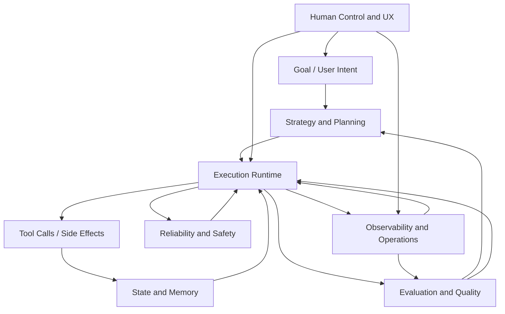

# Agentic Engineering Map (All Granularity Levels)

## Purpose

This repository is a PoC and a learning environment.  
This document maps agentic engineering from big-picture fields down to concrete implementation tactics so you can see:

- what to learn
- what to build
- what is already covered in this repo
- what is still missing

For a field-breadth reference beyond this repo slice, use `docs/agentic-engineering-atlas.md`.

## Granularity model

| Level | Name | Question answered |
| --- | --- | --- |
| L0 | Field | Which engineering domain are we in? |
| L1 | Method family | What class of approaches exists in this field? |
| L2 | Technique / named pattern | Which concrete pattern can I study and apply? |
| L3 | Implementation primitives | What components/contracts are needed in code? |
| L4 | Concrete implementation | What exact code/tests/artifacts should I add here? |

## Big-picture map

## Coverage legend

- `Strong`: implemented + exercised by tests/gate.
- `Partial`: present but limited depth or hardening.
- `Missing`: not implemented yet.

## L0 Field Map

| L0 Field | Coverage in this repo |
| --- | --- |
| Strategy and Planning | Strong |
| State and Memory | Strong |
| Tooling and Execution Runtime | Strong |
| Reliability and Safety | Strong |
| Evaluation and Quality Engineering | Strong |
| Observability and Operations | Strong |
| Human Interface and Product Control | Partial |

## 1) L0: Strategy and Planning

### L1-L4 breakdown

| L1 Method family | L2 Technique/pattern | L3 Implementation primitives | L4 Concrete implementation in this repo | Status | Search terms |
| --- | --- | --- | --- | --- | --- |
| Deterministic curriculum decomposition | Constraint-aware planning | Constraint model, deterministic node target calculator, contextual title seeding, weighted minute allocation | `learning_compiler/agent/spec.py` (`target_nodes`, `target_minutes`, `seed_titles`) | Strong | `constraint-aware planning deterministic` |
| Dependency-aware sequencing | DAG topological ordering | Node map, indegree tracking, stable ordering rules | `learning_compiler/orchestration/planning.py` (`topological_order`) | Strong | `topological sort planning dag` |
| Schedule estimation | Critical path analysis | Duration model, longest-path reconstruction | `learning_compiler/orchestration/planning.py` (`compute_critical_path`) | Strong | `critical path method dag` |
| Iterative curriculum optimization | Propose -> Critique -> Judge -> Repair | Loop controller, critic diagnostics, deterministic acceptance, typed repair actions | `learning_compiler/agent/optimizer.py`, `pedagogy_critic.py`, `quality_model.py`, `repair_planner.py`, `repair_executor.py` | Strong | `iterative dag optimization llm critic judge` |
| Agent loop control | ReAct | Thought/action/observation loop state, tool selection policy, stop criteria | Not implemented (current flow is staged pipeline, not live loop) | Missing | `ReAct prompting`, `reason act observe loop` |
| Agent loop control | Plan-and-Execute | Separate planner and executor modules, plan artifact, execution cursor | Partially represented by `generate -> validate -> plan -> iterate` pipeline | Partial | `plan and execute agents` |
| Self-correction | Reflexion / critic loop | Critique pass, repair action planning, bounded iteration stop rule | `learning_compiler/agent/pedagogy_critic.py`, `learning_compiler/agent/repair_planner.py`, `learning_compiler/agent/optimizer.py` | Strong | `Reflexion agent`, `self critique llm` |

### What you know now

- deterministic planning under constraints
- DAG planning and critical-path reasoning
- planner output as stable artifact (`plan.json`)
- iterative critique/repair optimization with deterministic acceptance

### What to learn next

- dynamic loop strategies beyond current implementation (`ReAct`, Tree/Graph-of-Thought, multi-agent debate)
- explicit rationale traces for planning decisions

## 2) L0: State and Memory

### L1-L4 breakdown

| L1 Method family | L2 Technique/pattern | L3 Implementation primitives | L4 Concrete implementation in this repo | Status | Search terms |
| --- | --- | --- | --- | --- | --- |
| Workflow state control | Explicit state machine | Stage enum, stage order, stage sync rules | `learning_compiler/orchestration/types.py`, `learning_compiler/orchestration/stage.py` | Strong | `state machine workflow orchestration` |
| Artifact consistency | Freshness/marker checks | Marker files, dependency mtime checks | `validation_is_current`, `plan_is_current`, `diff_is_current` in `learning_compiler/orchestration/stage.py` | Strong | `artifact freshness check` |
| Metadata contracts | Strict typed run metadata | Typed model, schema validation, fail-fast parse | `learning_compiler/orchestration/meta.py`, `learning_compiler/orchestration/fs.py` | Strong | `typed metadata schema validation` |
| Persistence strategy | Fresh-run contract | Re-init policy for incompatible local artifacts | Documented in `AGENTS.md` + strict run metadata load errors | Strong | `poc fresh-run contract` |
| Long-term semantic memory | Retrieval memory | Embeddings/index, retrieval policy, memory write/read API | Not implemented | Missing | `agent long term memory retrieval` |
| Checkpointing/rollback | Execution checkpoint model | Snapshot protocol, resume cursor, rollback procedure | Not implemented | Missing | `workflow checkpoint rollback` |

### What you know now

- robust local run state lifecycle
- strict metadata boundaries and stage inference

### What to learn next

- memory beyond artifact state (retrieval/episodic memory)
- checkpoint/rollback reliability patterns

## 3) L0: Tooling and Execution Runtime

### L1-L4 breakdown

| L1 Method family | L2 Technique/pattern | L3 Implementation primitives | L4 Concrete implementation in this repo | Status | Search terms |
| --- | --- | --- | --- | --- | --- |
| Command orchestration | Thin CLI / rich core | Parser dispatch + module handlers | `learning_compiler/orchestration/cli.py`, `commands_basic.py`, `commands_pipeline.py` | Strong | `thin cli rich core` |
| Tool abstraction | Dependency injection via protocol | Generator contract interface | `learning_compiler/agent/contracts.py` + orchestration usage | Strong | `python protocol dependency injection` |
| Provider runtime modes | Strategy selection (`internal`, `remote_llm`, `codex_exec`) | Policy model, provider selection, client factory | `learning_compiler/agent/model_policy.py`, `learning_compiler/agent/llm_client.py`, `learning_compiler/config.py` | Strong | `model provider strategy pattern` |
| Context-aware retrieval | Resolver composition | Context pack contract, repo-local resolver, fallback chain | `learning_compiler/agent/research.py` (`RepoLocalResolver`, `CompositeResourceResolver`, `default_resource_resolver`) | Strong | `resolver composition fallback` |
| Safe command inputs | Input contract hardening | `run_id` regex + path containment checks | `learning_compiler/orchestration/command_utils.py`, `learning_compiler/orchestration/fs.py` | Strong | `path traversal prevention pathlib` |
| Idempotent progression | Repeat-safe command behavior | Stage sync + marker validation before actions | `sync_stage` + pipeline command flow | Partial | `idempotent orchestration commands` |
| Failure semantics | Typed error propagation | Domain error taxonomy + stable exit codes | `learning_compiler/errors.py` | Strong | `typed error taxonomy cli` |
| Resilience controls | Timeout + retry budget | timeout seconds, retry budget, stage-specific failure handling | `learning_compiler/agent/model_policy.py`, `learning_compiler/agent/llm_client.py` | Partial | `timeout retry budget llm pipeline` |
| Runtime isolation | Circuit breaker / bulkhead | Failure counters, open/half-open states | Not implemented | Missing | `circuit breaker pattern` |

### What you know now

- clean command orchestration boundaries
- typed runtime failures
- hardened filesystem boundaries
- provider-mode orchestration (`internal` vs `remote_llm` vs `codex_exec`) with strict JSON contract IO

### What to learn next

- transient failure recovery (`retry`, `backoff`, `timeout`)
- resilience patterns (`circuit breaker`, `bulkhead`)

## 4) L0: Reliability and Safety

### L1-L4 breakdown

| L1 Method family | L2 Technique/pattern | L3 Implementation primitives | L4 Concrete implementation in this repo | Status | Search terms |
| --- | --- | --- | --- | --- | --- |
| Contract-first validation | Layered validator architecture | Separate schema/graph/evidence/quality modules + context-pack topic contract checks | `learning_compiler/validator/*` split by responsibility + `topic_spec.py` | Strong | `layered validation architecture` |
| Structural safety | Schema and DAG guards | Required keys, ID checks, cycle/reachability checks | `curriculum_schema.py`, `curriculum_graph.py` | Strong | `dag validation cycle detection` |
| Evidence safety | Evidence strictness profiles | Mode-driven evidence requirements | `curriculum_evidence.py` + `EvidenceMode` | Strong | `evidence mode validation` |
| Failure taxonomy | Stable typed errors | Error enum + exit mapping + details | `learning_compiler/errors.py` | Strong | `domain errors exit codes` |
| Runtime hardening | Fail-safe orchestration | Catch conversion/type failures and return typed errors | `learning_compiler/orchestration/commands_pipeline.py` | Strong | `fail safe orchestration` |
| Structured LLM output safety | Schema-constrained model outputs | JSON schema file, output parsing, fail-closed behavior | `learning_compiler/agent/llm_client.py` (`--output-schema`, strict JSON parse) | Strong | `structured outputs json schema` |
| Policy enforcement | Policy engine | Declarative risk rules, policy DSL/config | Not implemented | Missing | `policy engine guardrails` |
| Adversarial hardening | Fuzzing / hostile input tests | Randomized malformed inputs and assertions | Not implemented | Missing | `property based testing fuzzing python` |

### What you know now

- explicit guardrails with deterministic validation layers
- reliable fail-fast behavior for invalid artifacts

### What to learn next

- policy-as-code safety systems
- adversarial testing methodology

## 5) L0: Evaluation and Quality Engineering

### L1-L4 breakdown

| L1 Method family | L2 Technique/pattern | L3 Implementation primitives | L4 Concrete implementation in this repo | Status | Search terms |
| --- | --- | --- | --- | --- | --- |
| Regression quality | Fixture-based tests | Canonical sample artifacts | `tests/fixtures/curriculum.json`, `tests/test_curriculum_fixture.py` | Strong | `golden file testing` |
| Instructional quality safeguards | Actionability/repetition/relevance checks | mastery verb checks, repetition thresholds, topic-resource keyword overlap | `learning_compiler/validator/curriculum_quality.py`, `tests/test_curriculum_quality_validator.py` | Strong | `instructional quality validator` |
| Iterative quality optimization | Critic + deterministic judge + repairs | pedagogy diagnostics, weighted quality dimensions, repair action planner/executor | `learning_compiler/agent/pedagogy_critic.py`, `quality_model.py`, `repair_planner.py`, `repair_executor.py` | Strong | `critic judge repair loop` |
| Reproducibility assurance | Determinism tests | Repeat generation equality checks | `tests/test_agent_determinism.py`, `docs/determinism.md` | Strong | `deterministic test strategy` |
| Architectural quality | Static boundary checks | Import graph constraints | `scripts/static_checks.py`, `tests/test_architecture_boundaries.py` | Strong | `architecture boundary tests` |
| Gate automation | Quality gate script | syntax + static + validate + tests + coverage | `scripts/gate.sh`, `make gate` | Strong | `quality gate ci pipeline` |
| Incident-to-test loop | Regression capture | Tests added for discovered runtime bugs | `tests/test_orchestration_cli.py` additions | Strong | `bug regression test workflow` |
| Evals at scale | Scenario benchmark suite | versioned eval datasets + score tracking | Not implemented | Missing | `llm eval harness regression` |
| Fault injection | Chaos/adversarial tests | synthetic failures in runtime paths | Not implemented | Missing | `chaos testing workflow engine` |

### What you know now

- quality gate discipline
- determinism and regression testing workflow

### What to learn next

- broader eval harnesses and benchmark tracking
- fault-injection-based reliability testing

## 6) L0: Observability and Operations

### L1-L4 breakdown

| L1 Method family | L2 Technique/pattern | L3 Implementation primitives | L4 Concrete implementation in this repo | Status | Search terms |
| --- | --- | --- | --- | --- | --- |
| Transition logging | Structured run events | Standard event schema with metadata | `learning_compiler/orchestration/events.py`, `stage.py` | Strong | `structured event logging` |
| Run audit trail | Append-only history | Persisted run history in `run.json` and logs | `learning_compiler/orchestration/meta.py`, `runs/*/logs/events.jsonl` | Strong | `append only audit log` |
| Diagnostics | Error details payloads | contextual details in typed errors | `learning_compiler/errors.py`, orchestration errors | Strong | `context rich error handling` |
| Optimization traceability | Iteration trace artifact | per-iteration policy snapshot, diagnostics, actions, post-score | `learning_compiler/agent/trace.py`, `runs/*/outputs/reviews/optimization_trace.json` | Strong | `optimization trace artifact` |
| Operational metrics | Reliability/cost/latency metrics | metric collector + summary artifact | Not implemented | Missing | `sli slo metrics pipeline` |
| Tracing | Distributed spans | trace IDs, span boundaries | Not implemented | Missing | `opentelemetry python tracing` |
| Incident workflow | Runbooks/postmortems | failure taxonomy + standard response docs | Not implemented | Missing | `incident runbook postmortem` |

### What you know now

- structured state transition visibility
- artifact and history-level debugging
- iteration-level optimizer traceability

### What to learn next

- quantitative operations (metrics/SLOs)
- tracing and incident response discipline

## 7) L0: Human Interface and Product Control

### L1-L4 breakdown

| L1 Method family | L2 Technique/pattern | L3 Implementation primitives | L4 Concrete implementation in this repo | Status | Search terms |
| --- | --- | --- | --- | --- | --- |
| Operator guidance | Next-action hints | stage->action mapping | `cmd_next` in `learning_compiler/orchestration/commands_basic.py` | Strong | `operator guidance workflow cli` |
| State transparency | Status dashboard command | stage + artifact summary output | `cmd_status` in `learning_compiler/orchestration/commands_basic.py` | Strong | `status command design` |
| Visual inspection | DAG explorer UI | graph render, node details, filters | `app/index.html`, `app/main.js`, `app/styles.css` | Strong | `curriculum dag inspector` |
| Safe rendering | HTML escaping for loaded JSON | escape untrusted fields before `innerHTML` | `escapeHtml` usage in `app/main.js` | Strong | `xss escaping innerhtml` |
| Human approval loops | Approval checkpoints | explicit confirm-before-transition gates | Not implemented | Missing | `human in the loop approval workflow` |
| Guided remediation | Failure playbook UX | actionable remediation flows in CLI/UI | Not implemented | Missing | `error remediation ux` |

### What you know now

- operator-friendly status and next-step interfaces
- practical local inspection UX for generated artifacts

### What to learn next

- explicit approval/override controls
- guided remediation UX for failure cases

## Canonical loop patterns (L2 focus)

This section answers: "Which named agent loop patterns exist, and do we use them here?"

| Pattern | Core idea | Present in this repo |
| --- | --- | --- |
| ReAct | iterative reason-act-observe loop with tool calls | Missing |
| Plan-and-Execute | create plan first, then execute steps | Partial (staged pipeline) |
| Reflexion | self-critique and correction loop | Strong (critic + planner + repair loop) |
| Proposer/Judge | generation separated from validation | Strong |
| Tree/Graph of Thought | branching reasoning exploration | Missing |
| Multi-agent debate | multiple agents cross-criticize outputs | Missing |

## Implementation checklist by level

## L0-L1 (field and method understanding)

- Be able to explain each field and why it matters.
- Map each method family to the correct field.

## L2 (technique/pattern competency)

- Implement at least one new named technique per quarter.
- Add tests that prove behavior change and failure handling.

## L3 (implementation primitives)

- Define typed contracts before adding new behavior.
- Add explicit error semantics for each new primitive.

## L4 (concrete shipping behavior)

- Update code, tests, and docs together.
- Run `make gate` before handoff.

## Gap map: what you know vs what you do not know yet

| Domain | You know now (from this repo) | You should learn next |
| --- | --- | --- |
| Planning | deterministic DAG planning plus iterative critique/repair loop | dynamic live tool-reasoning loops (`ReAct`) |
| Runtime | command orchestration, typed failures, provider modes (`internal`, `remote_llm`, `codex_exec`) | retries/backoff/circuit breakers + richer provider adapters |
| State | strict run metadata and stage sync | checkpoints, rollback, semantic memory |
| Reliability | layered validators, strict JSON-output contracts, fail-fast behavior | policy engines, fuzz/adversarial validation |
| Quality | tests + gate + determinism + weighted quality judge + repair planner | eval harnesses, fault-injection testing |
| Ops | structured run events/history + optimization trace | metrics, tracing, SLOs, incident runbooks |
| Human control | status/next + visual inspector | approval gates and guided remediation |

## Suggested learning sequence

1. Deepen runtime resilience first:
   - retries/backoff/timeouts, then circuit breaker.
2. Add one dynamic loop pattern:
   - start with `ReAct` in a bounded sub-workflow.
3. Add observability maturity:
   - metrics artifact per run, then basic dashboards.
4. Add human-control maturity:
   - approval checkpoint before high-impact transitions.

Each step should include:
- implementation
- regression tests
- update to this map
- `make gate`
