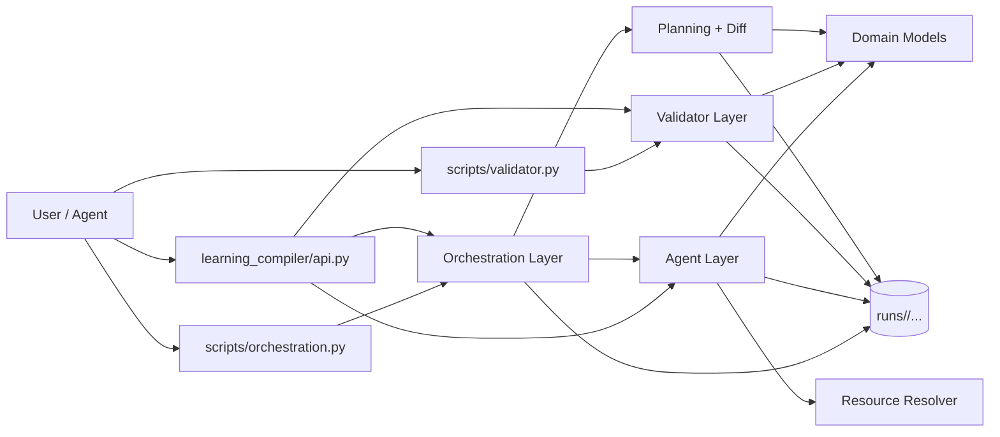
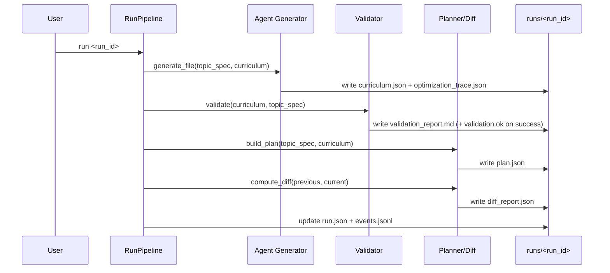
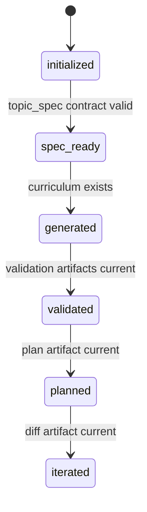

# Architecture

This document is the technical architecture reference for the curriculum builder.

## 1. System Overview

## 2. Layer Boundaries

- CLI layer (`scripts/*.py`): argument parsing, dispatch, typed error to exit-code translation.
- Orchestration layer (`learning_compiler/orchestration/*`): run lifecycle, stage sync, artifact writes, command flow.
- Agent layer (`learning_compiler/agent/*`): curriculum generation and optimization loop.
- Validator layer (`learning_compiler/validator/*`): deterministic acceptance checks.
- Domain layer (`learning_compiler/domain/*`): typed payload contracts.

Boundary rule:
- domain objects are the handoff contract between major subsystems.
- orchestration coordinates but does not own generation heuristics.
- validator is deterministic authority for quality acceptance.

## 3. Core Components

- `learning_compiler/orchestration/pipeline.py`
  - `RunPipeline` orchestrates `run`, `validate`, `plan`, and `iterate` flows.
- `learning_compiler/orchestration/stage.py`
  - infers stage from artifact freshness and synchronizes metadata.
- `learning_compiler/agent/generator.py`
  - constructs loop controller and persists curriculum + optimization trace.
- `learning_compiler/agent/optimizer.py`
  - iterative controller (`propose -> critique -> judge -> repair`).
- `learning_compiler/agent/llm_client.py`
  - public LLM facade + provider factory.
- `learning_compiler/agent/llm_remote.py`
  - remote Responses API provider implementation.
- `learning_compiler/agent/llm_codex.py`
  - `codex exec` provider implementation.
- `learning_compiler/agent/llm_schema.py` and `learning_compiler/agent/llm_prompt.py`
  - strict schema and prompt/parse helpers reused by providers.
- `learning_compiler/validator/rules.py`
  - fixed registry of validation rules in deterministic order.
- `learning_compiler/orchestration/planning.py`
  - deterministic weekly plan and structural diff/critical-path calculations.

## 4. Runtime Data Flow

## 5. Run State Model

Key behavior:
- stage is inferred from artifacts each command invocation.
- `run.json` stage is synchronized from filesystem truth.
- this prevents stale metadata from misreporting readiness.

## 6. Data Contracts

Domain contracts are explicit dataclasses in `learning_compiler/domain/models.py`:
- `TopicSpec`
- `Constraints`
- `ContextPack`
- `Curriculum`
- `CurriculumNode`
- `Resource`
- `MasteryCheck`
- `OpenQuestion`

Why this matters:
- avoids ad-hoc stringly-typed mutation across layers.
- standardizes serialization/deserialization through `to_dict()` and parsing helpers.

## 7. Design Patterns Used

- Compiler pipeline pattern:
  - strict staged transformation with deterministic checkpoints.
- Thin CLI / rich core:
  - script files are wrappers; business logic is importable.
- Strategy + dependency injection:
  - provider/resolver behavior selected via policy and protocol.
- Deterministic judge authority:
  - LLM proposes/repairs, deterministic scorer decides acceptance.
- Functional core / imperative shell:
  - core computations are side-effect-light; orchestration performs I/O.
- Artifact-driven state machine:
  - state inferred from artifacts, not only command history.
- Versioned envelope pattern:
  - scope artifacts include schema version and mode metadata.

## 8. Invariants

These invariants are relied on by orchestration and tooling:
- `topic_spec.json` must satisfy contract before generation/plan.
- `curriculum.json` must be DAG-valid and schema-valid to pass validator.
- `plan.json` and `diff_report.json` are derived artifacts and can be regenerated.
- `optimization_trace.json` is optional for some legacy runs but expected for generated runs.
- planning/diff math preserves numeric estimate precision (float estimates allowed).

## 9. Error Model

Typed errors are defined in `learning_compiler/errors.py`:
- `invalid_argument`
- `not_found`
- `validation_failed`
- `stage_conflict`
- `io_error`
- `config_error`
- `internal_error`

CLI entrypoints map them to stable exit codes for automation.

## 10. Extension Points

Primary extension seams:
- new generation provider:
  - add provider enum/policy support (`model_policy.py`)
  - implement provider behavior (`llm_remote.py`/`llm_codex.py` or new adapter)
  - add tests around retries/timeouts/schema parse
- new validator rule:
  - implement check in `learning_compiler/validator/*`
  - register in `validator/rules.py`
  - add fixture/regression tests
- new orchestration stage behavior:
  - update stage inference logic (`orchestration/stage.py`)
  - ensure command and metadata behavior remains coherent

## 11. Related Docs

- `docs/orchestration.md`
- `docs/agent-runtime.md`
- `docs/scope-ingestion.md`
- `docs/versioning-and-compatibility.md`
- `docs/contributor-playbook.md`
- `docs/incident-runbook.md`
- `docs/adr/README.md`
