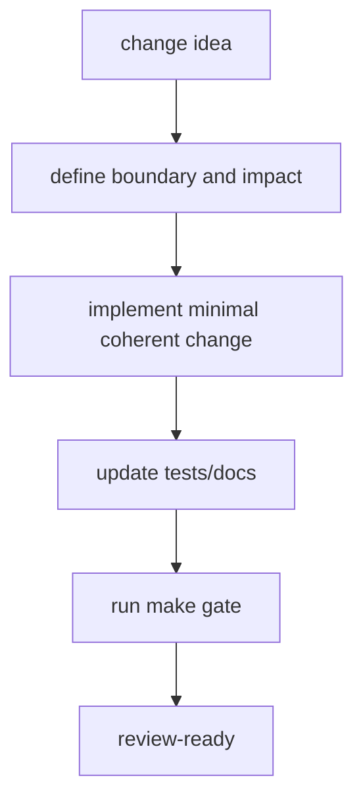
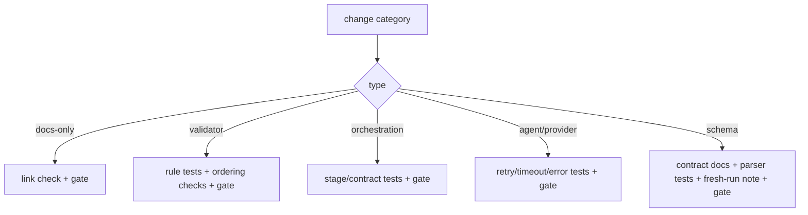
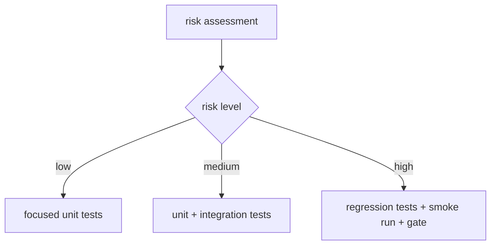
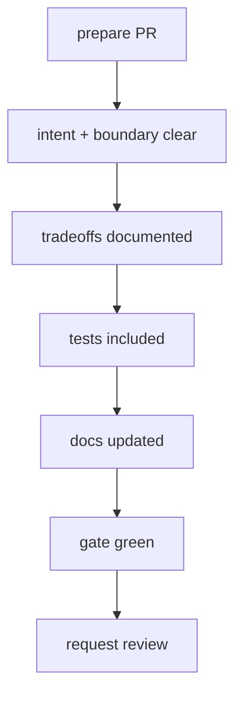
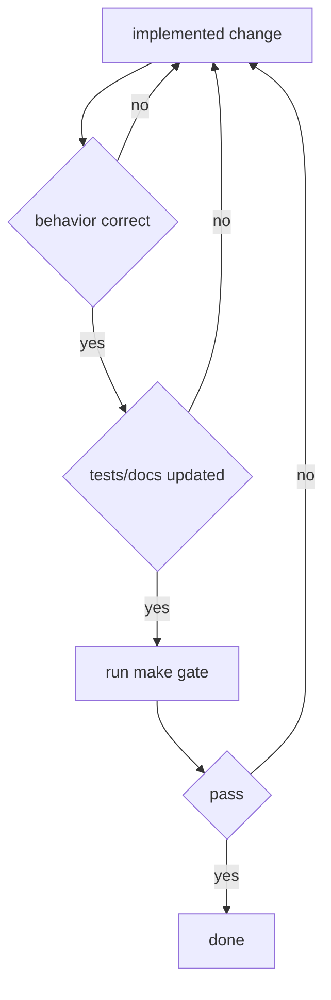
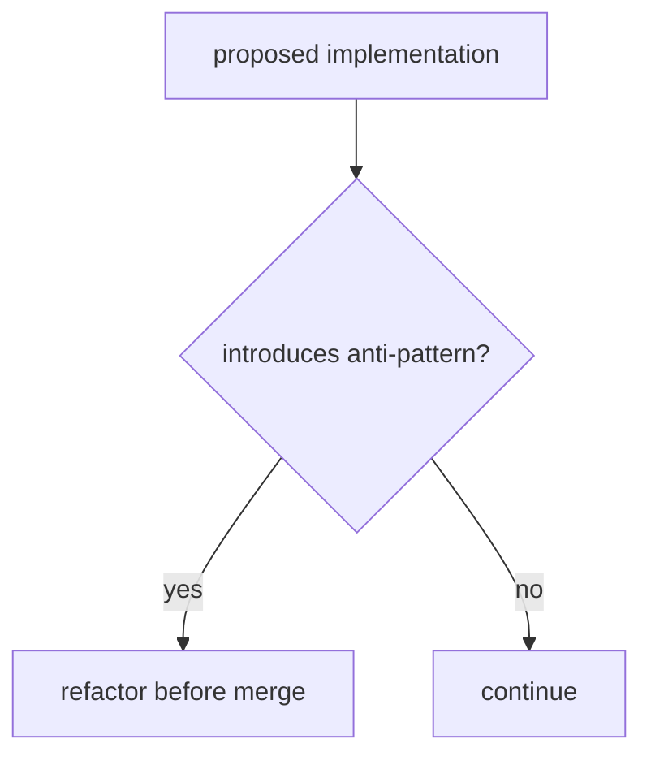

# Contributor Playbook

This document defines engineering standards for safe and reviewable changes.

## 1. Engineering Expectations

- Keep changes small and composable when possible.
- Prefer explicit typed contracts over ad-hoc dictionary mutation.
- Preserve deterministic behavior unless change intent explicitly modifies it.
- Keep CLI modules thin; move logic into importable modules.
- Update docs in the same change set when behavior changes.

## 2. Change-Type Workflow

### Documentation-only

Required:
- verify links and paths
- run `make gate`

### Validator rule changes

Required:
- add/update tests covering passing and failing fixtures
- verify no unintended rule-order regressions
- run `make gate`

### Orchestration flow changes

Required:
- test stage progression and stale artifact refresh behavior
- verify command contracts (`validate|plan|iterate|run`)
- run `make gate`

### Agent runtime/provider changes

Required:
- test retries/timeouts/error mapping
- test structured output parsing failures
- verify both happy path and failure path
- run `make gate`

### Schema/contract changes

Required:
- update contract docs
- add parser/validator tests
- document fresh-run impact
- run `make gate`

## 3. Testing Strategy by Risk

Low risk:
- narrow unit tests for touched utility functions

Medium risk:
- unit tests + integration path tests for affected commands/modules

High risk:
- targeted regression tests + full `make gate`
- manual smoke run of orchestration flow when feasible

## 4. Review Readiness Flow

A review-ready change should include:
- clear intent and boundary of change
- explicit tradeoffs for non-obvious decisions
- tests proving expected behavior
- documentation updates for any contract/path changes

## 5. Definition of Done Flow

- behavior works as intended
- tests updated when feasible
- docs updated if behavior/contracts changed
- `make gate` passes

## 6. Anti-Pattern Detection Flow

Avoid:
- silent contract drift without docs/tests
- embedding business logic in CLI wrappers
- bypassing typed parsers at module boundaries
- introducing non-deterministic behavior without rationale
- deleting unknown files to silence checks

