# Incident Runbook

This runbook covers common operational failures and recovery actions.

## 1. First Triage Flow

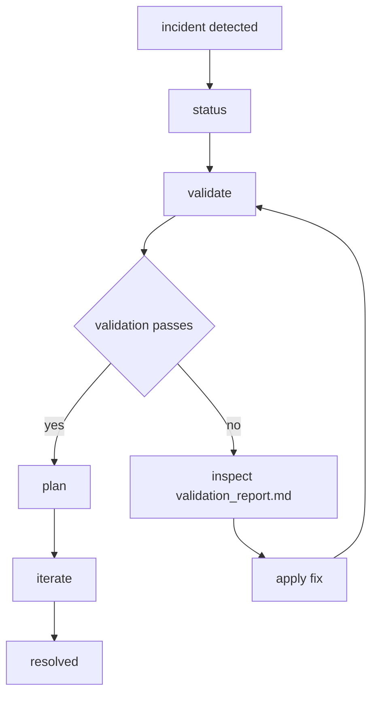

## 2. Failure Classification Flow

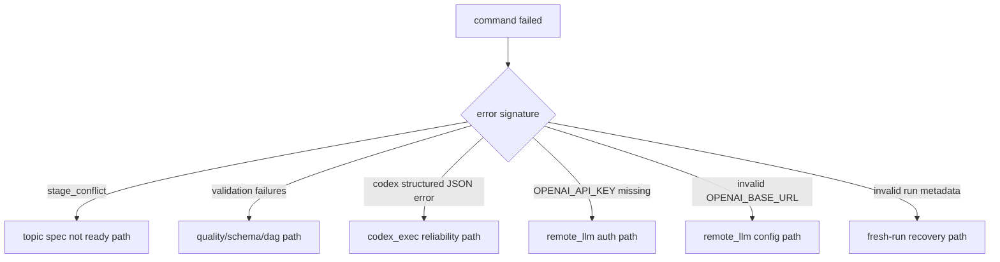

## 3. Common Failures and Recovery Flows

### A. `stage_conflict` on `run`

Signature:
- topic spec not ready

Cause:
- run is still `initialized` and no `--scope-file` provided

Recovery:
- fill `inputs/topic_spec.json`, or
- rerun with `--scope-file`

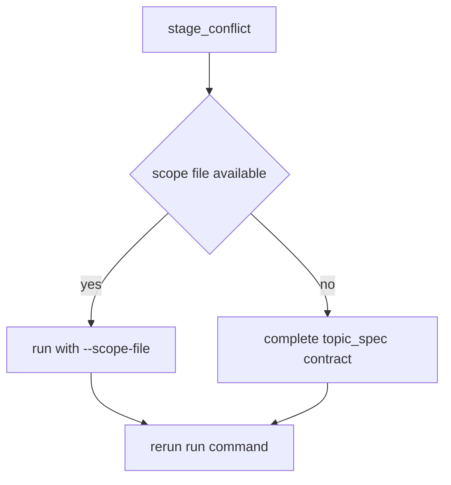

### B. Validation failure

Signature:
- `validate` or `run` exits non-zero with report failures

Cause:
- schema, DAG integrity, evidence mode, or quality rules failed

Recovery:
1. inspect `outputs/reviews/validation_report.md`
2. fix generator inputs/config or regenerate
3. rerun `validate` then `plan/iterate`

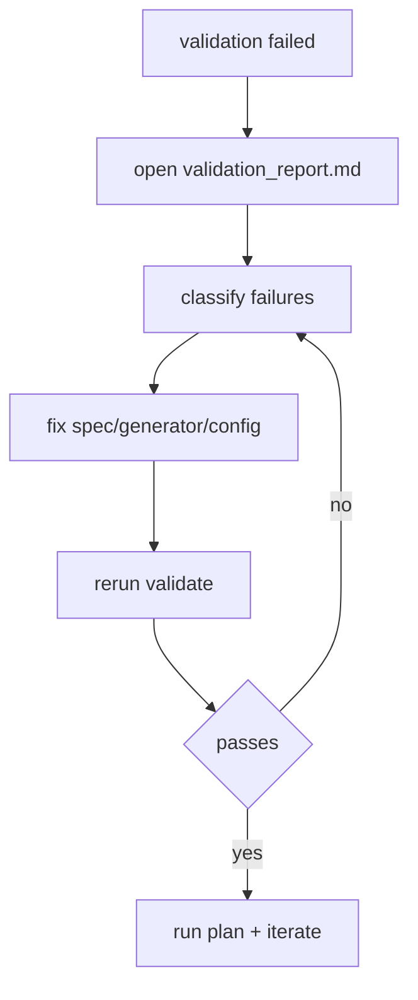

### C. `codex_exec mode failed to return valid structured JSON`

Possible causes:
- timeout
- malformed structured output
- incompatible `AGENT_MODEL` override

Recovery:
1. unset `AGENT_MODEL` (for chat-account codex default model routing)
2. increase `AGENT_TIMEOUT_SECONDS`
3. verify `CODING_AGENT_CMD` and `codex` CLI availability
4. rerun orchestration

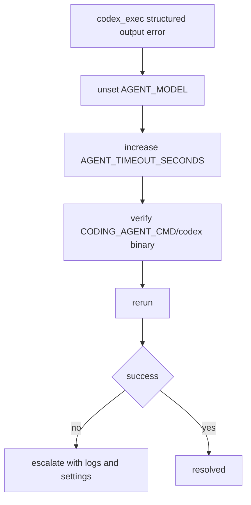

### D. `OPENAI_API_KEY is required` (remote_llm)

Cause:
- `AGENT_PROVIDER=remote_llm` without API key

Recovery:
- set `OPENAI_API_KEY`, or
- switch provider to `codex_exec`/`internal`

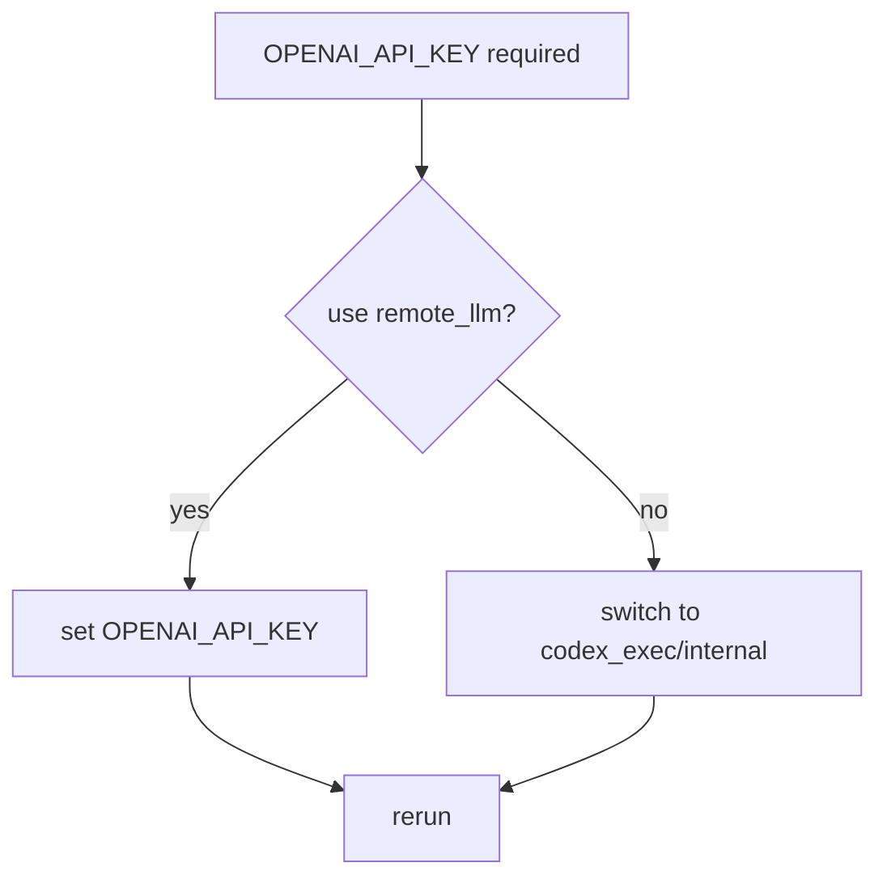

### E. Invalid `OPENAI_BASE_URL`

Cause:
- malformed URL or missing scheme/host

Recovery:
- set valid `http(s)://...` base URL
- rerun

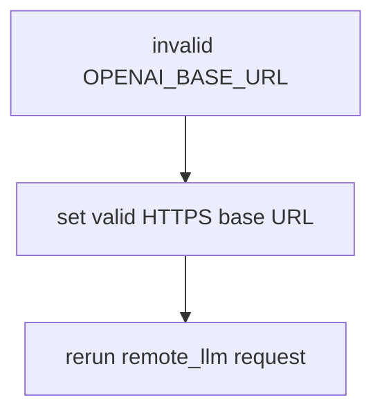

### F. Invalid run metadata

Signature:
- error indicates incompatible or invalid `run.json`

Cause:
- schema evolution or manual metadata corruption

Recovery:
1. archive run: `python3.11 scripts/orchestration.py archive <run_id>`
2. initialize fresh run
3. regenerate artifacts

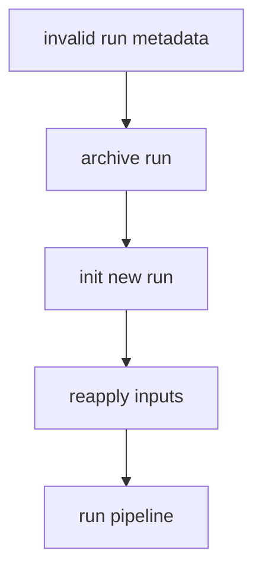

## 4. Stale Artifact Resolution Flow

Symptoms:
- stage appears behind expected command history
- `plan`/`diff` not reflecting latest curriculum edits

Resolution:
- stage auto-sync handles most cases
- rerun `validate`, `plan`, `iterate` in sequence

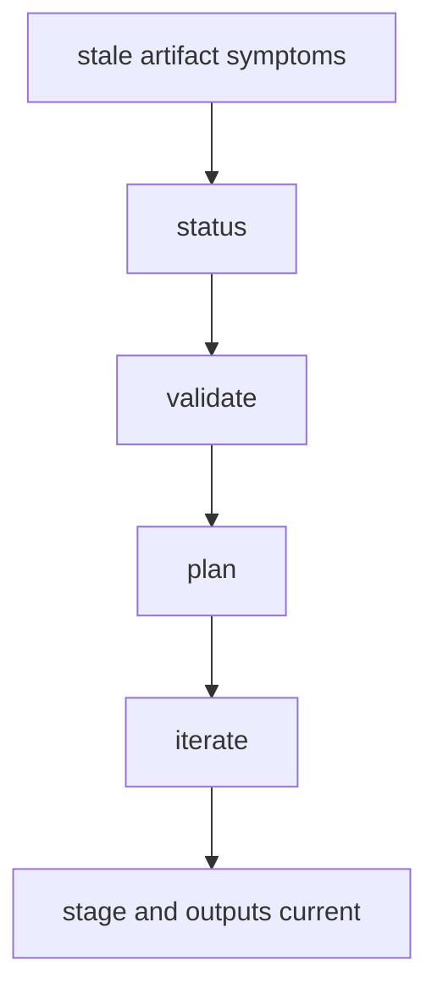

## 5. Escalation Flow

Escalate when:
- repeated structured-output failures across retries/providers
- deterministic validator failures after known-good baseline changes
- parsing failures in core contracts (`topic_spec`, `curriculum`, `run.json`)

Include in escalation report:
- command run
- run ID
- provider mode/env vars
- exact typed error message
- relevant artifact paths and timestamps

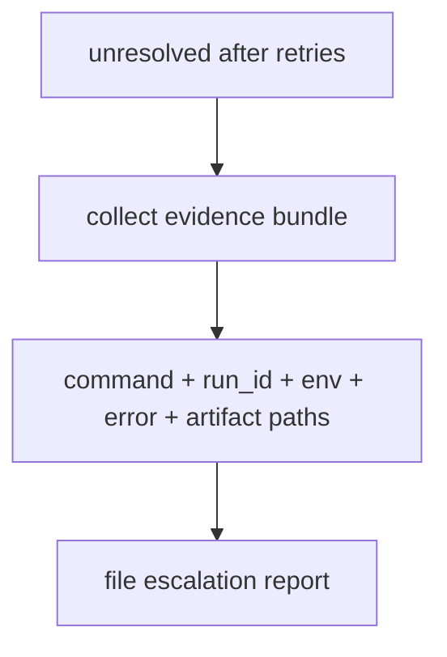

## 6. Post-Incident Flow

- add regression test if code bug found
- update docs if behavior/ops procedure changed
- run `make gate`
- summarize root cause and prevention action in PR notes

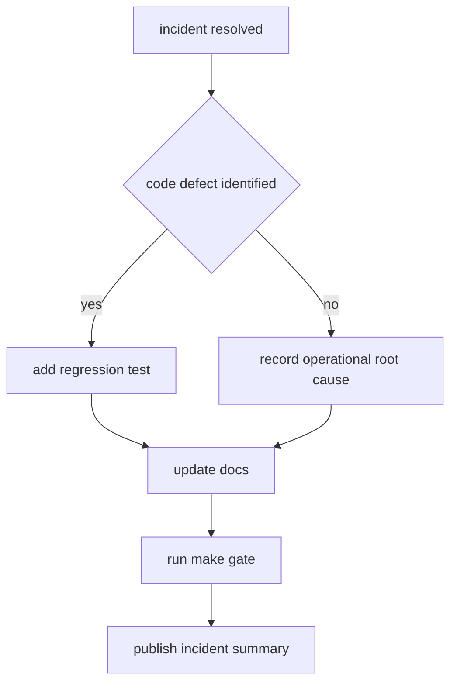
