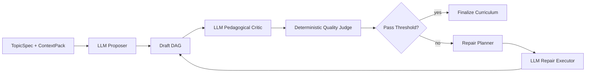
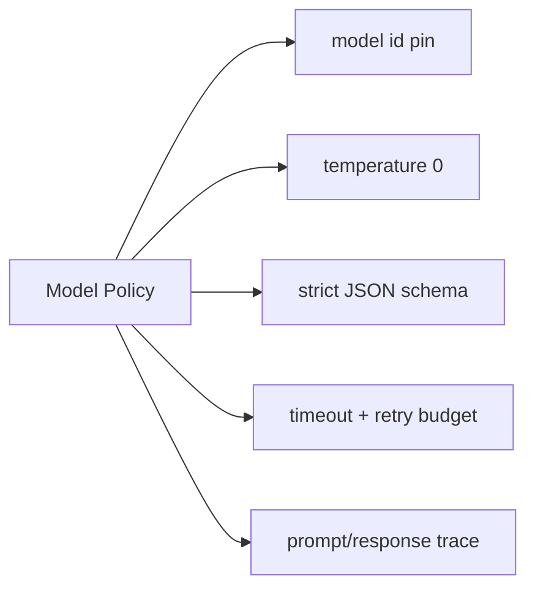

# Iterative DAG Curriculum Engine Design (Staff-Level Plan)

## 1) Problem Statement

Current generation produces structurally valid DAGs, but instructional quality can remain low because it is mostly one-pass and template-driven.  
Main gap: semantic grounding per node is weaker than graph validity.

Your target direction is correct:
- generate draft DAG
- assess pedagogical quality
- iteratively repair
- stop at convergence

This document defines the architecture and execution plan for that system.

Primary objective:
- Main goal is to make the product output (curriculum) the highest quality possible.

## 2) Goals

1. Keep the system generic across domains.
2. Make node quality pedagogically strong through iterative LLM-assisted optimization.
3. Enforce atomic nodes (single learnable capability per node).
4. Keep acceptance deterministic and replayable.
5. Preserve PoC constraints (no migration layer, fresh-run artifacts).
6. Use LLM-assisted optimization as the primary runtime mode.

## 3) Non-Goals

1. Pure deterministic template generation as the primary quality path.
2. No schema migration support for old run artifacts.
3. No distributed runtime or async orchestration in this phase.

## 4) Design Principles

1. `Propose -> Judge -> Repair` as canonical generation loop.
2. LLM-first for semantic quality; deterministic gates for acceptance.
3. Atomic node contract is strict, not advisory.
4. Fail hard on contract violations; do not silently coerce.
5. Separate quality scoring from mutation logic.
6. Every accepted node must be grounded in concrete references.

## 5) Atomic Node Contract

Each node must satisfy:

1. Single capability outcome:
- format: one action verb + one object/scope.
- reject compound capabilities joined by `and` if they imply multiple skills.

2. One primary topic:
- node title maps to one dominant concept.

3. One primary anchor:
- one top-ranked resource/code landmark must be clearly relevant.

4. Measurable mastery:
- concrete artifact output (`code change`, `test`, `analysis memo`, etc.).
- explicit pass criteria (observable and checkable).

5. Tight effort envelope:
- target per-node estimate range for practical mode (for example `60-150` min).
- outliers require explicit reason.

6. Dependency minimality:
- prerequisites only for required prior capabilities.
- avoid decorative edges.

## 6) Target Architecture





Core components:

1. `LLMProposer`
- creates first draft from constraints + context pack + repo landmarks.

2. `LLMCritic`
- scores pedagogy and atomicity issues with rationale.
- emits structured diagnostics consumable by planner.

3. `DeterministicQualityJudge`
- computes hard failures + deterministic score dimensions.
- final authority for acceptance/rejection.

4. `RepairPlanner`
- maps diagnostics to repair actions, ordered by severity.

5. `LLMRepairExecutor`
- rewrites/splits/retargets nodes via constrained JSON outputs.
- all edits are re-validated by deterministic judge.

6. `LoopController`
- controls max iterations, convergence checks, stop conditions.

7. `TraceWriter`
- writes iteration trace artifact for explainability.

8. `ModelPolicy`
- central config for model/version/temperature/timeout/retries.
- fail closed when model output violates contract.

## 7) Quality Model

Use explicit dimensions (0-100 each):

1. `structural_validity` (schema, DAG, reachability).
2. `atomicity` (single-skill node purity).
3. `pedagogical_progression` (foundation -> application -> integration -> validation).
4. `resource_relevance` (node-to-resource semantic match).
5. `mastery_actionability` (implementable task + measurable criteria).
6. `effort_coherence` (non-flat, plausible estimates).
7. `redundancy` (low title/capability/task duplication).
8. `learner_path_coherence` (novice can follow DAG with low confusion and minimal backtracking).

Aggregate score:
- weighted deterministic formula.
- hard gates for critical failures (for example cyclic graph, non-atomic nodes above threshold, missing actionable mastery).

`learner_path_coherence` is computed with two signals:
1. Deterministic structural checks:
- hidden prerequisite detection
- concept jump-size checks between prerequisite and dependent nodes
- abrupt workload jump checks
- unnecessary backtracking/duplicate dependency checks
2. LLM learner simulation:
- critic role prompt: `"you are a novice student following this DAG"`
- emits per-node confusion risk and missing-bridge diagnostics

Near-optimal path policy:
- evaluate candidate repaired DAGs and keep the highest-scoring valid candidate.
- this approximates near-optimality; global optimality is not assumed.

## 8) Repair Action Set

Define finite, explicit actions:

1. `split_node(node_id)`
- when atomicity violation detected.

2. `merge_nodes(node_a, node_b)`
- when overlap is high and both under-scoped.

3. `rewrite_node(node_id)`
- regenerate title/capability/core ideas/mastery to satisfy atomicity/actionability.

4. `rewire_prereqs(node_id)`
- remove unnecessary prerequisites; add missing required edge(s).

5. `retarget_resources(node_id)`
- replace repetitive/weak resources with node-specific anchors.

6. `retime_node(node_id)`
- adjust estimates based on complexity and dependency depth.

7. `reorder_nodes()`
- stabilize progression stage ordering after mutations.

## 9) LLM-First Loop Algorithm

Pseudo-flow:

```text
draft = llm_propose(topic_spec, context_pack)
for i in 1..MAX_ITERS:
  pedagogy = llm_critic(draft, topic_spec)
  report = deterministic_judge(draft, topic_spec, pedagogy)
  if report.hard_fail_count == 0 and report.total_score >= target_score and pedagogy.min_quality_met:
      return draft, report, pedagogy
  actions = plan_repairs(report, pedagogy)
  if actions is empty:
      break
  draft = llm_apply_repairs(draft, actions[:max_actions_per_iter], json_schema)
return best_seen_draft
```

Reliability controls:

1. Stable sort keys for diagnostics (`severity desc`, `node_id asc`, `rule_id asc`).
2. Stable action ordering and tie-breaking.
3. Model pinning (`model id`, `temperature=0`, strict schema outputs).
4. Retry/timeout budget with typed failure handling.
5. Deterministic acceptance: final curriculum must pass deterministic judge.

## 10) Repo Mapping (Implementation Plan)

### New modules

1. `learning_compiler/agent/model_policy.py`
- model + generation config and safety constraints.

2. `learning_compiler/agent/llm_client.py`
- provider abstraction with strict JSON response parsing.

3. `learning_compiler/agent/quality_model.py`
- deterministic rule evaluators + score aggregation.

4. `learning_compiler/agent/pedagogy_critic.py`
- LLM rubric evaluation + structured diagnostics.

5. `learning_compiler/agent/repair_actions.py`
- typed repair action enum/dataclasses.

6. `learning_compiler/agent/repair_planner.py`
- diagnostics -> actions compiler.

7. `learning_compiler/agent/optimizer.py`
- loop controller (`optimize_dag`).

8. `learning_compiler/agent/trace.py`
- iteration trace model + serializer.

### Existing modules to refactor

1. `learning_compiler/agent/generator.py`
- call LLM-first optimizer as default runtime mode.

2. `learning_compiler/agent/node_builder.py`
- keep node construction primitives reusable by repair executor.

3. `learning_compiler/agent/research.py`
- improve per-node resource ranking to avoid collapse on same two files.

4. `learning_compiler/validator/curriculum_quality.py`
- align rule IDs with optimizer diagnostics; validator remains final gate.

## 11) Artifacts

Add optional artifact:
- `runs/<run_id>/outputs/reviews/optimization_trace.json`

Trace format:
1. iteration index
2. model policy snapshot (`model`, `temperature`, `schema_version`)
3. pedagogy critic summary
4. deterministic score summary
5. learner-path coherence diagnostics
6. selected actions
7. post-score summary
8. stop reason

This gives explainability and learning value without migrations.

## 12) Acceptance Criteria

A run is considered good if:

1. Validator passes.
2. Atomicity violations = 0 (or below strict threshold if configured).
3. Resource diversity passes threshold:
- for example, at least `min(2 * node_count / 3, node_count)` unique URLs.
4. Repetition score below threshold.
5. At least 80% of nodes have node-specific primary anchors.
6. At least one repair iteration occurs when draft quality is below threshold.
7. All accepted outputs pass deterministic validator checks.
8. `learner_path_coherence >= 80` (configurable by profile).
9. Hidden prerequisite violations = 0.

## 13) Rollout Plan

### Phase 1: LLM Proposer + Policy
1. Add model policy + JSON schema enforcement.
2. Implement LLM proposer and deterministic fallback errors (no silent fallback generation).

### Phase 2: Dual Judge
1. Add LLM pedagogical critic.
2. Add deterministic quality judge integration and aggregate report.

### Phase 3: Iterative Repairs
1. Add `rewrite_node`, `retarget_resources`, `rewire_prereqs`.
2. Add `split_node` and `merge_nodes`.
3. Run fixed max 3-5 iterations with convergence logic.

### Phase 4: Hardening
1. Add focused unit tests per repair action and judge.
2. Add deterministic acceptance tests with recorded fixtures.
3. Extend docs and examples.

## 14) Test Strategy

1. Unit tests:
- atomicity detector
- resource relevance scorer
- each repair action behavior

2. Integration tests:
- full optimize loop on repo-focused topic spec
- stable acceptance behavior across repeated runs for pinned model policy

3. Regression tests:
- known low-quality drafts should be improved after optimization
- no cycle introduction during repair
- contract-safe handling of malformed LLM responses
- coherence regression: novice-path score should improve after repair iterations

4. Gate:
- include optimizer tests in `make gate`.

## 15) Risks and Mitigations

1. Overfitting to this repo
- mitigation: keep repair rules generic; repo specificity only through `context_pack`.

2. Oscillation between repairs
- mitigation: action cooldowns + max iteration cap + convergence criteria.

3. Excessive complexity
- mitigation: finite repair action set and explicit contracts.

4. Nondeterminism from model behavior
- mitigation: model pinning, `temperature=0`, strict JSON schema, fixture-based regression tests.

5. Provider outages / latency / cost
- mitigation: timeout and retry budgets, explicit error modes, optional caching for local development.

## 16) Recommendation

Proceed with LLM-first iterative optimizer architecture with deterministic acceptance gates.  
This is the most effective route to turn this PoC into a real learning environment for agentic engineering:

1. semantic quality from LLM proposer/critic,
2. reliability quality from deterministic judge/validator,
3. systems quality from explicit model policy and loop controls,
4. and explainability from optimization traces.
