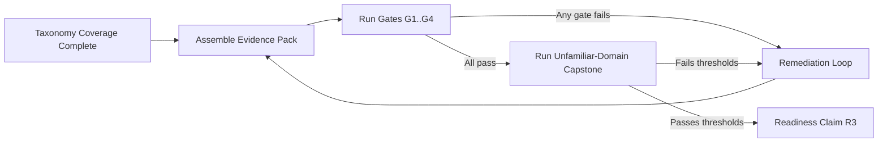
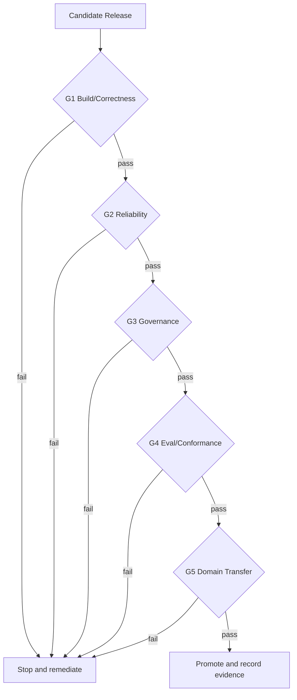
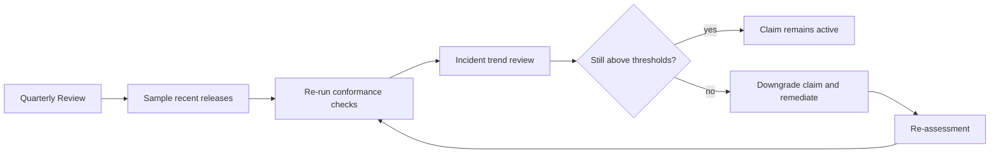

# Agentic Engineering Readiness Standard

This document defines the graduation standard for the claim:

`I can design, ship, and operate production-grade agentic systems in unfamiliar domains with measurable reliability and governance.`

Use this as the authoritative pass/fail contract.
Use `docs/learning/agentic-taxonomy.md` as the knowledge map and practice catalog.

## 1. Purpose and Boundary

This standard is for proving production capability, not for collecting topics.

In scope:
- design quality under uncertainty
- runtime reliability and operational discipline
- governance, safety, and auditability
- transfer to unfamiliar domains

Out of scope:
- absolute claim: "I can build any possible system"
- purely theoretical understanding without operational evidence

## 2. Readiness Model

| Level | Name | Capability Statement | Evidence Quality |
| --- | --- | --- | --- |
| R0 | Aware | Can explain concepts and patterns. | Notes and small demos. |
| R1 | Implementer | Can implement bounded components correctly. | Unit/integration tests and reproducible examples. |
| R2 | Operator | Can run systems in production with SLOs and incident response. | Runbooks, on-call evidence, conformance reports. |
| R3 | Transfer-Ready | Can deliver in unfamiliar domains with controlled risk. | Passed unknown-domain capstones. |
| R4 | Staff/Lead | Can define standards, review others, and improve org reliability. | Governance ownership and measurable team outcomes. |

Target for your stated goal: `R3` minimum.

## 3. Capability Domains and Required Proof

Every domain below must pass at `R3` level.

| Domain | Core question | Taxonomy anchors | Required proof at R3 |
| --- | --- | --- | --- |
| D1 Problem framing | Are autonomy boundaries and value targets explicit? | `T2.1.1`, `T2.1.2` | Signed problem framing doc with hard acceptance criteria and refusal conditions. |
| D2 Runtime architecture | Is execution deterministic where needed and bounded everywhere? | `T2.2.1`, `T3.1.2`, `T4.1.5` | Architecture + stop/budget policy + replayable traces. |
| D3 Tooling and side effects | Are tool calls typed, effect-classed, and safely mediated? | `T1.2.1`, `T3.2.2`, `T3.2.5` | Tool contracts, effect taxonomy, idempotency tests, policy mediation tests. |
| D4 Reliability and operations | Can this run under load and failure without unsafe behavior? | `T1.2.3`, `T4.1.1`, `T4.1.4` | SLO dashboard, incidents with postmortems, controlled degradation evidence. |
| D5 Governance and security | Are high-impact actions governed and auditable? | `T2.4.4`, `T2.4.5`, `T4.2.1` | Trust-boundary ledger, PDP/PEP artifacts, audit trail completeness report. |
| D6 Evaluation discipline | Are quality claims causal, comparable, and regression-protected? | `T3.4.2`, `T3.4.4`, `T3.4.5` | CI eval harness, conformance reports, paired-seed and ablation outputs. |
| D7 Human control and UX | Can operators inspect, intervene, and recover safely? | `T1.3.1`, `T2.4.3`, `T4.1.3` | Approval protocol, operator playbook, intervention latency metrics. |
| D8 Domain transfer | Can you deliver in an unfamiliar domain without fragile ad hoc shortcuts? | Cross-domain | Passed unknown-domain capstone under time and reliability constraints. |

## 4. Gate System (Hard Requirements)

All gates must pass for the readiness claim.

### G1 Build and Correctness Gate
- schema/contract checks pass in CI
- end-to-end happy path reproducible from clean environment
- at least one recovery path validated by test

### G2 Reliability Gate
- explicit SLOs defined (latency, success, cost, safety)
- at least 2 failure injection scenarios per critical tool path
- incident runbooks exist for top 5 failure classes
- evidence of controlled retries and bounded loop termination

### G3 Governance Gate
- effect classes enforced in runtime policy
- high-impact actions require explicit approval or policy allow with justification
- audit log coverage for action decisions >= 99%
- trust-boundary assumptions documented and validated by tests

### G4 Evaluation and Conformance Gate
- offline eval suite versioned and run in CI
- paired comparison protocol for method changes (same budgets/seeds)
- conformance report emitted for every release candidate
- release blocked on invariant failures unless exception process is recorded

### G5 Unfamiliar-Domain Transfer Gate
- deliver one system in a domain you did not previously work in
- constraints and taxonomy shift documented up front
- reliability/governance metrics stay within agreed thresholds during trial

## 5. Quantitative Readiness Thresholds (Default)

Use these defaults unless a stricter domain policy applies.

- `Release conformance pass rate`: >= 95% across last 20 release candidates
- `P0/P1 incident recurrence`: 0 repeats without remediation test
- `MTTR` for critical incidents: <= 4 hours median (or documented domain baseline)
- `Policy mediation coverage` for side-effecting actions: 100%
- `Unknown-domain capstone acceptance`: all required gates passed twice in different domains

## 6. Disqualifiers (Automatic Fail)

Any single item below invalidates the claim until remediated:

- side-effect path exists outside policy mediation boundary
- inability to replay a production incident with sufficient trace fidelity
- missing audit evidence for a high-impact action
- repeated critical incident class without prevention test added
- reported metrics cannot be reproduced from artifacts

## 7. Assessment Workflow

## 8. Gate Execution Flow

## 9. Evidence Pack Contract

Minimum artifact set for each assessed system:

- architecture decision set (boundaries, invariants, tradeoffs)
- tool and policy contracts with effect classes
- eval protocol and result artifacts
- conformance reports tied to release candidates
- incident runbooks + at least one real or simulated postmortem
- replay traces for at least two non-trivial failures
- domain transfer report for unfamiliar-domain capstone

Artifact location convention (recommended):
- `docs/` for design and policy contracts
- `runs/<run_id>/outputs/reviews/` for generated traces/reports
- `tests/` for executable reliability/governance regressions

## 10. Unfamiliar-Domain Capstone Standard

Run at least two capstones in different unfamiliar domains.

Capstone must include:
- domain framing and constraints in <= 48 hours
- working agentic system with real tool integration
- SLO and governance baseline before release
- at least one controlled incident simulation
- conformance artifact and postmortem

Pass criteria:
- all hard gates pass
- no disqualifier triggered
- reviewer can reproduce claims from artifacts

## 11. Recertification Cycle

Claim validity decays if not maintained. Re-certify on cadence.

Default cadence:
- quarterly evidence review
- immediate reassessment after major architecture or policy changes

## 12. Practical Interpretation of "Stand Out on the Market"

A strong market signal is not "knows many terms." It is repeatable outcomes:

- you can enter unfamiliar domains and ship safely
- you can explain and prove your reliability/governance claims
- your systems survive incidents with controlled blast radius
- your artifacts allow other engineers to audit and extend your work

If you can repeatedly pass this standard, your claim is defensible.
