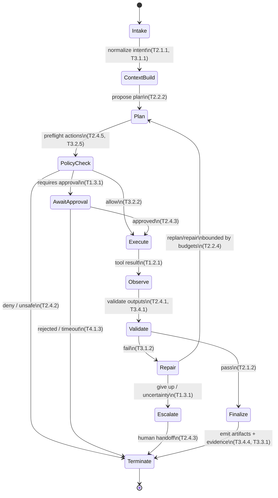
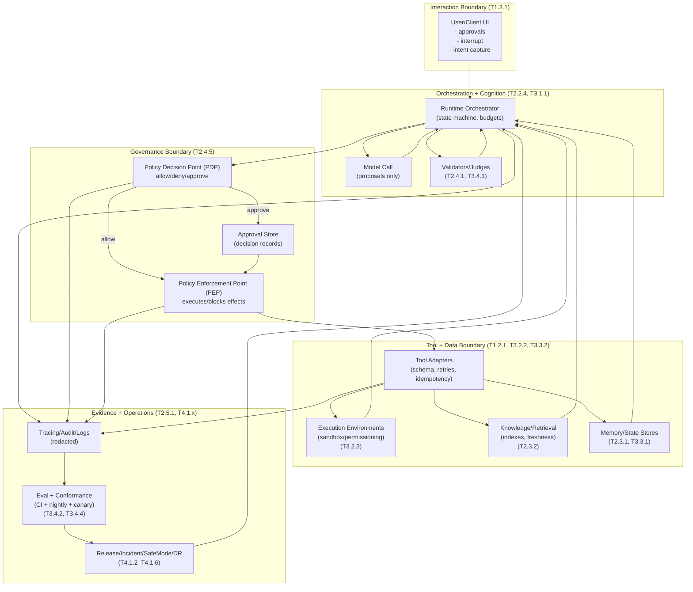
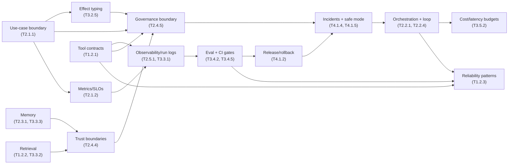
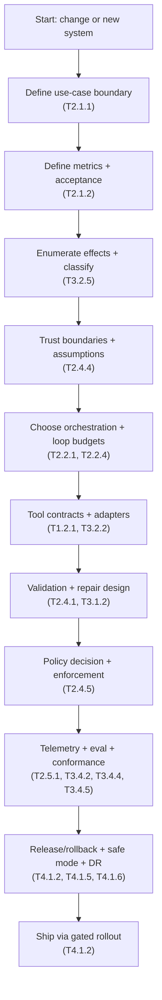
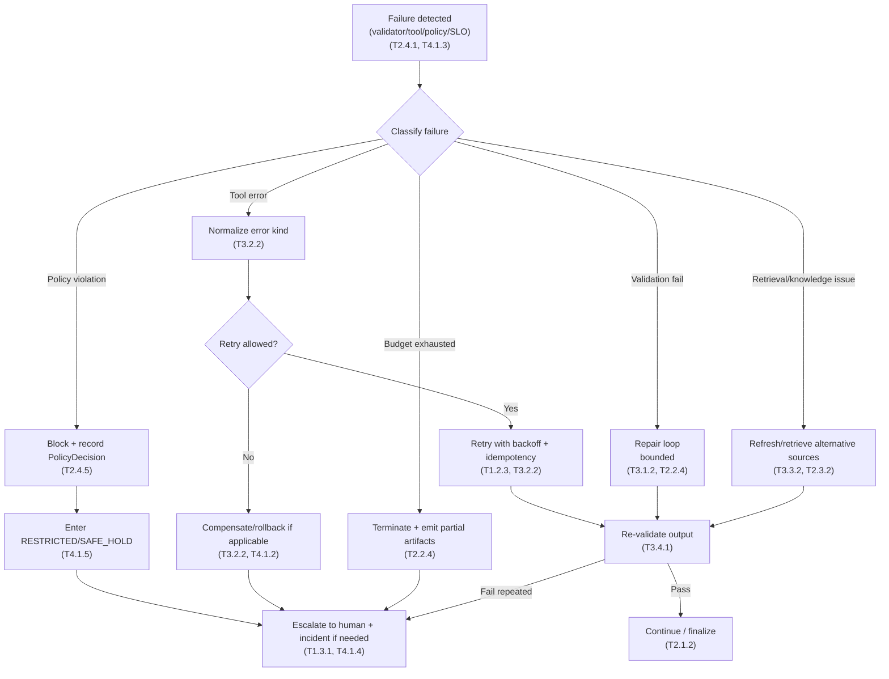
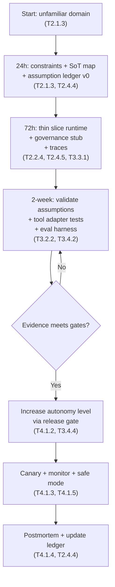
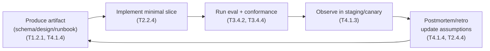
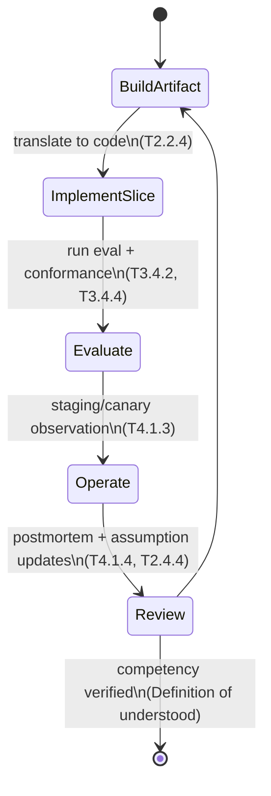

# 1. Purpose and How to Use This Document

This document is a **companion reference** to the Agentic Engineering taxonomy. It is designed to help you **internalize** the system as an **operational engineering discipline**, not a set of topics.

* The taxonomy is the **source of truth for topic depth** (all “what” and “why”).
* This document is the **source of truth for operational integration** (the “how it fits together,” “what artifacts exist,” “what contracts must hold,” and “how to decide under ambiguity”).
* For the **judgment/philosophy layer** (decision quality under ambiguity, anti-pattern recognition, and staff calibration), use `docs/learning/agentic-manifesto.md`.
* When you need depth, jump to the referenced taxonomy IDs (e.g., **T2.2.4**, **T3.4.5**). This doc intentionally avoids reprinting leaf content.

### Usage modes

1. **System design / architecture review**
   Use sections **3–6** as a checklist + contract catalog. Start with **boundaries and invariants** (T2.4.4, T2.4.5), then lock down primitives (T1.2.1, T3.2.5), then eval/observability (T2.5.1, T3.4.2, T3.4.4), then ops (T4.1.2–T4.1.6).

2. **Implementation / integration**
   Use section **5** as the “canonical primitives” you implement first, so runtime behavior is auditable and enforceable (T3.3.1, T2.5.1, T2.4.5, T3.2.2).

3. **Production incident / debugging**
   Use **6** (failure-first checklist) + the failure response diagram. Anchor your triage in run bookkeeping and decision logs (T3.3.1), and use safe-degradation profiles (T4.1.5) and rollback (T4.1.2).

4. **Unfamiliar domain transfer**
   Use section **7** as the execution protocol. Treat unknowns as tracked assumptions with explicit validation (T2.1.3, T2.4.4).

### Non-goals (explicit)

* This document does **not** teach each leaf topic. It **orchestrates** them.
* This document does **not** prescribe a particular vendor or framework (stack-agnostic). Where type examples appear, they are **schema patterns**, not language mandates (T1.2.1).

---

# 2. Canonical Mental Model (single-page compressed model)

An agentic system is a **deterministic runtime kernel** that repeatedly asks a **probabilistic model** to propose next steps, then executes those steps through **policy-mediated tools**, while continuously producing **evidence** (logs, traces, validations, evals) sufficient to explain and reproduce behavior.

Key idea: **the model proposes; the system disposes.**

* The model is an unreliable component (T1.1.2).
* The runtime must be reliable and enforceable (T2.2.4, T2.4.5, T3.3.1).

## The six canonical objects

These are the stable “atoms” you should see everywhere in your codebase and artifacts:

1. **Intent** — what outcome is requested (not how) (T2.1.1)
2. **State** — what the system currently believes is true (with provenance) (T2.3.1, T2.3.2)
3. **Plan** — a structured proposal for how to reach intent (T2.2.2, T3.1.2)
4. **Action** — a typed tool invocation with explicit effect class and idempotency semantics (T1.2.1, T3.2.2, T3.2.5)
5. **Observation** — tool outputs + retrieval results treated as untrusted inputs until validated (T2.4.4, T1.2.2)
6. **Evidence** — validations, policy decisions, traces, and eval outputs (T2.5.1, T3.4.4, T3.3.1)

## Invariants that define a “real” agentic system

If any of these are false, you’re building a demo or a workflow, not a production-grade agentic system:

* **Boundedness:** every run has explicit budgets and termination rules (T2.2.4, T3.1.2).
* **Mediation:** every side effect is gated by a governance boundary (policy decision + enforcement) (T2.4.5).
* **Effect typing:** every action is classified by impact and bound to controls (approval, retry rules, logging) (T3.2.5).
* **Reproducibility:** every run captures versions, prompts, tool I/O, and decision logs sufficient for replay/forensics (T3.3.1, T4.1.4).
* **Trust discipline:** external inputs are untrusted by default; trust boundaries are explicit and tested (T2.4.4, T1.3.2).
* **Measurability:** success/failure is defined by metrics, eval protocols, and conformance artifacts, not vibes (T2.1.2, T3.4.2, T3.4.4, T3.4.5).
* **Operability:** safe degradation and rollback are executable, not aspirational (T4.1.2, T4.1.5).

## Diagram 1 — Global control loop (runtime contract view)



---

# 3. End-to-End System Architecture (boundaries, responsibilities, invariants)

This section defines the **canonical boundary layout** of an agentic system. The point is not your microservice diagram; it’s the **separation of concerns** that prevents bypasses, unsafe side effects, and unreproducible incidents (T2.4.4, T2.4.5, T4.1.4).

## Responsibilities by boundary (what must live where)

### A) Interaction boundary (User ↔ System)

* Owns: user identity, consent surfaces, approvals UX, interrupt/stop controls (T1.3.1).
* Must not: directly invoke side-effect tools without governance mediation (T2.4.5).

### B) Orchestration boundary (Control-loop runtime kernel)

* Owns: loop state machine, budgets, step logging, stop policies, replan triggers (T2.2.4, T3.1.2).
* Must not: embed tool-specific auth or policy logic in ad-hoc code paths (T2.4.5).

### C) Cognition boundary (Model calls)

* Owns: generating proposals (plans, tool args, summaries) under prompt/context control (T1.1.2, T3.1.1).
* Must not: be trusted to enforce hard invariants (T2.4.2, T2.4.6).

### D) Governance boundary (Policy decision + enforcement)

* Owns: allow/deny/approve decisions + enforceable blocking of side effects (T2.4.5).
* Must not: depend on the model to “remember rules” (T2.4.2).

### E) Tool boundary (Adapters + execution)

* Owns: schema enforcement, retries/timeouts, idempotency, error normalization (T1.2.1, T1.2.3, T3.2.2).
* Must not: silently mutate state without emitting auditable events (T2.5.1, T3.3.1).

### F) Knowledge boundary (Retrieval + memory + source-of-truth)

* Owns: RAG pipelines, freshness controls, memory write constraints, provenance (T1.2.2, T2.3.1, T2.3.2, T3.3.2, T3.3.3).
* Must not: treat summaries as authoritative truth without references or validation (T2.4.4).

### G) Evidence boundary (Observability + evaluation + conformance)

* Owns: traces/audit logs, offline/online eval loops, conformance artifacts (T2.5.1, T3.4.2, T3.4.4, T4.1.3).
* Must not: log sensitive data without redaction policy (T1.3.3, T2.3.3).

### H) Operations boundary (Release + incident + continuity)

* Owns: versioning/rollback, safe mode, runbooks, DR drills (T4.1.2, T4.1.4, T4.1.5, T4.1.6).
* Must not: ship changes without eval and conformance gates appropriate to risk (T3.4.2, T3.4.4).

## Architectural invariants (non-negotiable “musts”)

These are the invariants you should assert in code and test in CI (T2.4.6, T3.4.2):

1. **No side effect without PEP enforcement**
   Every irreversible or write-like operation is executed only by the enforcement component, after a recorded policy decision (T2.4.5, T3.2.5).

2. **Every tool call is contract-checked**
   Inputs and outputs are schema-validated and normalized into a typed error taxonomy (T1.2.1, T3.2.1, T3.2.2).

3. **Every run is attributable and replayable (within practical limits)**
   Run ID, step IDs, versions, prompts, tool I/O references, and decisions are recorded with redaction (T3.3.1, T2.5.1).

4. **Trust boundaries are explicit**
   Untrusted content is labeled/tainted; policy and validators cannot be bypassed by “helpful” text (T2.4.4, T1.3.2).

5. **Bounded loops**
   Budgets exist and are enforced centrally (steps, time, tool retries, tokens/cost) (T2.2.4, T3.5.2).

## Diagram 2 — Architecture boundaries (trust + control planes)



---

# 4. Cross-Topic Interaction Map (how planning/runtime/safety/evals/ops influence each other)

The taxonomy topics are not independent. In production, almost every “agent bug” is a **coupling bug**: one subsystem made an assumption that another subsystem did not enforce, measure, or communicate (T2.4.4, T3.3.1, T4.1.4).

Below is an operational interaction map: “If you touch X, expect consequences in Y.”

## Primary coupling relationships (the ones that bite)

### (A) Requirements ↔ Autonomy ↔ Governance

* Your automation boundary defines what effects exist and which require approval (T2.1.1 → T3.2.5 → T2.4.5 → T1.3.1).
* Any change in autonomy level must update: policy rules, approval UX, logging obligations, and eval gates (T4.1.2, T3.4.4).

### (B) Orchestration ↔ Reliability ↔ Cost

* Loop shape and step granularity change failure surface area and retry behavior (T2.2.1, T2.2.4 ↔ T1.2.3 ↔ T3.5.2).
* “Add reflection” is not free; it must be budgeted and measured (T3.1.2, T2.1.2).

### (C) Tool contracts ↔ Safety ↔ Incident response

* Tools are where you encode real-world semantics: idempotency, effect type, error taxonomy (T1.2.1, T3.2.2, T3.2.5).
* Without normalized errors and tool-call audit trails, incident response becomes speculation (T3.3.1, T4.1.4).

### (D) Retrieval/memory ↔ Trust ↔ Privacy

* Retrieval results and long-term memory are both **external inputs** to the model and must be treated as tainted until validated (T1.2.2, T3.3.2, T3.3.3 ↔ T2.4.4).
* Memory write policy is simultaneously a quality feature and a compliance hazard (T2.3.1, T1.3.3, T2.3.3).

### (E) Evaluation ↔ Release management ↔ Safe degradation

* Offline eval and conformance define what “safe to ship” means (T3.4.2, T3.4.4, T3.4.5).
* Safe mode is not a last-minute bolt-on; it must align with effect typing and policy enforcement (T4.1.5 ↔ T3.2.5 ↔ T2.4.5).

### (F) Observability ↔ Everything

* If you cannot attribute outputs to versions, decisions, and tool I/O, you cannot improve safely (T2.5.1, T3.3.1, T4.1.3).
* Logging policy constrains debugging depth; decide intentionally (T1.3.3, T2.3.3).

## Diagram (Interaction graph) — “Touch one thing, pull five threads”



---

# 5. Canonical Primitive Catalog

This catalog defines **implementation primitives** that should appear as stable types/contracts across services and repos. The goal is to reduce ambiguity and enable strong enforcement, evaluation, and incident response (T1.2.1, T2.2.4, T2.4.5, T3.3.1).

Use these primitives as:

* shared schema packages (JSON Schema / Protobuf / TS types)
* log/trace payload standards
* CI conformance inputs/outputs
* review checklists (“show me the PolicyDecision record for this write action”)

## 5.1 Data contracts

### 5.1.1 Identifiers and version bundle

**Purpose:** Make runs traceable and reproducible (T3.3.1, T4.1.2).
**Invariant:** every persisted event must include `run_id` and `versions`.

```ts
type Id = string; // UUID/ULID; must be globally unique

type VersionRef = {
  name: string;           // "gpt-5.2-pro" / "prompt.checkout.v12" / "tool.crm.write.v3"
  digest?: string;        // content hash for immutability verification
  created_at?: string;    // ISO timestamp
};

type VersionBundle = {
  model: VersionRef;
  prompts: VersionRef[];  // include system/developer templates
  tools: VersionRef[];    // tool adapter versions, not only tool names
  policies: VersionRef[]; // policy rule set version(s)
  indexes?: VersionRef[]; // retrieval index snapshots
};
```

### 5.1.2 Task and intent normalization

**Purpose:** Convert user requests into a stable internal representation that downstream components can reason about (T2.1.1, T3.1.1).
**Invariant:** All policy and effect classification is performed on normalized intent, not raw user text (T2.4.5, T3.2.5).

```ts
type TaskSpec = {
  task_id: Id;
  run_id: Id;
  user_id?: Id;
  tenant_id?: Id;

  objective: string;        // “what success means”
  constraints: string[];    // “must/never”
  inputs: Record<string, unknown>;  // structured inputs if available
  expected_artifacts: string[];     // e.g. ["ticket", "email_draft", "report"]

  autonomy_level: "SUGGEST" | "APPROVAL_GATED" | "AUTO"; // maps to governance rules (T1.3.1, T2.4.5)
  risk_context?: {
    domain?: string;        // “finance”, “health”, etc.
    criticality?: "LOW" | "MED" | "HIGH";
    data_sensitivity?: "PUBLIC" | "INTERNAL" | "CONFIDENTIAL" | "RESTRICTED"; // (T1.3.3, T2.3.3)
  };
};
```

### 5.1.3 World state and claims (provenance-first state)

**Purpose:** Separate “observed facts” from “model guesses”; store claims with sources (T2.3.1, T2.3.2, T2.4.4).
**Invariant:** Any state used for high-impact decisions must be backed by an authoritative source reference or explicit uncertainty.

```ts
type EvidenceRef = {
  kind: "TOOL_RESULT" | "DOC_SNIPPET" | "DB_ROW" | "HUMAN_APPROVAL" | "TEST_RESULT";
  ref_id: string;          // pointer to stored artifact/log record (not raw blob)
  timestamp: string;       // ISO time
  trust: "UNTRUSTED" | "CONDITIONALLY_TRUSTED" | "TRUSTED"; // per trust boundary policy (T2.4.4)
};

type Claim = {
  claim_id: Id;
  subject: string;         // entity or topic
  predicate: string;       // attribute/relation
  value: unknown;
  confidence: number;      // 0..1 (informational, not a permission gate by itself)
  evidence: EvidenceRef[]; // provenance
  expires_at?: string;     // for freshness/decay (T2.3.2)
};

type WorldState = {
  run_id: Id;
  task_id: Id;
  claims: Claim[];
  checkpoints: { step_id: Id; timestamp: string; summary_ref: string }[];
};
```

## 5.2 Control-loop contracts

### 5.2.1 Loop budget and termination model

**Purpose:** Centralize boundedness and avoid distributed “while(true)” behavior (T2.2.4, T3.1.2, T3.5.2).
**Invariant:** Budget checks are enforced in the runtime kernel, not in prompts.

```ts
type Budget = {
  max_steps: number;
  max_tool_calls: number;
  max_total_tokens?: number;
  max_total_cost_usd?: number;
  wall_clock_timeout_ms: number;

  // Optional phase budgets (useful when planning/reflection exists)
  max_plan_steps?: number;
  max_repair_steps?: number;
};

type Termination = {
  reason:
    | "SUCCESS"
    | "FAILED_VALIDATION"
    | "POLICY_DENIED"
    | "APPROVAL_REJECTED"
    | "BUDGET_EXHAUSTED"
    | "TOOL_FAILURE"
    | "ESCALATED_TO_HUMAN"
    | "CANCELLED";
  timestamp: string;
  summary_ref: string; // pointer to final summary artifact
};
```

### 5.2.2 Step record and deterministic replay scaffold

**Purpose:** Make incident response and regression analysis possible (T3.3.1, T4.1.4).
**Invariant:** Each step is append-only; decisions refer to concrete inputs/outputs by reference.

```ts
type StepKind =
  | "INTAKE"
  | "CONTEXT_PACK"
  | "PLAN"
  | "POLICY_PREFLIGHT"
  | "TOOL_CALL"
  | "OBSERVE"
  | "VALIDATE"
  | "REPAIR"
  | "FINALIZE";

type StepRecord = {
  run_id: Id;
  step_id: Id;
  parent_step_id?: Id;
  kind: StepKind;
  timestamp: string;

  inputs_ref?: string;   // pointer to stored inputs (redacted)
  outputs_ref?: string;  // pointer to stored outputs (redacted)

  model_call?: {
    model: VersionRef;
    prompt_ref: string;
    sampling?: { temperature?: number; top_p?: number; seed?: number };
    usage?: { input_tokens: number; output_tokens: number; cost_usd?: number };
  };

  decision_refs?: string[]; // policy decision, validator results, approvals
};
```

## 5.3 Tool contracts

### 5.3.1 Tool specification (what the agent is allowed to assume)

**Purpose:** Make tool usage stable and testable (T1.2.1, T3.2.1).
**Invariant:** Tool adapters must enforce the schema; the model never “freehands” arguments into production.

```ts
type EffectClass = "READ" | "WRITE_REVERSIBLE" | "WRITE_IRREVERSIBLE" | "EXTERNAL_SIDE_EFFECT" | "HIGH_IMPACT";

type ToolSpec = {
  tool_name: string;
  description: string;

  input_schema_ref: string;   // JSON Schema ref
  output_schema_ref: string;  // JSON Schema ref

  effect_class: EffectClass;  // default effect (may be escalated contextually) (T3.2.5)
  idempotency: {
    supported: boolean;
    key_fields?: string[];    // fields that define idempotent identity
    ttl_seconds?: number;
  };

  error_model: {
    stable_error_kinds: string[]; // e.g. ["AUTH", "NOT_FOUND", "RATE_LIMIT", ...]
    retryable_kinds: string[];
  };

  auth_scope: string[];       // least privilege (T1.3.2)
};
```

### 5.3.2 Tool call / result and normalized error taxonomy

**Purpose:** Make retries safe and failures classifiable (T1.2.3, T3.2.2).
**Invariant:** Retrying is allowed only when `(effect_class, idempotency, error_kind)` permit it.

```ts
type ToolCall = {
  run_id: Id;
  step_id: Id;

  call_id: Id;
  tool_name: string;

  args: Record<string, unknown>;
  idempotency_key?: string;      // required for non-read when supported (T3.2.2)
  effect_class: EffectClass;     // possibly escalated by context classifier (T3.2.5)

  timeout_ms: number;
};

type ToolErrorKind =
  | "SCHEMA_INVALID"
  | "AUTH"
  | "NOT_FOUND"
  | "RATE_LIMIT"
  | "TIMEOUT"
  | "CONFLICT"
  | "UPSTREAM_5XX"
  | "DOMAIN_RULE_VIOLATION"
  | "UNKNOWN";

type ToolResult = {
  run_id: Id;
  call_id: Id;
  tool_name: string;

  status: "OK" | "ERROR";
  output?: Record<string, unknown>;

  error?: {
    kind: ToolErrorKind;
    message: string;          // sanitized
    retryable: boolean;
    upstream_ref?: string;    // link to upstream request ID
  };

  timings: { start_ms: number; end_ms: number };
  output_ref: string;         // stored payload ref (redacted)
};
```

## 5.4 Policy contracts

### 5.4.1 PDP/PEP interface (decision ≠ enforcement)

**Purpose:** Make side-effect control enforceable and auditable (T2.4.5).
**Invariant:** PEP refuses to execute without a matching PolicyDecision record.

```ts
type PolicyInput = {
  run_id: Id;
  step_id: Id;

  actor: { user_id?: Id; role?: string; tenant_id?: Id };
  task: { task_id: Id; autonomy_level: TaskSpec["autonomy_level"] };

  proposed_action: {
    tool_name: string;
    effect_class: EffectClass;
    args_summary: string;    // redacted summary; not raw secrets (T1.3.3)
    resource_hint?: string;  // “ticket:123”, “customer:456”
  };

  context_signals?: {
    data_sensitivity?: TaskSpec["risk_context"]["data_sensitivity"];
    anomaly_flags?: string[]; // from runtime/obs (T4.1.3, T4.1.5)
    trust_level?: EvidenceRef["trust"]; // taint state (T2.4.4)
  };
};

type PolicyDecision = {
  decision_id: Id;
  run_id: Id;
  step_id: Id;

  outcome: "ALLOW" | "DENY" | "REQUIRE_APPROVAL";
  rationale: string; // short, operator-readable

  obligations?: {
    require_preview?: boolean;  // show diff/preview to approver (T1.3.1)
    require_redaction?: boolean;
    force_safe_mode?: boolean;  // tighten profile (T4.1.5)
    log_level?: "MIN" | "STD" | "FULL";
  };

  policy_version: VersionRef;
  timestamp: string;
};
```

### 5.4.2 Approval protocol artifacts

**Purpose:** Persist accountable human decisions (T1.3.1, T2.4.3).
**Invariant:** Approval decisions are immutable and linked to the exact proposed action fingerprint.

```ts
type ApprovalRequest = {
  approval_id: Id;
  run_id: Id;
  step_id: Id;

  requested_by: { user_id?: Id; system: boolean };
  action_fingerprint: string; // hash of tool_name + canonicalized args + effect_class
  preview_ref: string;        // what will change / what will be executed
  created_at: string;
};

type ApprovalDecision = {
  approval_id: Id;
  decided_by: { user_id: Id; role?: string };
  outcome: "APPROVED" | "REJECTED";
  comment?: string;
  decided_at: string;
};
```

## 5.5 Evaluation contracts

### 5.5.1 Eval case, eval run, and protocol constraints

**Purpose:** Make evaluation comparable and causally meaningful (T3.4.2, T3.4.5).
**Invariant:** Comparisons require budget parity and recorded versions.

```ts
type EvalCase = {
  case_id: Id;
  description: string;

  task: Omit<TaskSpec, "run_id" | "task_id">;
  input_ref: string;       // stored prompt/input
  expected_ref?: string;   // optional gold artifact
  rubric_ref?: string;     // judge rubric or scoring rules

  constraints: {
    max_steps?: number;
    max_tool_calls?: number;
    max_tokens?: number;
    environment_profile?: "SIMULATED" | "STAGING" | "LIVE_READONLY";
  };
};

type EvalRun = {
  eval_run_id: Id;
  started_at: string;
  versions: VersionBundle;
  protocol: {
    seeds?: number[];         // paired-seed runs (T3.4.5)
    budget_parity: boolean;   // must be true for comparisons
    repetitions: number;
  };
  results_ref: string;        // pointer to per-case results
};
```

### 5.5.2 Conformance report (hard invariants + utility)

**Purpose:** Turn “safe and reliable” into executable evidence (T3.4.4).
**Invariant:** Releases cannot be approved without a conformance artifact at the required risk level.

```ts
type InvariantCheck = {
  name: string;           // e.g. "no_write_without_policy_decision"
  severity: "BLOCKER" | "MAJOR" | "MINOR";
  passed: boolean;
  evidence_ref: string;   // logs/tests supporting this check
};

type UtilityMetric = {
  name: string;           // e.g. "task_success_rate", "p95_latency_ms"
  value: number;
  unit: string;
  window: string;         // "offline_eval", "canary_24h", etc.
};

type ConformanceReport = {
  report_id: Id;
  created_at: string;
  versions: VersionBundle;

  invariants: InvariantCheck[];
  utility: UtilityMetric[];

  exceptions?: {
    name: string;
    approved_by: string;
    expiry: string;
    rationale: string;
  }[];
};
```

## 5.6 Observability contracts

### 5.6.1 Trace span schema (agent-native tracing)

**Purpose:** Enable forensic reconstruction across model calls and tools (T2.5.1, T4.1.3).
**Invariant:** Redaction happens before persistence; raw sensitive blobs are stored only in approved stores (T1.3.3, T2.3.3).

```ts
type TraceSpan = {
  trace_id: Id;
  span_id: Id;
  parent_span_id?: Id;

  run_id: Id;
  step_id?: Id;

  name: string;           // "plan", "policy_decision", "tool.call.crm.update"
  start_time: string;
  end_time: string;

  attributes: Record<string, string | number | boolean>; // avoid high-cardinality PII
  links?: { ref: string; kind: "PROMPT" | "TOOL_IO" | "POLICY" | "APPROVAL" | "EVAL" }[];
};
```

### 5.6.2 Audit event schema (who did what, with what authority)

**Purpose:** Compliance and accountability for side effects (T2.3.3, T4.2.1).
**Invariant:** Any external side effect emits an audit event referencing policy + approval + before/after.

```ts
type AuditEvent = {
  event_id: Id;
  timestamp: string;

  actor: { user_id?: Id; system: boolean; role?: string; tenant_id?: Id };
  run_id: Id;

  action: {
    tool_name: string;
    effect_class: EffectClass;
    resource: string;         // stable identifier if available
  };

  authority: {
    policy_decision_id: Id;
    approval_id?: Id;
    policy_version: VersionRef;
  };

  change?: {
    before_ref?: string;
    after_ref?: string;
    diff_ref?: string;
  };
};
```

---

# 6. Design Decision Protocol

This is the **canonical decision workflow** for designing or materially changing an agentic system. It is optimized to reduce ambiguity by forcing explicit choices, evidence requirements, and failure-first reasoning (T2.1.1, T2.1.2, T2.4.4, T2.4.5, T3.4.4).

## 6.1 Step-by-step decision flow (artifact-driven)

**Rule:** every step produces an artifact. If you can’t produce the artifact, you haven’t made the decision.

1. **Define the automation boundary** (what is in-scope vs handoff)
   Artifact: **Use-case boundary spec** + stop conditions (T2.1.1).
   Decision criteria: choose the smallest boundary that (a) has measurable value and (b) avoids irreversible actions early.

2. **Define success and safety in metrics**
   Artifact: **Metric spec + acceptance thresholds** (T2.1.2).
   Decision criteria: define at least one metric each for quality, safety, cost, latency, and reliability.

3. **Enumerate effects and classify them**
   Artifact: **Effect inventory** mapped to tools/resources (T3.2.5).
   Decision criteria: if an effect can change production state, require governance mediation and auditable authority (T2.4.5).

4. **Set trust boundaries and assumptions**
   Artifact: **Trust boundary diagram + assumption ledger** (T2.4.4).
   Decision criteria: treat all model outputs, retrieval content, and tool outputs as untrusted unless validated by contract/tests.

5. **Choose orchestration shape and loop contract**
   Artifact: **Runtime state machine contract + budgets** (T2.2.1, T2.2.4).
   Decision criteria: if you need auditability and deterministic containment, prefer explicit states over free-form loops.

6. **Define tool contracts and adapters**
   Artifact: **ToolSpec catalog + adapter tests** (T1.2.1, T3.2.2).
   Decision criteria: any non-read tool must define idempotency and error taxonomy.

7. **Define validation and repair strategy**
   Artifact: **Validation map + repair decision tree** (T2.4.1, T3.1.2).
   Decision criteria: deterministic validators first; probabilistic judges only where needed and calibrated (T3.4.1).

8. **Define policy contracts and enforcement points**
   Artifact: **PolicyInput/PolicyDecision schema + enforcement tests** (T2.4.5, T2.4.2).
   Decision criteria: “deny by default” for write/high-impact effects until evidence supports expansion.

9. **Define evidence systems (observability + evaluation + conformance)**
   Artifact: **Telemetry spec + eval protocol + conformance schema** (T2.5.1, T3.4.2, T3.4.4, T3.4.5).
   Decision criteria: any release that changes prompts/models/tools/policies must produce comparable eval evidence.

10. **Define operational controls (release, rollback, safe mode, DR)**
    Artifact: **Release checklist + runbooks + safe profiles + RTO/RPO** (T4.1.2, T4.1.4, T4.1.5, T4.1.6).
    Decision criteria: if you cannot safely degrade/rollback, you cannot safely increase autonomy.

## Diagram 3 — Decision protocol flow



## 6.2 Tradeoff matrix (decision criteria, not preferences)

| Decision axis           | Options                                                         | Choose when                                                                    | Primary risks                                                         | Taxonomy anchors       |
| ----------------------- | --------------------------------------------------------------- | ------------------------------------------------------------------------------ | --------------------------------------------------------------------- | ---------------------- |
| Orchestration structure | Free-form loop vs explicit state machine                        | Use state machine when auditability, containment, and reproducibility matter   | Free-form loops drift; state machines can become rigid                | T2.2.1, T2.2.4         |
| Autonomy level          | Suggest vs approval-gated vs auto                               | Start lowest that delivers value; increase only with evidence                  | Over-automation creates unreviewable side effects                     | T2.1.1, T1.3.1, T4.1.5 |
| Validation strategy     | Deterministic validators vs judge-based scoring vs hybrid       | Prefer deterministic for invariants; judge for nuanced quality                 | Judges drift and are gameable if uncalibrated                         | T2.4.1, T3.4.1         |
| Retrieval strategy      | Stuffing context vs RAG vs hybrid retrieval+rerank              | Use RAG/hybrid when sources exceed context or must cite                        | “Confident wrong with citations” if retrieval quality isn’t evaluated | T1.2.2, T3.3.2, T2.3.2 |
| Memory policy           | Write-everything vs write-after-validation vs structured claims | Default to write-after-validation + provenance                                 | Privacy risk; storing falsehoods as facts                             | T3.3.3, T2.3.1, T1.3.3 |
| Tool granularity        | Few powerful tools vs many narrow tools                         | Narrow tools reduce blast radius; powerful tools reduce orchestration overhead | Powerful tools amplify injection/abuse and mis-spec errors            | T1.2.1, T2.2.3, T1.3.2 |
| Retry semantics         | Aggressive retries vs conservative retries vs no retries        | Aggressive only for read/strictly idempotent operations                        | Duplicate side effects; retry storms                                  | T1.2.3, T3.2.2         |
| Logging fidelity        | Full-fidelity vs sampled vs minimal                             | Use minimum that supports SLOs/forensics with redaction                        | Privacy leakage; cost explosion; missing evidence                     | T2.5.1, T3.3.1, T2.3.3 |
| Release gating          | Manual review vs CI eval gates vs conformance hard blocks       | Use conformance hard blocks for high-impact invariants                         | Teams bypass slow gates unless optimized                              | T3.4.2, T3.4.4, T4.1.2 |
| Safe degradation        | Manual only vs automatic triggers vs hybrid                     | Hybrid in production; auto triggers must be monotonic                          | Oscillation, unintended lockouts, fail-open behavior                  | T4.1.5, T4.1.3         |

## 6.3 Failure-first review checklist (design + pre-ship)

Use this checklist in design review and again before release. Each item is phrased as a “how could this fail?” question, because reality is adversarial and sloppy (T4.1.4).

### Control-loop boundedness (T2.2.4, T3.1.2)

* Are budgets enforced centrally, not in prompts?
* Are termination reasons emitted and measurable?
* Is there a deterministic fallback path when the model thrashes?

### Tool safety and correctness (T1.2.1, T3.2.2, T3.2.5)

* Does every non-read tool support idempotency or compensating behavior?
* Are retries conditioned on effect class + error kind?
* Are tool inputs/outputs schema-validated and normalized?

### Governance boundary integrity (T2.4.5)

* Can any runtime path execute a side effect without a recorded PolicyDecision?
* Does enforcement refuse to execute when policy evidence is missing or mismatched?
* Are approvals persisted and bound to exact action fingerprints?

### Trust boundary discipline (T2.4.4, T1.3.2)

* Are retrieval content and tool outputs treated as tainted by default?
* Is there an explicit policy for handling prompt injection and malicious content?
* Are there regression tests ensuring no new bypass paths appear?

### Evaluation and conformance (T3.4.2, T3.4.4, T3.4.5)

* Are changes compared under budget parity and paired seeds (where applicable)?
* Do you have conformance checks for invariants that must never regress?
* Is your eval set representative of the failure modes you actually see?

### Observability and auditability (T2.5.1, T3.3.1, T4.1.3)

* Can you answer: “what happened, why, and under which versions” for any run?
* Are audit events emitted for side effects with authority references?
* Is sensitive data redaction applied consistently?

### Operations readiness (T4.1.2, T4.1.4, T4.1.5, T4.1.6)

* Is rollback executable and complete (prompts/tools/policies/indexes)?
* Is safe mode executable and monotonic (tightening permissions, not loosening)?
* Have you rehearsed incidents and restores in staging?

## Diagram 4 — Failure classification and response path (runtime + ops)



---

# 7. Unfamiliar Domain Transfer Protocol

This protocol is for entering a domain where your priors are unreliable. The goal is not to “learn the domain”; the goal is to prevent **incorrect assumptions** from silently becoming runtime behavior (T2.1.3, T2.4.4).

## 7.1 24h / 72h / 2-week execution plan

### First 24 hours: constrain scope and surface constraints (T2.1.3)

**Objective:** produce a bounded, defensible problem statement and an assumption ledger.

Deliverables (minimum set):

* **Domain onboarding brief**: glossary, primary workflows, known constraints, stakeholders/owners (T2.1.3).
* **Source-of-truth map**: systems ranked by authority + freshness expectations (T2.3.2).
* **Assumption ledger v0**: explicit unknowns with validation plan (T2.4.4).
* **Effect inventory** for the use case (even if hypothetical) (T3.2.5).
* **Initial risk decomposition**: data sensitivity, irreversible actions, regulated artifacts (T1.3.3, T1.3.2).

Rules of engagement:

* Default autonomy to **SUGGEST** until you have domain-specific evidence (T2.1.1, T1.3.1).
* Treat domain documents as untrusted inputs; plan for injection and drift (T1.3.2, T2.4.4).

### First 72 hours: build a thin slice with hard boundaries (T2.2.4, T2.4.5)

**Objective:** implement the smallest runnable loop that touches the real boundary surfaces (tools, policy, logs) but keeps autonomy tightly gated.

Deliverables:

* **Thin-slice runtime** with explicit loop state + budgets + termination (T2.2.4).
* **Tool catalog draft** with schemas, effect classes, idempotency posture (T1.2.1, T3.2.5).
* **Governance boundary stub** (PDP/PEP) that blocks all non-read by default (T2.4.5).
* **Trace + audit baseline**: run_id, step logs, policy decisions, tool I/O references (T3.3.1, T2.5.1).
* **Eval seed set (10–20 cases)** representing domain edge cases you already discovered (T3.4.2).

### First 2 weeks: validate assumptions and earn autonomy (T3.4.4, T4.1.2)

**Objective:** accumulate evidence, not features.

Deliverables:

* **Assumption ledger v1** with validation outcomes and retired assumptions (T2.4.4).
* **Validated tool adapters** with retry/idempotency tests (T3.2.2).
* **Domain-specific validators** (deterministic where possible) and repair paths (T2.4.1).
* **Eval harness expanded** (≥50–100 cases) + protocol spec (budget parity, seeds) (T3.4.2, T3.4.5).
* **Conformance report** with blocker invariants appropriate to domain risk (T3.4.4).
* **Canary release plan** + rollback plan (T4.1.2).
* **Safe mode profile** wired to anomaly/policy signals (T4.1.5).

## 7.2 Assumption ledger (canonical format)

Assumptions are not “notes”; they are **tracked liabilities** with owners and testable exit conditions (T2.4.4, T2.1.3).

```md
Assumption Ledger (vX)

- assumption_id: A-###
- statement: "..."
- type: DOMAIN | DATA | LEGAL | SECURITY | TOOL | UX | PERFORMANCE
- scope: component / workflow / tenant
- risk_if_false: LOW | MED | HIGH
- validation_method: interview | doc_source | tool_query | test | staging_experiment
- evidence_ref: link(s) to artifacts/logs
- owner: person/team
- status: OPEN | PARTIALLY_VALIDATED | VALIDATED | REJECTED
- review_cadence: weekly / per release
- expiry_date: ISO date (force re-check for drift)
```

Operational rule:

* Any assumption that affects **policy, effect typing, or tool semantics** must be validated before autonomy increases (T2.4.5, T3.2.5).

## 7.3 Risk decomposition (what to break apart first)

Use a risk-first decomposition rather than “feature-first”.

1. **Effect risk**: enumerate actions by effect class and irreversibility (T3.2.5).
2. **Data risk**: classify data sensitivity and permissible logging/storage (T1.3.3, T2.3.3).
3. **Authority risk**: define who is allowed to approve/execute each effect (T1.3.1, T2.4.3).
4. **Tool risk**: identify which tools can cause cascading failures or blast radius (T1.2.3, T2.2.3).
5. **Model risk**: identify where non-determinism or hallucination can cause harm; constrain with validators (T1.1.2, T2.4.1).

## 7.4 Evidence required before autonomy increase

Define autonomy increases as a **gated state transition** with explicit evidence requirements (T4.1.2, T3.4.4).

Suggested gating (adapt per domain criticality):

* **SUGGEST → APPROVAL_GATED**

  * Tool contracts exist and are tested (schema, error taxonomy) (T1.2.1, T3.2.1).
  * Governance boundary blocks side effects without approvals (T2.4.5).
  * Audit events emitted for proposed side effects (T2.5.1, T2.3.3).
  * Offline eval indicates acceptable draft quality under protocol constraints (T3.4.2, T3.4.5).

* **APPROVAL_GATED → AUTO**

  * Idempotency/compensation semantics validated for each write tool (T3.2.2).
  * Conformance report shows zero blocker invariant failures on eval + canary (T3.4.4).
  * Safe degradation profiles tested (auto switch to restricted on anomalies) (T4.1.5, T4.1.3).
  * Incident runbooks exist and a staging game-day has been executed (T4.1.4).
  * Release rollback restores prompts/tools/policies/indexes coherently (T4.1.2).

## Diagram 5 — Domain transfer workflow (evidence-driven ramp)



---

# 8. Internalization System

This is a **deliberate practice** system to internalize the taxonomy operationally. It is artifact-driven and failure-driven (T3.4.2, T4.1.4). No motivational fluff; just engineering reps.

## 8.1 Active recall questions (answer from memory, then verify)

### Mental model and boundaries

1. What are the six canonical objects (Intent/State/Plan/Action/Observation/Evidence) and which component owns each? (T2.2.4, T3.3.1)
2. Which invariants must be enforced in code rather than prompts? Name at least five. (T2.4.2, T2.4.5, T2.2.4)
3. Where is the trust boundary for retrieval content and tool output, and how is taint represented? (T2.4.4, T1.2.2)
4. What evidence is required to answer “why did this side effect happen?” in one minute during an incident? (T3.3.1, T2.5.1, T4.1.4)

### Contracts and primitives

5. What fields must be present on a ToolCall to make retries safe and auditable? (T3.2.2, T3.2.5)
6. What is the minimal PDP/PEP interface, and what must PEP refuse to do? (T2.4.5)
7. Which data must be versioned to enable meaningful rollback? (T4.1.2, T3.3.1)
8. What constitutes a “conformance artifact,” and what should it contain at minimum? (T3.4.4)

### Evaluation and protocol rigor

9. What makes an eval comparison invalid even if one version “wins”? (budget parity, seeding, leakage) (T3.4.5)
10. How do you detect “silent regressions” after upstream model/provider change? (sentinel eval + monitoring) (T4.2.2, T4.4.1, T4.1.3)
11. What metrics belong in guardrails vs primary objective metrics? (T2.1.2, T3.4.3)

### Operations and failure modes

12. What are the triggers and monotonic rules for safe degradation profiles? (T4.1.5)
13. What must be in an incident runbook for “agent stuck / runaway tool calls”? (T4.1.4, T2.2.4)
14. How do you prove that “denied actions cannot execute through any runtime path”? (tests + enforcement) (T2.4.5, T2.4.6)
15. What does a DR drill validate beyond “service is back up”? (governance + integrity + conformance) (T4.1.6, T3.4.4)

## 8.2 Weekly drills (repeatable, measurable reps)

Each drill produces an artifact and a measured outcome.

1. **Boundary bypass regression drill**
   Add a new tool path, then write a test that fails if it bypasses PDP/PEP (T2.4.5, T2.4.4).

2. **Idempotency chaos drill**
   Simulate lost responses and retries; verify no duplicate irreversible effects (T3.2.2, T1.2.3).

3. **RAG drift drill**
   Re-index with a changed embedding model; measure retrieval quality delta and update monitors (T3.3.2, T2.3.2).

4. **Judge calibration drift check**
   Re-run judge calibration set after model update; quantify correlation shift (T3.4.1, T4.2.2).

5. **Safe mode switch drill**
   Force anomaly signals and verify monotonic transition to restricted profiles (T4.1.5, T4.1.3).

6. **Rollback completeness drill**
   Rollback prompt + policy + index versions; prove behavior returns to baseline via eval and conformance (T4.1.2, T3.4.4).

7. **Incident game-day mini**
   Inject prompt injection in retrieved doc and verify policy blocks side-effect attempt; document MTTR (T1.3.2, T4.1.4).

8. **Assumption ledger audit**
   Pick 10 assumptions; ensure each has owner, validation method, expiry; close or revalidate (T2.4.4, T2.1.3).

## 8.3 Artifact-first learning loop (the only loop that matters)

Operational learning is “artifact → evidence → correction,” not “read → feel smart.”



## 8.4 “Definition of understood” criteria (observable competence)

You “understand” a topic cluster when you can do the following under time pressure:

* **Boundary competence:** Given a new side-effect tool, you can integrate it with effect typing, PDP/PEP enforcement, audit logging, and tests that prevent bypasses (T3.2.5, T2.4.5, T3.3.1).
* **Protocol competence:** You can design an eval protocol that makes two variants comparable and explain sources of variance (T3.4.5).
* **Operational competence:** You can diagnose a production failure using run logs/traces and enact safe mode/rollback with minimal guesswork (T4.1.4, T4.1.5, T4.1.2).
* **Transfer competence:** In an unfamiliar domain, you can produce a defensible onboarding brief, assumption ledger, and evidence gates before autonomy increases (T2.1.3, T2.4.4).

## Diagram 6 — Learning/internalization loop (practice system)



---

# 9. 30/60/90 Day Application Plan linked to taxonomy IDs

This plan is structured as **deliverables + gates**, not “study topics.” Each milestone produces artifacts that can be used in design reviews and production readiness checks (T2.1.2, T3.4.4, T4.1.2).

## Day 0–30: Build the enforceable kernel (bounded, observable, safe-by-default)

**Primary outcomes:** working runtime kernel + tool contracts + governance stub + traceability.

Deliverables and linked IDs:

* Runtime state machine + budgets + termination reasons (T2.2.4, T3.1.2)
* ToolSpec catalog + schema enforcement + normalized errors (T1.2.1, T3.2.1, T3.2.2)
* Effect typing applied to all tool calls (T3.2.5)
* PDP/PEP stub that denies side effects by default and logs decisions (T2.4.5, T2.4.2)
* Run bookkeeping: step records + version bundle (T3.3.1, T4.1.2)
* Minimal retrieval (if needed): citations/provenance pipeline stub (T1.2.2, T3.3.2)
* Minimal eval smoke set (10–20 cases) + dashboards for success/latency/tool errors (T3.4.2, T4.1.3)

Gate to proceed:

* Demonstrate that a denied write action cannot execute via any path (T2.4.5).
* Demonstrate boundedness (no unbounded loops under fault injection) (T2.2.4, T1.2.3).

## Day 31–60: Make changes safe (eval rigor + release discipline + approvals)

**Primary outcomes:** regression resistance and accountable human control paths.

Deliverables and linked IDs:

* Eval harness expanded (≥100 cases) with protocol spec (budget parity, seeds) (T3.4.2, T3.4.5)
* Conformance report generated per CI run with blocker invariants (T3.4.4)
* Approval workflow wired to policy outcomes + stored approval records (T1.3.1, T2.4.3, T2.4.5)
* Versioned prompts/tools/policies with canary + rollback playbook (T4.1.2)
* Threat model + adversarial tests for injection/tool abuse (T1.3.2, T2.4.2)
* Memory write policy and redaction rules if memory exists (T3.3.3, T1.3.3, T2.3.3)

Gate to proceed:

* CI blocks merges on invariant regressions (T3.4.4).
* Canary can be rolled back cleanly (T4.1.2).

## Day 61–90: Operate like production (SLOs, safe mode, incidents, continuity)

**Primary outcomes:** production-operable system with rehearsed failure handling.

Deliverables and linked IDs:

* SLO dashboards + alerting; error budget policy (T4.1.3, T2.1.2)
* Safe degradation profiles (`NORMAL` → `RESTRICTED` → `SAFE_HOLD`) implemented and tested (T4.1.5)
* Incident runbooks + at least one game day with postmortem action items (T4.1.4)
* DR plan with RTO/RPO targets and at least one restore drill (T4.1.6)
* Supply-chain governance: dependency inventory + staged updates + monitoring (T4.2.2)
* Cost/latency optimization tied to budgets (T3.5.2)

Gate to “production-shaped”:

* You can detect, contain, and explain failures with measurable MTTR targets (T4.1.4).
* Safe mode reduces admissible actions monotonically under stress (T4.1.5).
* Post-recovery conformance checks pass after DR events (T4.1.6, T3.4.4).

---

# 10. Appendix

## 10.1 Mapping table: section → taxonomy IDs

| Section                                 | Primary taxonomy anchors                                       |
| --------------------------------------- | -------------------------------------------------------------- |
| 1. Purpose and How to Use This Document | T2.1.2, T4.1.4                                                 |
| 2. Canonical Mental Model               | T1.1.1, T1.1.2, T2.2.4, T2.4.5, T3.3.1                         |
| 3. End-to-End System Architecture       | T2.2.3, T2.4.4, T2.4.5, T2.5.1, T3.2.3, T4.1.2                 |
| 4. Cross-Topic Interaction Map          | T2.1.1, T2.3.2, T3.2.5, T3.4.4, T4.1.5                         |
| 5. Canonical Primitive Catalog          | T1.2.1, T1.2.3, T2.4.5, T3.2.2, T3.3.1, T3.4.2, T3.4.4, T2.3.3 |
| 6. Design Decision Protocol             | T2.1.1, T2.1.2, T2.2.4, T2.4.1, T2.4.4, T2.4.5, T3.4.5, T4.1.2 |
| 7. Unfamiliar Domain Transfer Protocol  | T2.1.3, T2.4.4, T2.3.2, T3.4.4, T4.1.5                         |
| 8. Internalization System               | T3.4.2, T3.4.4, T4.1.4, T2.4.4                                 |
| 9. 30/60/90 Day Application Plan        | T2.2.4, T3.2.5, T3.4.2, T3.4.4, T4.1.2, T4.1.5, T4.1.6         |

## 10.2 Glossary of canonical terms used in this document only

* **Deterministic runtime kernel**: The non-LLM control components that must behave predictably given inputs (orchestration, policy enforcement, tool adapters). It is where invariants live (T2.2.4, T2.4.5).

* **Intent**: The normalized representation of requested outcome and constraints used by policy, planning, and evaluation (T2.1.1).

* **WorldState**: A provenance-first state store composed of claims backed by EvidenceRefs; explicitly separates observed facts from model proposals (T2.3.1, T2.4.4).

* **EvidenceRef**: A pointer to stored artifacts (tool I/O, docs, approvals, tests) plus a trust label; avoids passing raw blobs everywhere (T2.5.1, T3.3.1).

* **Effect class**: A finite enumeration of action impact levels used to bind retry rules, approval requirements, logging obligations, and safe mode constraints (T3.2.5).

* **PDP/PEP**: Policy Decision Point / Policy Enforcement Point. PDP produces an auditable decision; PEP is the only component allowed to execute side effects and must refuse execution without decision evidence (T2.4.5).

* **Action fingerprint**: A stable hash of `(tool_name, canonical_args, effect_class)` used to bind approvals and prevent “approved one thing, executed another” drift (T1.3.1, T2.4.5).

* **Conformance artifact**: A machine-readable report containing invariant checks (pass/fail with evidence) and utility metrics, produced per CI run or release and used as a gate (T3.4.4).

* **Budget parity**: Evaluation constraint that compared variants must use equal budgets (tokens, steps, tool calls) to make conclusions causal rather than budget-driven (T3.4.5).

* **Safe mode profile**: A runtime operational state that monotonically tightens admissible actions under uncertainty or incident conditions (e.g., disables high-impact tools) (T4.1.5).

* **Assumption ledger**: A tracked list of explicit assumptions with owners, validation methods, evidence links, and expiry; treated as a liability register during unfamiliar-domain work (T2.4.4, T2.1.3).
