# Orchestration

This document specifies orchestration lifecycle behavior and command contracts.

## 1. Scope

Orchestration code lives under `learning_compiler/orchestration/` and is exposed by `scripts/orchestration.py`.

Main responsibilities:
- initialize run workspaces
- synchronize run stage from artifacts
- execute pipeline commands (`validate`, `plan`, `iterate`, `run`)
- persist reports and lifecycle events

## 2. Run Directory Contract

Per run (`runs/<run_id>/`):
- `inputs/topic_spec.json`
- `inputs/scope.md`
- `outputs/curriculum/curriculum.json`
- `outputs/curriculum/previous_curriculum.json`
- `outputs/reviews/optimization_trace.json`
- `outputs/reviews/validation_report.md`
- `outputs/reviews/diff_report.json`
- `outputs/plan/plan.json`
- `logs/events.jsonl`
- `logs/validation.ok`
- `scope_concepts.json`
- `scope_dag.json`
- `run.json`

## 3. Command Map (All Commands)

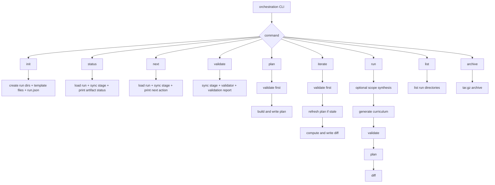

## 4. Per-Command Flows

### `init`

Behavior:
- creates run folder structure
- copies topic spec template into `inputs/topic_spec.json`
- creates scope template in `inputs/scope.md`
- initializes `run.json` and first event in `logs/events.jsonl`

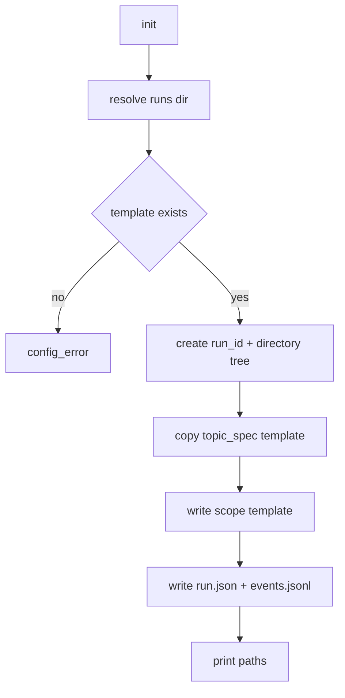

### `status`

Behavior:
- loads `run.json`
- syncs stage from artifacts
- reports artifact availability and scope artifact validity

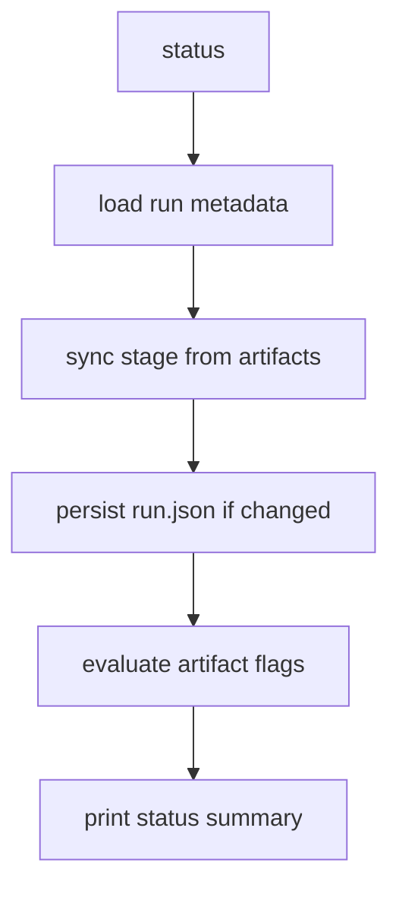

### `next`

Behavior:
- loads and syncs stage
- prints next recommended command based on current stage

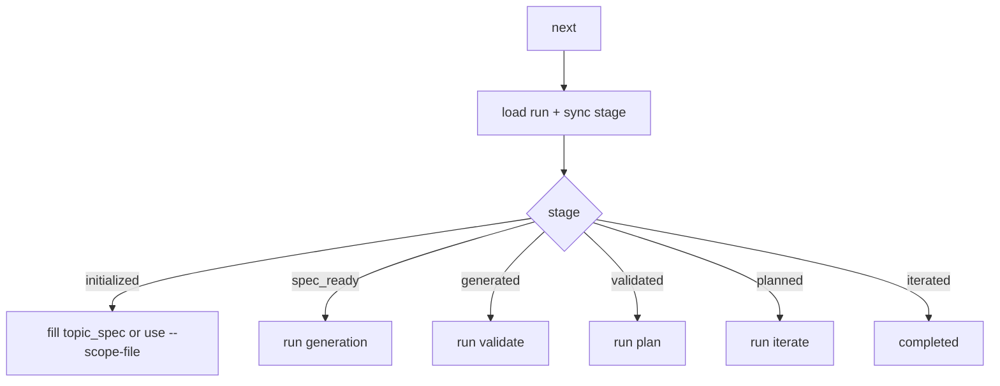

### `validate`

Behavior:
- syncs stage
- validates topic spec contract
- invokes validator subprocess
- writes `validation_report.md`
- writes/removes `logs/validation.ok` marker

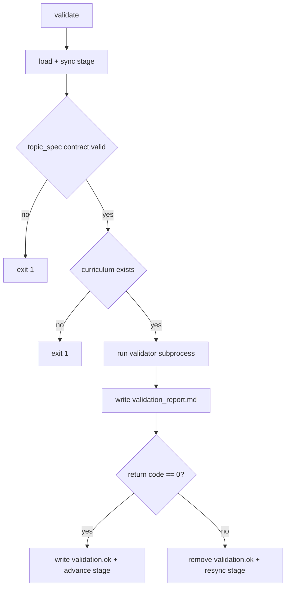

### `plan`

Behavior:
- runs `validate` first
- on successful validation, computes deterministic plan
- writes `outputs/plan/plan.json`

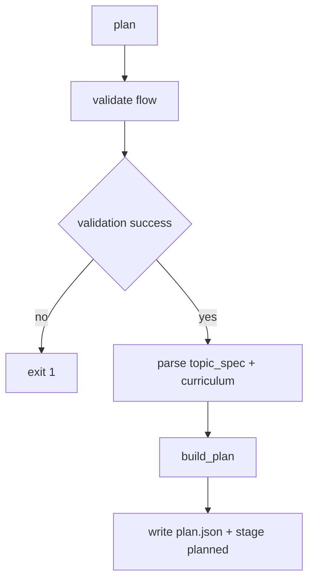

### `iterate`

Behavior:
- runs `validate` first
- refreshes plan if plan/validation markers are stale
- computes diff against previous curriculum
- writes `outputs/reviews/diff_report.json`

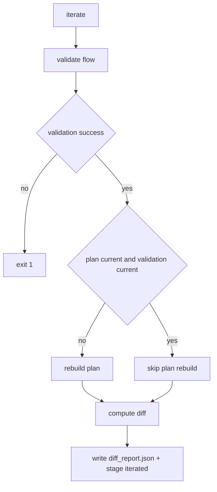

### `run`

Behavior:
- optional: synthesize topic spec from scope input
- generate curriculum
- validate
- plan
- diff

If validation fails, `run` exits non-zero and skips plan/diff.

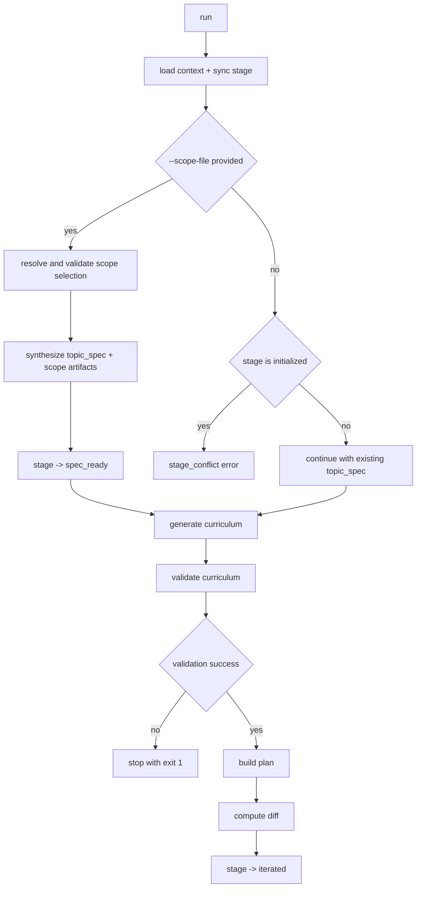

## 5. Stage Synchronization and Freshness

Stage is inferred from artifact freshness, not only historical command order.

Current checks:
- `spec_ready`: `topic_spec.json` passes contract validation
- `generated`: curriculum exists
- `validated`: `validation.ok` is current relative to spec/curriculum/report
- `planned`: `plan.json` is current relative to spec/curriculum
- `iterated`: `diff_report.json` is current relative to current/previous curriculum

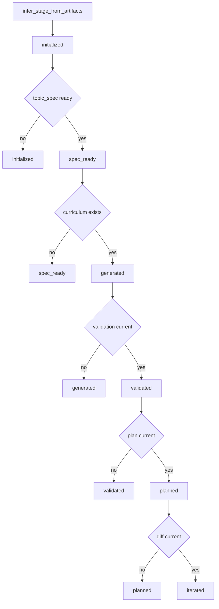

## 6. Planning and Diff Rules

Planning (`build_plan`):
- typed parse of topic spec and curriculum
- deterministic topological order
- week count bounded to `[2, 4]`
- weekly node allocation by minute capacity
- injects mastery deliverables and rolling review items

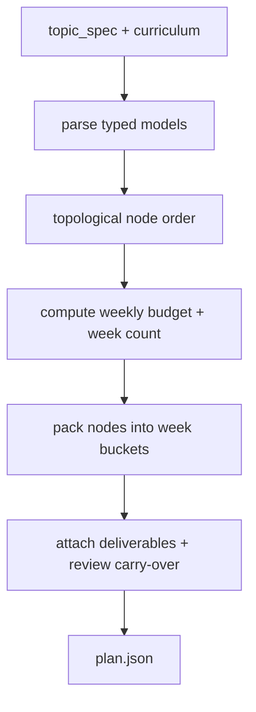

Diff (`compute_diff`):
- node set delta: added/removed
- field-level node changes
- total time delta
- critical-path change detection

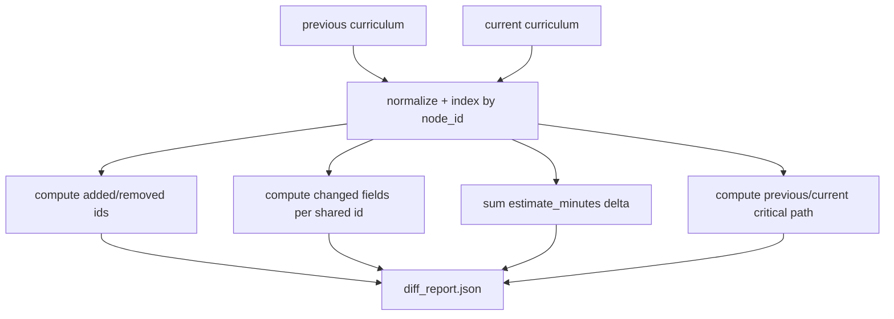

Precision note:
- `estimate_minutes` is treated as numeric, including fractional values.

## 7. Failure and Recovery Flow

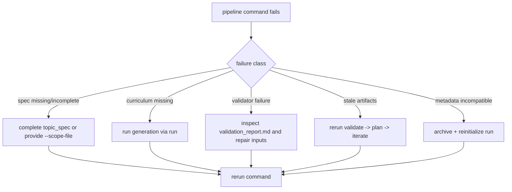

## 8. Operational Playbook Flow

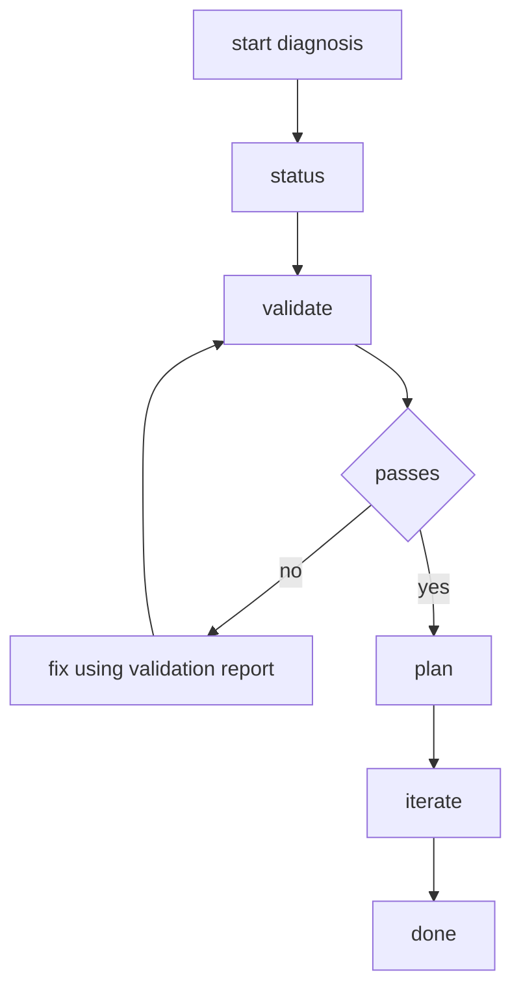
