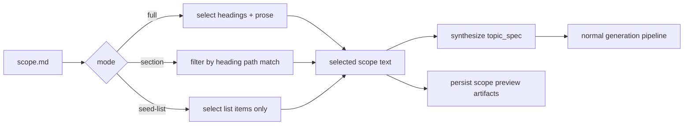

# Scope Ingestion

This document specifies how `--scope-file` input is transformed into generation inputs.

## 1. Goal

Users can provide unordered, mixed-granularity scope text (for example markdown notes). The system:
- selects relevant source content
- synthesizes a valid `topic_spec.json`
- runs normal curriculum generation and optimization

## 2. Entry Point

Command:

```bash
python3.11 scripts/orchestration.py run <run_id> --scope-file <path>
```

Optional selection controls:
- `--scope-mode full|section|seed-list` (default `full`)
- `--scope-section <heading text>` (repeatable; required for `section` mode)

Implementation:
- `learning_compiler/orchestration/scope.py`

## 3. Selection Modes

### `full`

Selection behavior:
- includes markdown headings and non-empty prose lines
- ignores fenced code blocks
- skips front matter header block (`--- ... ---`)

### `section`

Selection behavior:
- tracks heading stack paths
- includes only content under headings matching normalized section filters
- requires at least one `--scope-section`

### `seed-list`

Selection behavior:
- includes list items only (bullets and numbered lists)
- useful when scope is mostly concept bullet points

## 4. Selection Flow



## 5. Topic Spec Synthesis

Synthesized fields include:
- `goal`, `audience`
- `prerequisites`
- `scope_in` extracted from headings/bullets/sentence fragments
- `scope_out`
- `constraints` including estimated node/hour bounds
- `domain_mode`, `evidence_mode`
- `misconceptions`
- `context_pack` (with local path to selected run scope file)

Guardrails:
- synthesized spec is validated against topic-spec contract before write.
- empty/invalid selected content raises typed error.

## 6. Persisted Artifacts

After successful synthesis:
- selected content written to `runs/<run_id>/inputs/scope.md`
- synthesized spec written to `runs/<run_id>/inputs/topic_spec.json`
- scope metadata envelopes written:
  - `runs/<run_id>/scope_concepts.json`
  - `runs/<run_id>/scope_dag.json`

Envelope metadata includes:
- schema version
- artifact type
- source path
- ingest mode
- section filters
- payload details

## 7. Current Design Choice

Current orchestration scope path is direct scope passthrough.

Meaning:
- no separate heuristic concept graph construction stage is executed during scope ingestion.
- generation is grounded in selected scope text via synthesized topic spec and optional scope document context.

This keeps orchestration deterministic and simple while delegating DAG shaping to generator + optimizer.

## 8. Known Limitations

- heavily prose-only documents can still bias titles toward document structure rather than pure field ontology.
- extraction is lexical and may include noise in `scope_in` for very large, narrative files.
- no explicit concept canonicalization/merging stage before generation.

## 9. Suggested Future Upgrade Path

If scope-to-field abstraction quality needs to increase, introduce an optional pre-generation abstraction stage:
1. extract normalized field concepts from selected scope
2. canonicalize/merge near-duplicates
3. infer prerequisite candidates between concepts
4. pass canonical concept set as generation constraints
5. retain current direct path as fallback mode
