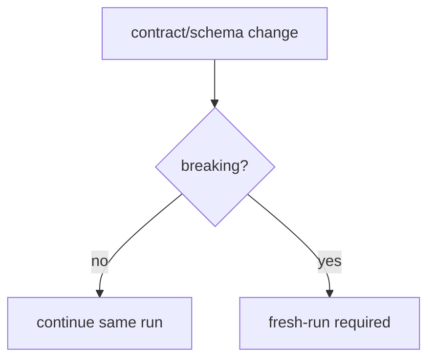
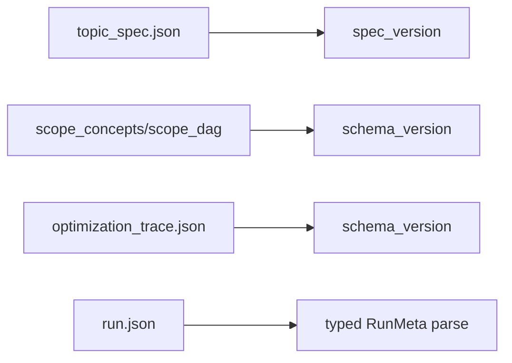
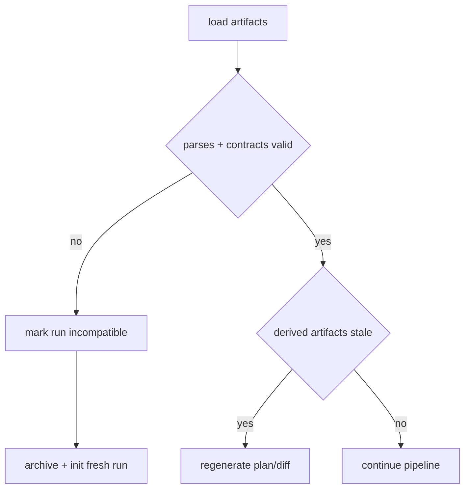
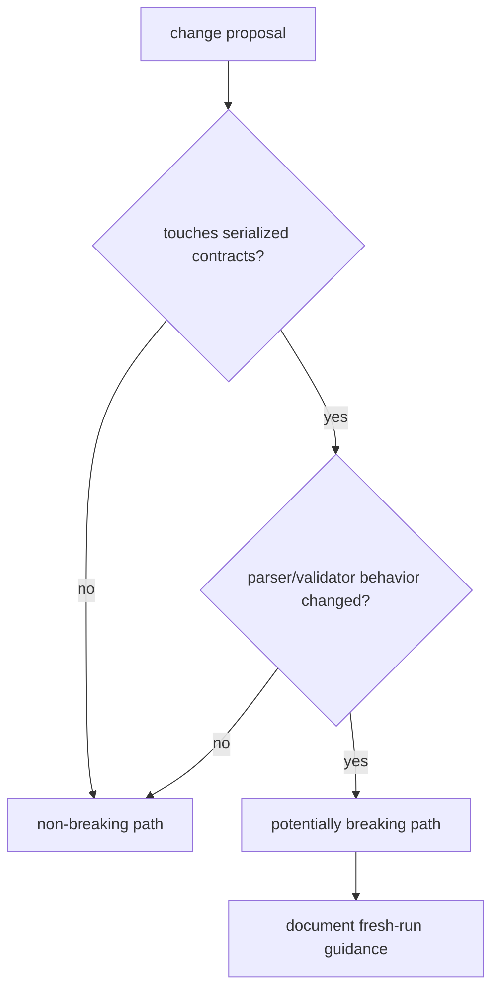
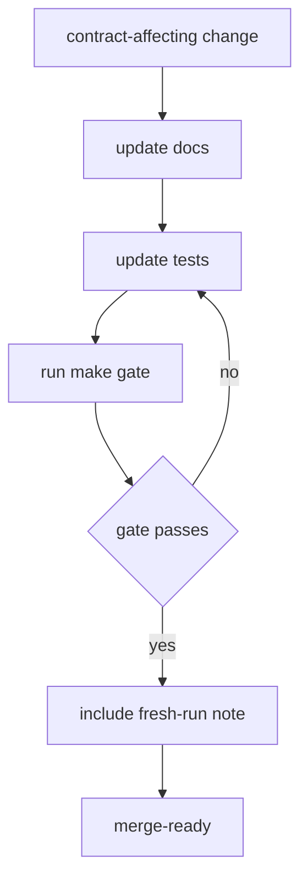
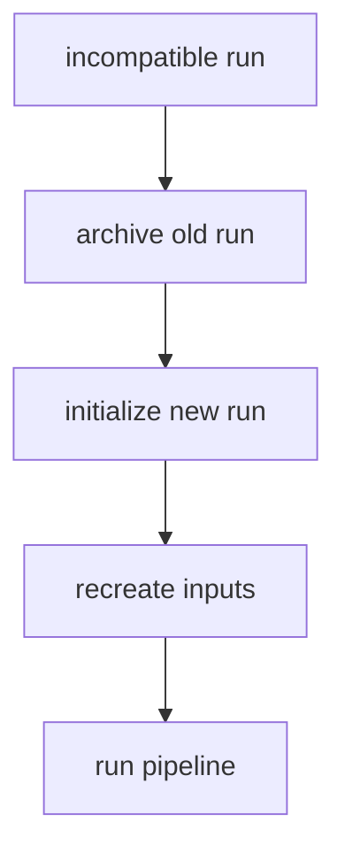

# Versioning and Compatibility Policy

This document defines compatibility expectations for artifacts, schemas, and run metadata.

## 1. Policy Summary

- This repository is a PoC with a strict fresh-run contract.
- Backward-compatible migrations for run metadata/artifacts are not required.
- When schema/contract changes are incompatible, create a new run.

## 2. Versioned Contracts Map

### Topic Spec

- Field: `spec_version`
- Current expected value: `1.0`
- Validator behavior: topic spec must satisfy required contract fields and types.

### Scope Artifacts

- Envelope field: `schema_version`
- Current expected value: `1.0`
- Envelope fields:
  - `artifact_type`
  - `source_path`
  - `mode`
  - `section_filters`
  - `policy_snapshot`
  - `payload`

### Optimization Trace

- Field: `schema_version`
- Source: model policy snapshot at generation time
- Current default value: `1.0`

### Run Metadata

- File: `runs/<run_id>/run.json`
- Parsed via typed model (`RunMeta`)
- Invalid or incompatible metadata is treated as non-recoverable for that run.

## 3. Compatibility Decision Flow

Rule A: New run for incompatible changes
- If parsing or contract checks fail due to schema evolution, reinitialize run.

Rule B: Derived artifact regeneration
- `plan.json` and `diff_report.json` are derived and may be regenerated anytime.

Rule C: Stage is artifact-driven
- Runtime stage is inferred from current artifact freshness, reducing dependence on historical command sequence.

## 4. Change Classification Flow

### Non-breaking changes (same run can continue)

- documentation-only updates
- internal refactors with unchanged file formats
- validator rule tuning with same artifact structure

### Potentially breaking changes (prefer fresh run)

- required topic spec field changes
- run metadata shape changes
- scope artifact envelope shape/version changes
- curriculum schema changes used by validator/planner

## 5. Release and Merge Flow

Before merge for contract-affecting changes:
1. update relevant docs (`README.md`, `docs/*`)
2. add/adjust tests for parsing/validation behavior
3. run `make gate`
4. mention fresh-run requirement in change summary

## 6. Incompatible Run Recovery Flow

If an existing run becomes incompatible:
- archive if needed: `python3.11 scripts/orchestration.py archive <run_id>`
- initialize new run: `python3.11 scripts/orchestration.py init "<name>"`
- rerun pipeline from clean artifacts

